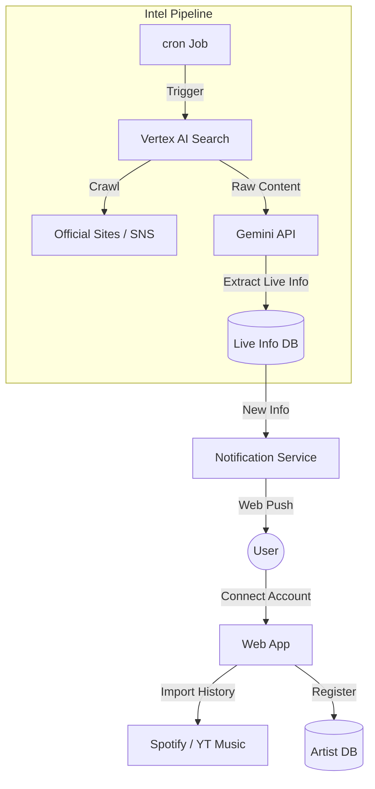

# Product Design

## Elevator Pitch

### 1. Basic pattern

#### English version

```
"Are you passionate music fans who attend 10+ concerts a year, constantly juggling multiple websites and social media to avoid missing out on crucial information? Our app is designed for you."

"Simply register your favorite artists, and we'll automatically deliver personalized push notifications about upcoming concerts, ticket releases, and everything you need to know."

"We eliminate the need to actively 'hunt' for information, providing a passive experience where the information you want 'finds you'. Looking ahead, we envision a platform that enriches your musical life by suggesting concerts tailored to your tastes."
```

#### Japanese version

```
年間10本以上ライブに行くような熱心な音楽ファンで、複数のサイトやSNSをチェックして情報を見逃しそうになった経験がある方のためのアプリです。

このアプリは、好きなアーティストを登録するだけで、ライブの開催からチケット情報まで、あなたに必要な情報だけをプッシュ通知で自動的にお知らせします。

これまでの能動的に情報を「探しに行く」手間をなくし、欲しい情報が「自動で届く」受動的な体験を提供します。将来的には、あなたの好みに合わせたライブを提案し、音楽ライフをより豊かにするプラットフォームを目指します。
```

### 2. Advanced pattern

#### English version

```
"Ever missed out on tickets because you found out about a concert too late? It's a terrible feeling, right? Especially when you're constantly checking websites, social media, and emails!"

"Our app is your personal concert assistant, designed to prevent that frustration. Just register your favorite artists, and we'll send you push notifications with the important stuff."

"Stop chasing information! Let the info come to you. This app will be your ultimate partner in rocking your music life."
```

#### Japanese version

```
「あのライブ、気づいた時にはもうチケットの申込期間が終わってた…」

こんな悔しい思いをしたことはありませんか？熱心なファンほど、公式サイト、SNS、メールと情報を追うのは本当に大変ですよね。

私たちが開発するアプリは、そんなあなたのための「ライブ専門のパーソナルアシスタント」です。一度アーティストを登録すれば、あとは重要な情報だけがプッシュ通知で届きます。

もう、あなたから情報を見つけに行く必要はありません。このアプリが、あなたの音楽ライフをより充実させる最高のパートナーになります。
```

## Product Vision & Strategy

### Core Value Proposition
- **Problem**: 「チケット申込期間の失念」および「イベント開催情報の見逃し」。
- **Solution**: ユーザーの好みを学習し、Web上のあらゆるソースから最新のライブ情報を自動収集・解析してプッシュ通知で届ける。

### Platform Focus
- **Web First**: 最新のWeb技術を活用し、ブラウザベースで完結。
- **No Native App**: ネイティブアプリ（iOS/Android）の開発コストを省き、Web Push通知等の技術で同等の体験を提供する。

## Feature Overview (MVP)

### 1. User Preference Import
ユーザーの手間を最小限にするため、既存の音楽プラットフォームから好みをインポートする。
- **連携先**: Spotify, YouTube Music
- **機能**: 視聴履歴やライブラリ情報を解析し、データベースにお気に入りアーティストとして自動登録する。

### 2. Automated Intel Gathering (The Core)
人力ではなく、LLMと検索技術を駆使した自動化パイプライン。
- **Source Discovery**: アーティストごとの情報源（公式サイト、X/Twitter等）を Gemini API で特定・保存。
- **Continuous Monitoring**: 
    - Google Cloud Vertex AI Search を利用してWeb上の最新情報を定期クロール。
    - 取得したデータを Gemini API で解析し、「ライブ情報」「チケット情報」であるかを判定。
    - 構造化データとしてDBに保存。

### 3. Smart Notification
- 重要な情報（ライブ解禁、チケット先行開始、締切直前）のみをWeb Push通知で配信。
- `Noise-free` な体験を目指す。

## Technical Architecture Concept



## Roadmap

### Phase 1: Foundation & Data Pipeline
**目標**: ユーザーのお気に入り登録と、情報の自動収集サイクルの確立。
- ユーザー認証機能
- 音楽サブスク連携（Spotify/YouTube Music）
- アーティストDB構築
- **Core Engine**: Gemini + Vertex AI Search による情報収集・解析ジョブの実装。

### Phase 2: User Experience (MVP Release)
**目標**: ユーザーへの価値提供開始（通知）。
- ライブ情報一覧 UIの実装
- Web Push 通知の実装
- 一般ユーザー向けリリース

### Phase 3: Platform Expansion
**目標**: ビジネス化とエコシステムの拡大。
- アーティスト向け機能（チケット販売・管理システム）
- チケット販売によるマネタイズ
