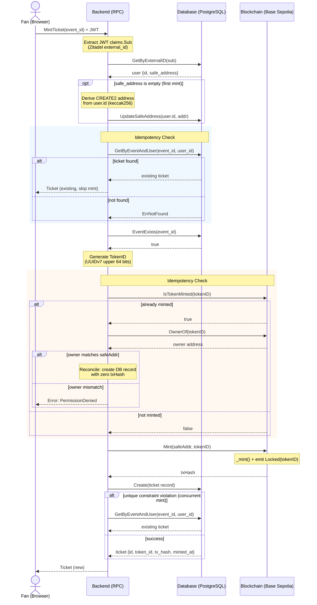
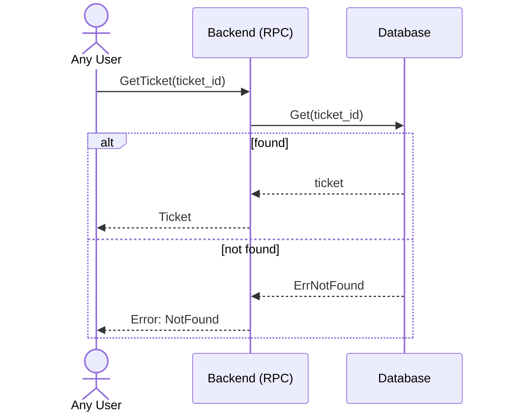
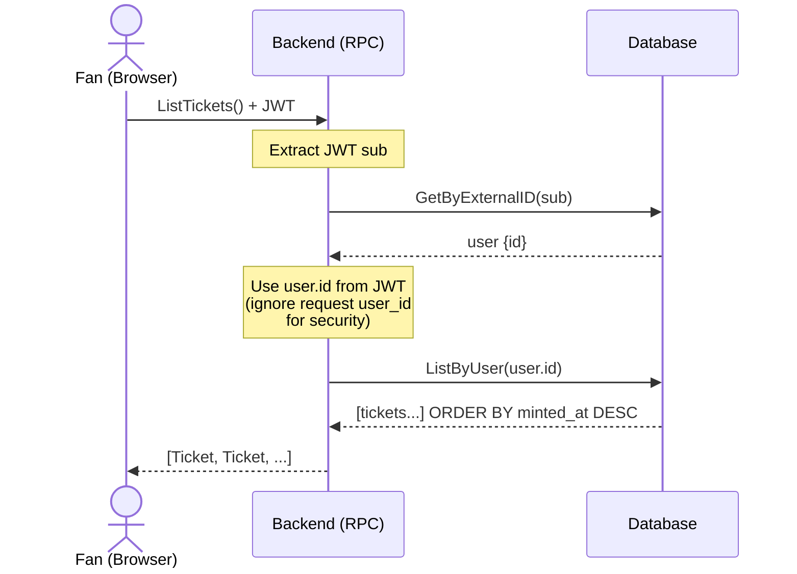
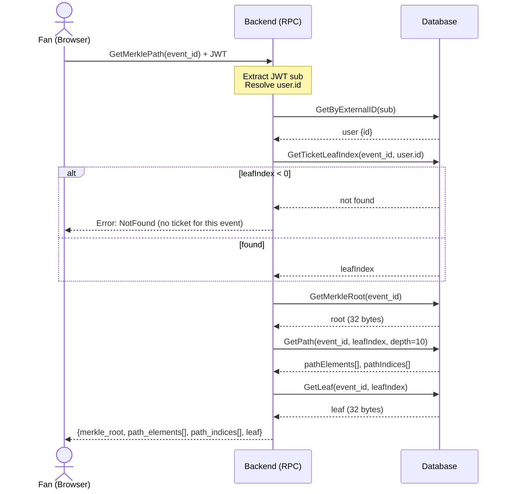
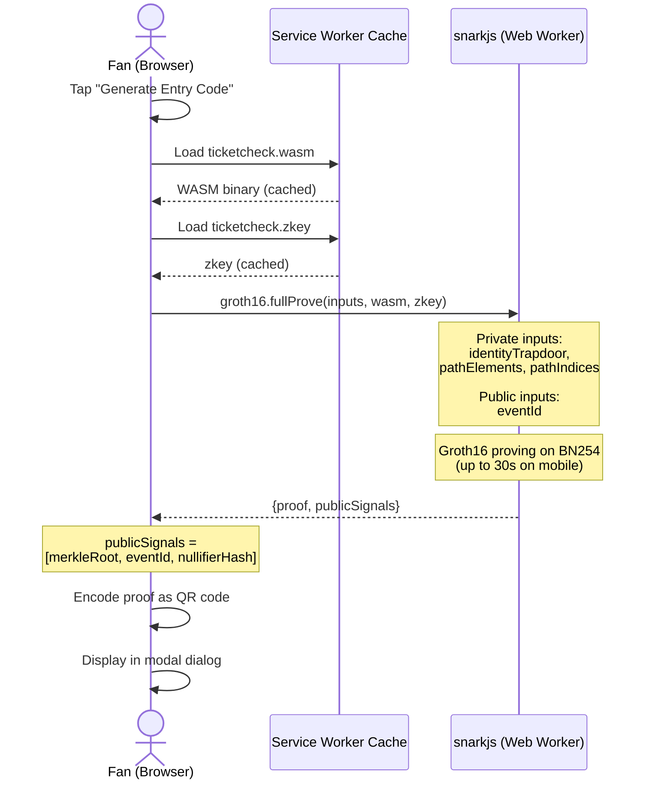
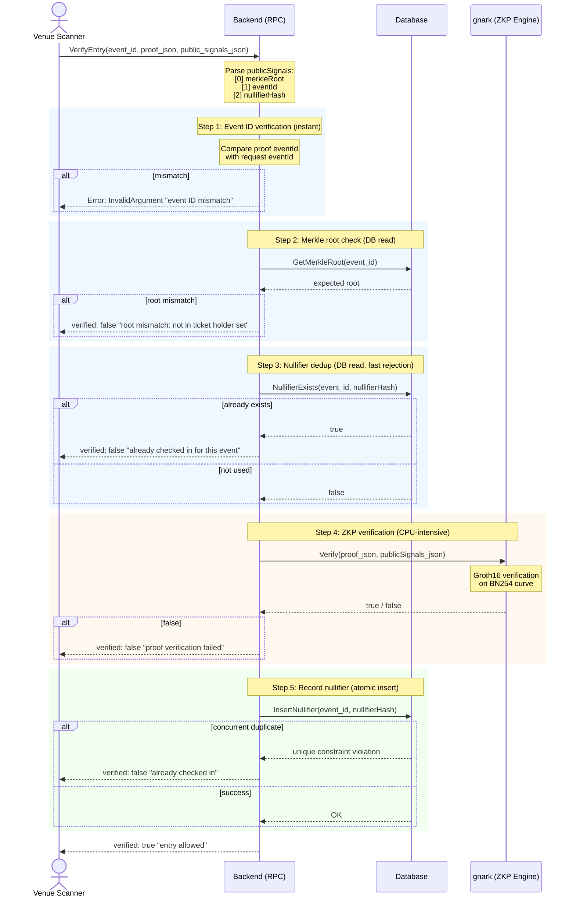
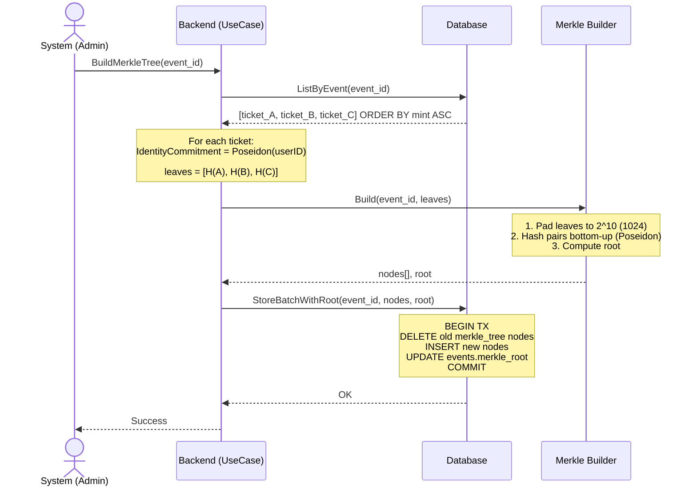
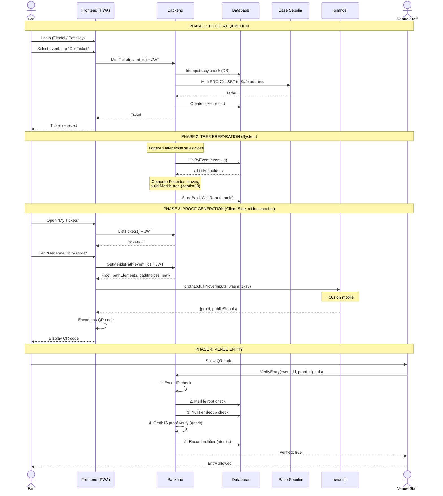

# Ticket System MVP — Implementation Overview

## 1. System Architecture (Full Picture)

```
┌─────────────────────────────────────────────────────────────────────────────────┐
│                         LIVERTY MUSIC TICKET SYSTEM MVP                        │
│                                                                                │
│   "Soulbound NFT Ticket x Zero-Knowledge Proof Entry Verification"             │
└─────────────────────────────────────────────────────────────────────────────────┘

                     ┌──────────────────────────────────┐
                     │         Aurelia 2 PWA            │
                     │    (Frontend / Browser)           │
                     ├──────────────────────────────────┤
                     │  /tickets page                    │
                     │  ┌────────────┐ ┌──────────────┐ │
                     │  │ Ticket List │ │ QR Code View │ │
                     │  │  (SBT)     │ │  (Entry)     │ │
                     │  └─────┬──────┘ └──────▲───────┘ │
                     │        │               │          │
                     │  ┌─────▼───────────────┴───────┐ │
                     │  │  snarkjs (Groth16)           │ │
                     │  │  ┌──────────────────────┐   │ │
                     │  │  │ TicketCheck Circuit   │   │ │
                     │  │  │ (WASM + zkey)         │   │ │
                     │  │  │ In-browser ZKP gen    │   │ │
                     │  │  └──────────────────────┘   │ │
                     │  └─────────────────────────────┘ │
                     └──────────┬───────────────────────┘
                                │ ConnectRPC (gRPC-web)
                                ▼
┌───────────────────────────────────────────────────────────────────────────────┐
│                        Go Backend (GKE Autopilot, Osaka)                     │
│                                                                               │
│  ┌─────────────────────────────┐    ┌──────────────────────────────────────┐ │
│  │     TicketService (RPC)     │    │       EntryService (RPC)             │ │
│  ├─────────────────────────────┤    ├──────────────────────────────────────┤ │
│  │ MintTicket   → Issue SBT   │    │ VerifyEntry    → ZKP verify+record  │ │
│  │ GetTicket    → Get ticket   │    │ GetMerklePath  → Get Merkle proof   │ │
│  │ ListTickets  → List all    │    │                                     │ │
│  └──────┬──────────────────────┘    └──────┬───────────────────────────────┘ │
│         │                                   │                                 │
│  ┌──────▼──────────────────────────────────▼───────────────────────────────┐ │
│  │                        Usecase Layer                                    │ │
│  │                                                                         │ │
│  │  TicketUseCase                    EntryUseCase                          │ │
│  │  ├ Idempotency (DB+On-chain)      ├ PublicSignals parse                │ │
│  │  ├ TokenID gen (UUIDv7)           ├ EventID matching                   │ │
│  │  ├ Safe address (CREATE2)         ├ Merkle Root verification           │ │
│  │  └ Concurrent mint handling       ├ Nullifier dedup check              │ │
│  │                                    ├ Groth16 verify (gnark)            │ │
│  │                                    └ Merkle Tree build (Poseidon)      │ │
│  └─────────────────────────────────────────────────────────────────────────┘ │
│         │                                   │                                 │
│  ┌──────▼──────────────────────────────────▼───────────────────────────────┐ │
│  │                     Infrastructure Layer                                │ │
│  │                                                                         │ │
│  │  ┌──────────┐ ┌──────────┐ ┌──────────┐ ┌──────────┐ ┌──────────────┐ │ │
│  │  │TicketRepo│ │MerkleRepo│ │Nullifier │ │ ZKP      │ │ TicketSBT    │ │ │
│  │  │  (pgx)   │ │  (pgx)   │ │Repo(pgx) │ │Verifier  │ │ Client(EVM) │ │ │
│  │  └────┬─────┘ └────┬─────┘ └────┬─────┘ │(gnark)   │ └──────┬──────┘ │ │
│  │       │             │            │        └──────────┘        │         │ │
│  └───────┼─────────────┼────────────┼────────────────────────────┼─────────┘ │
└──────────┼─────────────┼────────────┼────────────────────────────┼───────────┘
           │             │            │                            │
           ▼             ▼            ▼                            ▼
┌─────────────────────────────────────┐         ┌──────────────────────────────┐
│     Cloud SQL PostgreSQL 18         │         │    Base Sepolia (EVM)        │
│                                     │         │                              │
│  tickets      merkle_tree           │         │  ┌────────────────────────┐  │
│  ┌──────────┐ ┌───────────────┐     │         │  │    TicketSBT.sol       │  │
│  │id (UUID) │ │event_id       │     │         │  │    (ERC-721+ERC-5192)  │  │
│  │event_id  │ │depth          │     │         │  │                        │  │
│  │user_id   │ │node_index     │     │         │  │  mint()                │  │
│  │token_id  │ │hash (32bytes) │     │         │  │  locked() -> true      │  │
│  │tx_hash   │ └───────────────┘     │         │  │  transferFrom -> revert│  │
│  │minted_at │                       │         │  └────────────────────────┘  │
│  └──────────┘ nullifiers            │         │                              │
│               ┌───────────────┐     │         └──────────────────────────────┘
│  events       │event_id       │     │
│  ┌──────────┐ │nullifier_hash │     │
│  │merkle_   │ │used_at        │     │
│  │  root    │ └───────────────┘     │
│  └──────────┘                       │
└─────────────────────────────────────┘
```


---

## 2. Use Case Sequence Diagrams

This section covers all use cases the system currently supports.
Each diagram shows the exact participants, message flow, and branching logic.

### Use Case Summary

| # | Use Case | Actor | Auth | Blockchain |
|---|----------|-------|------|------------|
| 1 | Mint Soulbound Ticket | Fan | JWT | Yes (ERC-721 mint) |
| 2 | Get Ticket Details | Any user | No | No |
| 3 | List My Tickets | Fan | JWT | No |
| 4 | Get Merkle Path (Proof Prep) | Fan | JWT | No |
| 5 | Generate Entry Code (ZKP) | Fan | No (client-side) | No |
| 6 | Verify Entry at Venue | Venue staff | No | No |
| 7 | Build Merkle Tree | System | Internal | No |


### 2.1. UC1: Mint Soulbound Ticket

A fan purchases a ticket for an event. The backend mints an ERC-5192 Soulbound
Token on Base Sepolia and records the ticket in the database. The flow is
idempotent at three levels: DB lookup, on-chain check, and unique constraint.



**Error branches:**
- Event not found -> `NotFound`
- Invalid Ethereum address -> `InvalidArgument`
- On-chain token owned by different address -> `PermissionDenied`
- Concurrent mint (DB unique constraint) -> fetch existing, return idempotently


### 2.2. UC2: Get Ticket Details

Any user retrieves ticket details by ID. No authentication required.




### 2.3. UC3: List My Tickets

An authenticated fan views all their tickets. The user ID is extracted from
the JWT to prevent listing another user's tickets.




### 2.4. UC4: Get Merkle Path (Proof Preparation)

Before generating a ZKP, the frontend needs the Merkle inclusion proof data
for the authenticated user. This data proves the user is in the ticket holder
set without revealing which specific ticket holder they are.




### 2.5. UC5: Generate Entry Code (Client-Side ZKP)

This is entirely client-side. The fan generates a Groth16 zero-knowledge proof
in the browser using snarkjs. The proof proves they hold a ticket without
revealing their identity. The result is encoded as a QR code.



**Key point:** This can work entirely offline once the circuit files are cached.
No network request is needed for proof generation.


### 2.6. UC6: Verify Entry at Venue (ZKP Verification)

Venue staff scans the fan's QR code. The backend verifies the zero-knowledge
proof, checks for double-entry via nullifier, and records the check-in.
No authentication is required (the proof itself is the credential).



**Verification order is optimized for performance:**
1. Event ID check -- string compare (instant)
2. Merkle root check -- single DB read
3. Nullifier check -- single DB read (fast rejection of double-entry)
4. Groth16 proof verification -- CPU-intensive (done last, only for new proofs)
5. Nullifier insert -- atomic write (prevents concurrent double-entry race)


### 2.7. UC7: Build Merkle Tree (System Internal)

After tickets are minted for an event, the system builds a Merkle tree from
all ticket holders. This tree is required for ZKP proof generation and
verification. Not exposed as a public RPC -- triggered internally.




### 2.8. End-to-End Flow: Ticket Purchase to Venue Entry

This composite diagram shows the complete user journey across all use cases.




---

## 3. Smart Contract (TicketSBT) — Detailed Explanation

### 3.1. Contract Overview

TicketSBT is a Solidity smart contract deployed on Base Sepolia (chain ID 84532).
It implements a **Soulbound Token (SBT)** — an NFT that cannot be transferred after minting.
This prevents ticket scalping and secondary market resale.

The contract inherits from three base contracts:

```
┌─────────────────────────────────────────────────────────────────┐
│                         TicketSBT                              │
│                                                                 │
│  Inherits:                                                      │
│  ┌──────────────┐  ┌──────────────────┐  ┌──────────────────┐  │
│  │   ERC721     │  │  AccessControl   │  │    IERC5192      │  │
│  │ (OpenZeppelin│  │ (OpenZeppelin    │  │ (EIP-5192        │  │
│  │  v5.5.0)     │  │  v5.5.0)         │  │  Soulbound std)  │  │
│  └──────┬───────┘  └────────┬─────────┘  └────────┬─────────┘  │
│         │                   │                      │             │
│   NFT ownership       Role-based access      Lock status        │
│   Token metadata       MINTER_ROLE           Locked event       │
│   Transfer logic       ADMIN_ROLE            locked() query     │
└─────────────────────────────────────────────────────────────────┘
```

### 3.2. Contract Source: `contracts/src/TicketSBT.sol`

```solidity
contract TicketSBT is ERC721, AccessControl, IERC5192 {
    bytes32 public constant MINTER_ROLE = keccak256("MINTER_ROLE");
```

**Token metadata:**
- Name: `"Liverty Music Ticket"`
- Symbol: `"LMTKT"`

**Roles:**
- `DEFAULT_ADMIN_ROLE` — Can grant/revoke other roles. Held by deployer EOA.
- `MINTER_ROLE` — Can call `mint()`. Held by backend service EOA.
  - In production, the private key lives in GCP Secret Manager.
  - In dev, the deployer EOA doubles as the minter.

### 3.3. Mint Function

```solidity
function mint(address recipient, uint256 tokenId) external onlyRole(MINTER_ROLE) {
    _mint(recipient, tokenId);
    emit Locked(tokenId);
}
```

**How it works:**
1. Only callable by addresses with `MINTER_ROLE` (the backend service).
2. `_mint()` creates the NFT — assigns ownership of `tokenId` to `recipient`.
3. Immediately emits `Locked(tokenId)` per ERC-5192 spec, signaling the token is
   permanently non-transferable from the moment of creation.

**Key design decisions:**
- `tokenId` is NOT auto-incremented on-chain. The backend generates it from UUIDv7
  (upper 64 bits), ensuring monotonically increasing, collision-resistant IDs that
  match the database `tickets.token_id` column.
- `recipient` is a Safe Smart Account address derived deterministically from
  `users.id` via CREATE2. Users never provide their own address.

### 3.4. Soulbound Lock (ERC-5192)

```solidity
function locked(uint256 tokenId) external view override returns (bool) {
    _requireOwned(tokenId);
    return true;
}
```

- Always returns `true` for any existing token — every token is permanently locked.
- Reverts with `ERC721NonexistentToken` if the token doesn't exist.
- This implements the IERC5192 interface defined in EIP-5192.

### 3.5. Transfer Blocking

```solidity
function transferFrom(address, address, uint256) public pure override {
    revert("SBT: Ticket transfer is prohibited");
}

function safeTransferFrom(address, address, uint256, bytes memory) public pure override {
    revert("SBT: Ticket transfer is prohibited");
}
```

**Why only two overrides (not three)?**

OpenZeppelin ERC721 v5.5.0 defines three transfer functions:

```
ERC721 Transfer Functions
═════════════════════════

1. transferFrom(from, to, tokenId)                     ← virtual    → OVERRIDDEN
2. safeTransferFrom(from, to, tokenId)                 ← NOT virtual → cannot override
3. safeTransferFrom(from, to, tokenId, bytes data)     ← virtual    → OVERRIDDEN
```

The 3-argument `safeTransferFrom` (#2) is non-virtual in OZ v5.5.0.
Its implementation simply delegates to the 4-argument version (#3):

```solidity
// OpenZeppelin ERC721.sol line 128
function safeTransferFrom(address from, address to, uint256 tokenId) public {
    safeTransferFrom(from, to, tokenId, "");   // calls #3
}
```

Since #3 is overridden to revert, calling #2 will also revert. The protection is
complete without needing to override #2 directly.

**Call graph proving all transfer paths are blocked:**

```
ANY external call
       │
       ├─── transferFrom(from, to, tokenId) ──────────────▶ REVERT
       │
       ├─── safeTransferFrom(from, to, tokenId) ──┐
       │                                           │
       │          delegates to ────────────────────▼
       │
       └─── safeTransferFrom(from, to, tokenId, data) ───▶ REVERT
```

### 3.6. ERC-165 Interface Detection

```solidity
function supportsInterface(bytes4 interfaceId)
    public view override(ERC721, AccessControl) returns (bool)
{
    return interfaceId == type(IERC5192).interfaceId
        || super.supportsInterface(interfaceId);
}
```

Reports support for:
- `IERC5192` (Soulbound interface)
- `IERC721` (NFT standard) — via ERC721
- `IAccessControl` — via AccessControl
- `IERC165` — via ERC721

The `override(ERC721, AccessControl)` is required because both parent contracts
define `supportsInterface`, and Solidity requires explicit disambiguation.

### 3.7. Interface: `contracts/src/interfaces/IERC5192.sol`

```solidity
interface IERC5192 {
    event Locked(uint256 tokenId);
    event Unlocked(uint256 tokenId);
    function locked(uint256 tokenId) external view returns (bool);
}
```

From EIP-5192 (Minimal Soulbound NFT):
- `Locked` event — emitted when a token becomes non-transferable.
- `Unlocked` event — declared but never emitted (all tokens are permanently locked).
- `locked()` — returns the lock status of a token.

### 3.8. Forge Tests: `contracts/test/TicketSBT.t.sol`

7 tests covering all contract behavior:

```
TEST SUITE: TicketSBTTest
═════════════════════════════════════════════════════════════════

 Setup
   admin deploys TicketSBT(admin)
   admin grants MINTER_ROLE to minter

 Authorized Mint
   test_AuthorizedMint
     minter mints tokenId=1 to recipient -> ownerOf(1) == recipient

   test_MintEmitsLockedEvent
     expects Locked(42) event -> minter mints tokenId=42

   test_LockedReturnsTrueForMintedToken
     minter mints tokenId=1 -> locked(1) == true

 Unauthorized Mint
   test_UnauthorizedMintReverts
     other (no role) tries to mint -> reverts (AccessControl error)

 Transfer Lock
   test_TransferFromReverts
     recipient tries transferFrom -> reverts "SBT: Ticket transfer is prohibited"

   test_SafeTransferFromReverts
     recipient tries safeTransferFrom(4-arg) -> reverts "SBT: Ticket transfer is prohibited"

 Edge Cases
   test_LockedRevertsForNonExistentToken
     locked(9999) -> reverts (token doesn't exist)
```

### 3.9. Foundry Configuration: `contracts/foundry.toml`

```toml
[profile.default]
src = "src"
out = "out"
libs = ["lib"]
test = "test"
script = "script"
optimizer = true
optimizer_runs = 200
remappings = [
    "@openzeppelin/contracts/=lib/openzeppelin-contracts/contracts/",
    "forge-std/=lib/forge-std/src/",
]
```

- **optimizer_runs = 200** — Balanced optimization for both deployment cost and runtime gas.
- **remappings** — Maps `@openzeppelin/contracts/` imports to local `lib/` directory.
- **Dependencies** (in `lib/`, gitignored, installed via `forge install`):
  - `openzeppelin-contracts` (v5.5.0) — ERC721, AccessControl, ERC165
  - `forge-std` — Foundry test framework (Test, vm cheatcodes)

### 3.10. CI Integration: Forge Test Job

Added to `.github/workflows/test.yml`:

```
CI Pipeline for Contracts
═════════════════════════

  changes (path-filter)
      │
      ├─ contracts/src/**  ──┐
      ├─ contracts/test/** ──┤── contracts == 'true'
      ├─ contracts/foundry.toml
      │
      ▼
  forge-test (if contracts changed)
      │
      ├─ actions/checkout@v4
      ├─ foundry-rs/foundry-toolchain@v1
      ├─ git clone forge-std + openzeppelin-contracts
      └─ forge test -vvv
```

Dependencies are cloned via `git clone --depth 1` because `contracts/lib/` is
gitignored. The CI job installs them fresh each run.


---

## 4. Backend Implementation — Detailed Explanation

### 4.1. Clean Architecture Layers

```
┌─────────────────────────────────────────────────────────────┐
│  Adapter Layer (RPC Handlers)                               │
│  ┌──────────────────────┐  ┌─────────────────────────────┐  │
│  │  ticket_handler.go   │  │  entry_handler.go           │  │
│  │  MintTicket()        │  │  VerifyEntry()              │  │
│  │  GetTicket()         │  │  GetMerklePath()            │  │
│  │  ListTickets()       │  │                             │  │
│  └──────────┬───────────┘  └──────────────┬──────────────┘  │
│             │ mapper/ticket.go             │                 │
└─────────────┼──────────────────────────────┼─────────────────┘
              │                              │
              ▼                              ▼
┌─────────────────────────────────────────────────────────────┐
│  Usecase Layer                                              │
│  ┌──────────────────────┐  ┌─────────────────────────────┐  │
│  │  ticket_uc.go        │  │  entry_uc.go                │  │
│  │  MintTicket()        │  │  VerifyEntry()              │  │
│  │  GetTicket()         │  │  GetMerklePath()            │  │
│  │  ListTicketsForUser()│  │  BuildMerkleTree()          │  │
│  └──────────┬───────────┘  └──────────────┬──────────────┘  │
│             │                              │                 │
│             │  depends on interfaces       │                 │
│             │  (entity package)            │                 │
└─────────────┼──────────────────────────────┼─────────────────┘
              │                              │
              ▼                              ▼
┌─────────────────────────────────────────────────────────────┐
│  Entity Layer (Domain Interfaces)                           │
│                                                             │
│  TicketRepository    TicketMinter      ZKPVerifier          │
│  EventRepository     NullifierRepo     MerkleTreeRepo      │
└─────────────────────────────────────────────────────────────┘
              │                              │
              ▼                              ▼
┌─────────────────────────────────────────────────────────────┐
│  Infrastructure Layer (Implementations)                     │
│                                                             │
│  ┌───────────┐ ┌───────────┐ ┌───────────┐ ┌────────────┐ │
│  │ticket_repo│ │merkle_repo│ │nullifier  │ │ticketsbt   │ │
│  │  (pgx)    │ │  (pgx)    │ │repo (pgx) │ │client (EVM)│ │
│  └───────────┘ └───────────┘ └───────────┘ └────────────┘ │
│  ┌───────────┐ ┌───────────┐ ┌────────────────────────┐    │
│  │poseidon.go│ │ tree.go   │ │ verifier.go (gnark)    │    │
│  │(BN254hash)│ │(builder)  │ │ (Groth16 verification) │    │
│  └───────────┘ └───────────┘ └────────────────────────┘    │
│  ┌────────────────────────┐                                 │
│  │ safe/address.go        │                                 │
│  │ (CREATE2 derivation)   │                                 │
│  └────────────────────────┘                                 │
└─────────────────────────────────────────────────────────────┘
```

### 4.2. Merkle Tree Construction

```
 Ticket holders for an event:
 [User_A, User_B, User_C]

      IdentityCommitment: Poseidon(userId bytes)
      |
 Leaves:  [H(A), H(B), H(C), 0, 0, 0, ... 0]   <- padded to 2^depth
                                                     (depth=10 -> 1024 leaves)

 Tree build (bottom-up Poseidon hashing):

         Depth 3 (root):          Poseidon(N6, N7)
                                  /              \
         Depth 2:          Poseidon(N2,N3)    Poseidon(N4,N5)
                           /          \        /          \
         Depth 1:     Poseidon    Poseidon  Poseidon   Poseidon
                      (L0,L1)    (L2,L3)   (L4,L5)    (L6,L7)
                       /   \      /   \     /   \       /   \
         Depth 0:    H(A) H(B) H(C)  0    0    0      0    0
                     (leaves)

 All nodes stored in merkle_tree table:
   (event_id, depth, node_index, hash)

 Root hash stored in events.merkle_root (for fast verification)
```

**Poseidon hash function:**
- Uses BN254 scalar field (same curve as circom/snarkjs).
- Output: 32-byte little-endian field element.
- Compatible with circomlib's Poseidon implementation used in the frontend ZKP circuit.

### 4.3. Safe Address Derivation (CREATE2)

```
     users.id (UUIDv7)
          │
          ▼
     keccak256(users.id) ──▶ salt (32 bytes)
          │
          ▼
     CREATE2(
       deployer: SafeProxyFactory 0x4e1DCf7AD4e460CfD30791CCC4F9c8a4f820ec67
       salt:     keccak256(users.id)
       initCode: Safe v1.4.1 singleton + proxy bytecode
     )
          │
          ▼
     Deterministic address (0x...)
```

**Why this approach?**
- Auth-provider-agnostic: Same `users.id` always produces the same address,
  even if the identity provider (Zitadel) changes.
- No on-chain deployment needed: The address is computed off-chain and used as
  the NFT recipient. The Safe smart account can be deployed lazily later.


---

## 5. Database Schema

```
┌──────────────────────────────────────────────────────────────────────────┐
│                          PostgreSQL 18 Schema                           │
├──────────────────────────────────────────────────────────────────────────┤
│                                                                          │
│  users                           events                                  │
│  ┌────────────────────┐          ┌─────────────────────────┐            │
│  │ id         UUID PK │<────┐    │ id           UUID PK    │<─────┐    │
│  │ external_id TEXT UQ │     │    │ venue_id     UUID FK    │      │    │
│  │ email       TEXT    │     │    │ title        TEXT       │      │    │
│  │ safe_address TEXT UQ│     │    │ local_date   DATE      │      │    │
│  │ created_at  TIMESTP│     │    │ start_at     TIMESTP   │      │    │
│  └────────────────────┘     │    │ open_at      TIMESTP   │      │    │
│                              │    │ source_url   TEXT      │      │    │
│                              │    │ merkle_root  BYTEA     │      │    │
│                              │    └─────────────────────────┘      │    │
│                              │                                     │    │
│  tickets                     │    concerts (1:1 with events)       │    │
│  ┌─────────────────────────┐ │    ┌─────────────────────────┐     │    │
│  │ id         UUID PK      │ │    │ event_id   UUID PK/FK   │─────┘    │
│  │ event_id   UUID FK ─────┼─┼───>│ artist_id  UUID FK      │          │
│  │ user_id    UUID FK ─────┼─┘    └─────────────────────────┘          │
│  │ token_id   NUMERIC UQ   │                                           │
│  │ tx_hash    TEXT          │     merkle_tree                           │
│  │ minted_at  TIMESTP      │     ┌──────────────────────────────┐     │
│  │                          │     │ event_id    UUID FK ──────────┼──┐  │
│  │ UQ(event_id, user_id)   │     │ depth       INT               │  │  │
│  └─────────────────────────┘     │ node_index  INT               │  │  │
│                                   │ hash        BYTEA (32 bytes) │  │  │
│                                   │                              │  │  │
│                                   │ PK(event_id, depth, index)   │  │  │
│                                   └──────────────────────────────┘  │  │
│                                                                      │  │
│  nullifiers                                                          │  │
│  ┌───────────────────────────────────┐                               │  │
│  │ id              UUID PK           │                               │  │
│  │ event_id        UUID FK ──────────┼───────────────────────────────┘  │
│  │ nullifier_hash  BYTEA UQ/event    │                                  │
│  │ used_at         TIMESTAMPTZ       │                                  │
│  │                                   │                                  │
│  │ UQ(event_id, nullifier_hash)      │                                  │
│  └───────────────────────────────────┘                                  │
│                                                                          │
└──────────────────────────────────────────────────────────────────────────┘
```

### Key Constraints

- `tickets(event_id, user_id) UNIQUE` — One ticket per user per event (idempotent minting).
- `tickets(token_id) UNIQUE` — Each on-chain token ID is unique globally.
- `nullifiers(event_id, nullifier_hash) UNIQUE` — Each nullifier can only be used once
  per event (prevents double-entry via ZKP replay).
- `merkle_tree(event_id, depth, node_index) PK` — Full tree stored, queried by sibling path.


---

## 6. Protobuf API Definitions

### 6.1. TicketService

```protobuf
service TicketService {
  rpc MintTicket(MintTicketRequest)   returns (MintTicketResponse);
  rpc GetTicket(GetTicketRequest)     returns (GetTicketResponse);
  rpc ListTickets(ListTicketsRequest) returns (ListTicketsResponse);
}
```

| Method | Auth | Description |
|--------|------|-------------|
| MintTicket | Required (JWT) | Issue a soulbound ticket to the authenticated user |
| GetTicket | None | Retrieve ticket details by ID |
| ListTickets | Required (JWT) | List all tickets for the authenticated user |

### 6.2. EntryService

```protobuf
service EntryService {
  rpc VerifyEntry(VerifyEntryRequest)     returns (VerifyEntryResponse);
  rpc GetMerklePath(GetMerklePathRequest) returns (GetMerklePathResponse);
}
```

| Method | Auth | Description |
|--------|------|-------------|
| VerifyEntry | None | Verify a ZKP proof for event entry |
| GetMerklePath | Required (JWT) | Get Merkle inclusion proof for proof generation |

### 6.3. Entity Messages

```
Ticket {
  id:        TicketId (UUID)
  event_id:  EventId (UUID)
  user_id:   UserId (UUID)
  token_id:  TokenId (uint64, > 0)
  tx_hash:   string (0x-prefixed, 64 hex chars)
  mint_time: Timestamp (OUTPUT_ONLY)
}
```


---

## 7. Frontend Implementation

### 7.1. Implemented Features

```
┌─────────────────────────────────────────────────────────────┐
│  /tickets Page                                              │
│                                                             │
│  ┌─────────────────────────────────────────────────────┐   │
│  │  ┌─────────┐                                        │   │
│  │  │ SBT     │  Event: abc-123                        │   │
│  │  │ Badge   │  Minted: 2026-02-15                    │   │
│  │  │         │  Token: 18446744073709551615            │   │
│  │  └─────────┘  [Generate Entry Code]                  │   │
│  │                     │                                │   │
│  │                     ▼ (click)                        │   │
│  │              ┌──────────────┐                        │   │
│  │              │   snarkjs    │ <- up to 30s on mobile  │   │
│  │              │  Groth16     │                        │   │
│  │              │  fullProve() │                        │   │
│  │              └──────┬───────┘                        │   │
│  │                     │                                │   │
│  │                     ▼                                │   │
│  │              ┌──────────────┐                        │   │
│  │              │  QR Code     │                        │   │
│  │              │  Modal       │                        │   │
│  │              │  (proof data)│                        │   │
│  │              └──────────────┘                        │   │
│  └─────────────────────────────────────────────────────┘   │
│                                                             │
│  ┌─────┬──────┬──────┬────────┬──────┬──────────┐          │
│  │Home │Search│Artists│Tickets │Setup │          │ <- Bottom │
│  │     │      │      │(active)│      │          │    Nav    │
│  └─────┴──────┴──────┴────────┴──────┴──────────┘          │
└─────────────────────────────────────────────────────────────┘
```

### 7.2. Services

| Service | File | Responsibility |
|---------|------|----------------|
| TicketService | `src/services/ticket-service.ts` | Fetch tickets via ConnectRPC |
| EntryService | `src/services/entry-service.ts` | Fetch Merkle path from backend |
| ProofService | `src/services/proof-service.ts` | Generate Groth16 proof in-browser |

### 7.3. Proof Generation (Client-Side)

The ProofService uses snarkjs to generate a Groth16 proof entirely in the browser:

```
Input (private):                    Input (public):
  identityTrapdoor ─────────┐        eventId ────────┐
                             │                         │
                             ▼                         ▼
                    ┌─────────────────────────┐
                    │   TicketCheck Circuit    │
                    │   (ticketcheck.wasm)     │
                    │                         │
                    │   + ticketcheck.zkey     │
                    │   (trusted setup params) │
                    └───────────┬─────────────┘
                                │
                                ▼
                    proof (JSON) + publicSignals (JSON)
                    [merkleRoot, eventId, nullifierHash]
```

The WASM and zkey files are cached by the Service Worker for offline use.


---

## 8. Infrastructure (Cloud Provisioning)

### 8.1. GCP Secret Manager Secrets

| Secret Name | Purpose |
|-------------|---------|
| `ticket-sbt-deployer-key` | Private key for TicketSBT contract deployer EOA |
| `base-sepolia-rpc-url` | JSON-RPC endpoint for Base Sepolia testnet |
| `bundler-api-key` | ERC-4337 Bundler API key (Pimlico/Alchemy) |

### 8.2. Kubernetes ExternalSecret Mapping

```
GCP Secret Manager                    K8s Secret (backend namespace)
┌──────────────────────┐              ┌────────────────────────────┐
│ ticket-sbt-deployer- │──────────────│ TICKET_SBT_DEPLOYER_KEY    │
│   key                │              │                            │
│ base-sepolia-rpc-url │──────────────│ BASE_SEPOLIA_RPC_URL       │
│ bundler-api-key      │──────────────│ BUNDLER_API_KEY            │
└──────────────────────┘              └────────────────────────────┘
         ^                                        │
         │ Pulumi managed                         │ ESO syncs
         │                                        ▼
                                           Backend Pod env vars
```


---

## 9. Technology Stack Summary

```
          ┌─ Aurelia 2 + Tailwind CSS ───────────── PWA (A2HS)
          │  snarkjs (Groth16 in-browser)           Service Worker
          │  oidc-client-ts (Zitadel OIDC)          QR Code gen
  Browser ┤
          │        ConnectRPC (gRPC-web)
          └────────────┬────────────────────────────────────────
                       │
          ┌────────────▼────────────────────────────────────────
          │  Go 1.24 + ConnectRPC
          │  ├─ gnark v0.14 (Groth16 Verifier)
  Backend ┤  ├─ go-ethereum/ethclient (EVM interaction)
          │  ├─ pgx (PostgreSQL driver)
          │  └─ circom2gnark (snarkjs -> gnark converter)
          └────────────┬──────────────────┬─────────────────────
                       │                  │
          ┌────────────▼──────┐  ┌────────▼──────────────────┐
          │ Cloud SQL         │  │ Base Sepolia (L2)         │
    Data  │ PostgreSQL 18     │  │ TicketSBT (ERC-721+5192)  │
          │ (PSC, Osaka)      │  │ AccessControl (MINTER)    │
          └───────────────────┘  └───────────────────────────┘
                       │
          ┌────────────▼──────────────────────────────────────
          │  GKE Autopilot (Osaka)
   Infra  │  ├─ ArgoCD (GitOps)
          │  ├─ External Secrets Operator -> GCP Secret Manager
          │  └─ Atlas Operator (DB migrations)
          └───────────────────────────────────────────────────
```


---

## 10. Implementation Status by Repository

```
┌──────────────────┬──────────────────────────────────────┬──────────────┐
│    Repository    │           Component                  │    Status    │
├──────────────────┼──────────────────────────────────────┼──────────────┤
│  specification   │ TicketService proto (3 RPCs)         │   DONE       │
│                  │ EntryService proto (2 RPCs)          │   DONE       │
│                  │ Ticket/Event/User entity protos      │   DONE       │
│                  │ Protovalidate rules                  │   DONE       │
│                  │ OpenSpec artifacts (4 specs)          │   DONE       │
├──────────────────┼──────────────────────────────────────┼──────────────┤
│  backend         │ DB Schema (5 tables)                 │   DONE       │
│                  │ TicketSBT.sol (ERC-5192 SBT)         │   DONE       │
│                  │ TicketUseCase (idempotent mint)       │   DONE       │
│                  │ EntryUseCase (ZKP verification)       │   DONE       │
│                  │ RPC Handlers (5 endpoints)           │   DONE       │
│                  │ Repositories (Ticket/Merkle/etc)     │   DONE       │
│                  │ Blockchain client (EVM)              │   DONE       │
│                  │ Poseidon hash / Merkle tree builder  │   DONE       │
│                  │ ZKP Verifier (gnark Groth16)         │   DONE       │
│                  │ Safe Address derivation (CREATE2)    │   DONE       │
│                  │ Unit + Integration tests             │   DONE       │
│                  │ Forge test CI job                    │   DONE       │
├──────────────────┼──────────────────────────────────────┼──────────────┤
│  frontend        │ /tickets page (list + QR)            │   DONE       │
│                  │ TicketService client                 │   DONE       │
│                  │ EntryService client                  │   DONE       │
│                  │ ProofService (snarkjs in-browser)    │   DONE       │
│                  │ Bottom nav integration               │   DONE       │
│                  │ PWA manifest / Service Worker        │   PARTIAL    │
│                  │ Zitadel Passkey config               │   PARTIAL    │
├──────────────────┼──────────────────────────────────────┼──────────────┤
│  cloud-          │ GCP Secret Manager (3 secrets)       │   DONE       │
│  provisioning    │ ExternalSecret -> K8s Secret         │   DONE       │
│                  │ Setup documentation                  │   DONE       │
└──────────────────┴──────────────────────────────────────┴──────────────┘
```


---

## 11. Remaining Work

| Area | Remaining Tasks |
|------|-----------------|
| PWA Foundation | manifest.json icons, Service Worker circuit caching |
| Auth / Zitadel | Passkey registration UI, login flow Passkey support |
| CI/CD | Forge test CI job completed in PR #106 |

Backend, smart contracts, protobuf definitions, and infrastructure are **fully implemented**.
