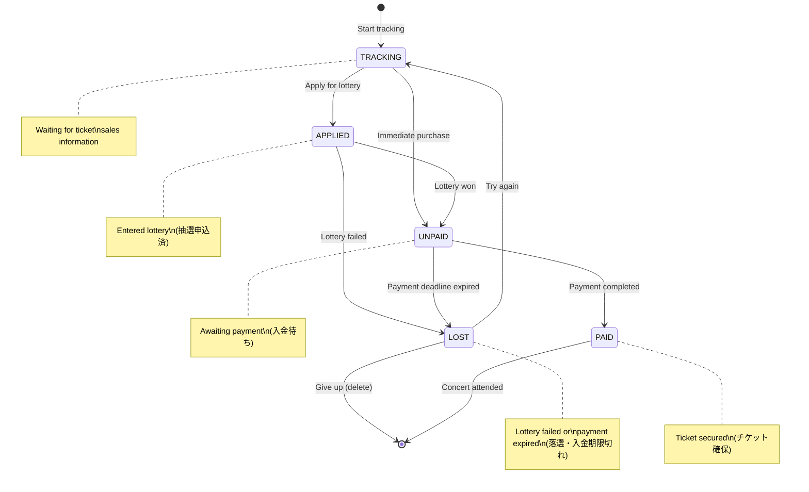

## Context

The Liverty Music platform currently auto-collects concert information and delivers push notifications to fans based on their followed artists and hype levels. Users can see upcoming concerts on a dashboard grouped by date and proximity lanes (home/nearby/away), and view concert details in a bottom sheet.

However, there is no mechanism for users to track their personal ticket acquisition progress. In the Japanese live music market, ticket purchasing involves multiple stages: monitoring for ticket sales announcements, applying for lotteries (抽選), handling lottery results, and completing payment. Users currently manage this process manually outside the platform.

This change introduces `TicketJourney` — a per-event, per-user status tracker integrated into the existing dashboard and detail sheet. It is a lightweight, user-driven feature with no automation or external integrations.

## Goals / Non-Goals

**Goals:**
- Allow users to set and change a personal ticket acquisition status for any event on their dashboard
- Display the current status as a badge on dashboard concert cards for at-a-glance tracking
- Provide status change controls in the event detail sheet
- Keep the data model generic (event-level, not concert-specific) for future event type extensibility

**Non-Goals:**
- Automated status transitions (e.g., detecting lottery results or payment completion)
- Ticket purchase links or payment integration
- Notification triggers based on journey status (e.g., "payment deadline approaching")
- Filtering or sorting dashboard concerts by journey status
- History or audit log of status changes

## State Transition Diagram

The system does not enforce transitions — users can move freely between any states.
The diagram below shows the **typical (expected) flow**, not a hard constraint.

## Decisions

### Decision 1: Entity References event_id, Not concert_id

**Choice**: `TicketJourney` references `event_id` at both the proto and database levels.

**Rationale**: The platform's entity model uses `event` as the generic scheduled performance, with `concert` as a music-specific specialization. The ticket acquisition workflow (tracking → applied → paid) is not music-specific — it applies to any ticketed event. Using `event_id` avoids a migration when the platform expands to other event types.

In the database, the `concerts` table already uses `event_id` as its primary key (FK → events), so the join path from `ticket_journeys` to concert-specific data is straightforward.

**Alternatives considered**:
- *concert_id*: Rejected; would couple the feature to music events and require migration for future event types.

---

### Decision 2: Separate RPC Service (TicketJourneyService)

**Choice**: New `rpc/ticket_journey/v1/ticket_journey_service.proto` with its own service definition.

**Rationale**: The ticket journey is a distinct domain concern from the existing `TicketService` (SBT blockchain tickets) and `ConcertService` (event catalog). Following the 1-service-per-package pattern already established in the codebase (`follow/v1/`, `concert/v1/`, `ticket/v1/`), a dedicated package avoids conflating user-subjective tracking with system-authoritative ticket records.

**Alternatives considered**:
- *Add RPCs to TicketService*: Rejected; SBT ticket minting and user journey tracking are orthogonal concerns with different lifecycles.
- *Add RPCs to ConcertService*: Rejected; ConcertService is a read-only catalog, adding user-specific mutations breaks its cohesion.

---

### Decision 3: SetStatus as Upsert (Not Separate Create/Update)

**Choice**: A single `SetStatus` RPC that performs an upsert — creates the journey if it doesn't exist, or updates the status if it does.

**Rationale**: From the user's perspective, setting a status on a concert is a single action regardless of whether they've tracked it before. Splitting into Create and Update would force the frontend to track existence state, adding complexity with no user benefit. The database supports this naturally with `INSERT ... ON CONFLICT DO UPDATE`.

**Alternatives considered**:
- *Separate Create + Update RPCs*: Rejected; adds frontend complexity and extra round-trips for no user benefit.

---

### Decision 4: ListByUser Returns event_id + status Only (Frontend Join)

**Choice**: `ListByUser` returns a flat list of `(event_id, status)` pairs. The frontend joins this with the concert list already fetched from `ConcertService.ListByFollower`.

**Rationale**: The dashboard already fetches the full concert catalog on load. Returning enriched concert data from `ListByUser` would duplicate that payload. A lightweight map (`event_id → status`) is simpler to fetch, cache, and merge. Both calls can be made in parallel on dashboard load.

**Alternatives considered**:
- *Embed Concert data in ListByUser response*: Rejected; duplicates data already available from ConcertService, increases payload size and coupling.

---

### Decision 5: No Timestamps on ticket_journeys Table

**Choice**: The `ticket_journeys` table has no `created_at` or `updated_at` columns.

**Rationale**: The journey status is a mutable, user-controlled label with no business logic depending on when it was set or changed. Adding timestamps would be speculative complexity. If analytics or history tracking is needed later, it can be added as a separate concern (e.g., an event log table).

---

### Decision 6: Status Enum Includes LOST for Lottery Failure

**Choice**: `TicketJourneyStatus` includes a `LOST` state between `APPLIED` and `UNPAID`.

**Rationale**: In the Japanese concert ticket market, lottery-based sales (抽選販売) are the dominant distribution method. Losing a lottery is a frequent, important event that affects the user's next action (re-apply for another round, try a different vendor, or give up). Without `LOST`, users would have to reset to `TRACKING` or leave `APPLIED` stale — both lose the information that they attempted and failed.

---

### Decision 7: No Enforced State Transitions

**Choice**: The backend does not validate state transitions. Users can set any status at any time.

**Rationale**: The ticket acquisition process in practice is non-linear. Users may skip states (immediate purchase skips `APPLIED`), go backward (re-enter `TRACKING` after `LOST` to try again), or jump (set `PAID` directly if they purchased outside the tracked flow). Enforcing a state machine would create friction without adding value, since the system has no way to verify the user's actual ticket status.

---

## Risks / Trade-offs

| Risk | Mitigation |
|------|------------|
| `LOST` status accumulates stale entries for past events | Past events naturally leave the dashboard as their date passes. No cleanup needed for MVP; can add archival later if table grows. |
| Users may not discover the status feature | Badge visibility on cards provides passive discovery. Detailed UX for the change controls in the detail sheet is deferred to implementation. |
| Future need for timestamps or history | Can be added as a separate `ticket_journey_events` audit table without modifying the core table. |
| Frontend must coordinate two parallel API calls on dashboard load | Both calls are independent and lightweight. `Promise.all` handles this naturally. If one fails, the dashboard still renders concerts (journey status gracefully degrades to "no status"). |
