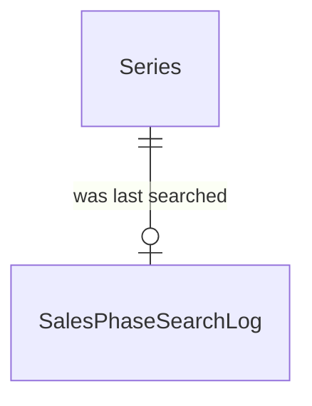

# Spec Delta

## Purpose

A Sales Phase Search Log records when a Series was last searched for ticket sales phases, so that discovery searches each series at most once in a given interval, whether or not that search found anything.

| attribute | meaning | constraint |
|---|---|---|
| series | The series that was searched | required; one log per series |
| searched time | When the series was last searched successfully | required, an absolute instant |

## ADDED Requirements

### Requirement: Searched time is not in the future

A sales phase search log's searched time SHALL NOT be after the current time.

#### Scenario: Future searched time

- **WHEN** a log carries a searched time one hour from now
- **THEN** the log is invalid
