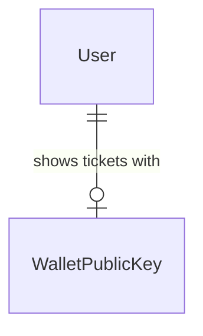

# Spec Delta

## Purpose

A WalletPublicKey is the public half of a key pair that a fan's device creates for showing tickets. The private half never leaves that device; the platform keeps only this public key and checks AdmissionCodes against it. A User has at most one, so tickets can be shown from one device at a time; registering another device's key replaces it.

| attribute | meaning | constraint |
|-----------|---------|------------|
| user | the User whose device created the key | required; one WalletPublicKey per User |
| public key | the public key, ECDSA over P-256 | required, a valid point on the curve |
| registered time | when the device registered it | required |

## ADDED Requirements

### Requirement: A public key is a valid P-256 key

A WalletPublicKey's public key SHALL be a valid ECDSA public key on the P-256 curve.

#### Scenario: Key from a browser

- **WHEN** the public key exported by a browser for a new P-256 signing key pair is given
- **THEN** it is valid

#### Scenario: Not a curve point

- **WHEN** 65 random bytes are given as the public key
- **THEN** it is invalid
