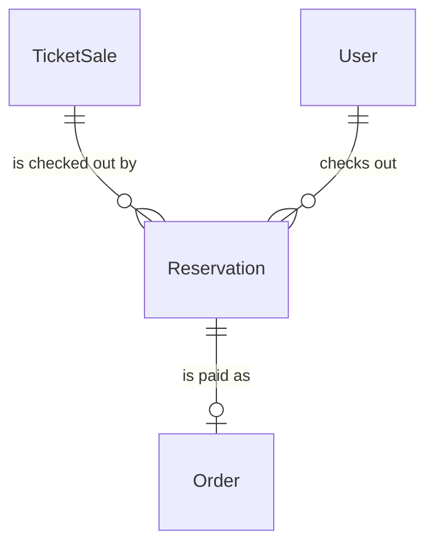
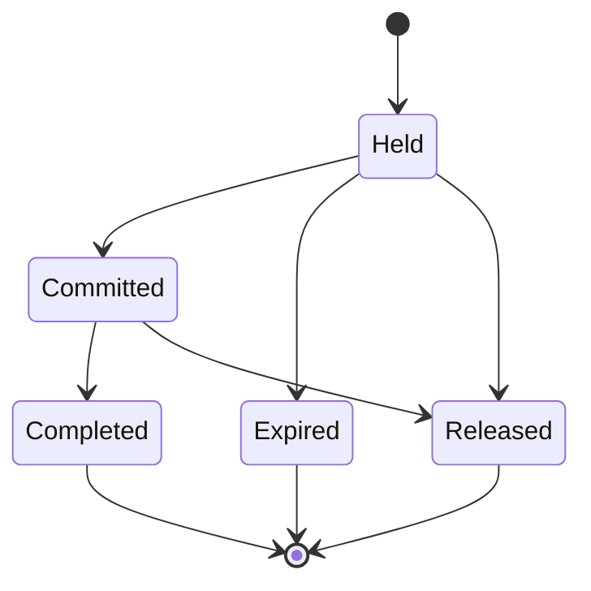

# Spec Delta

## Purpose

A Reservation is one fan's checkout on a TicketSale: it holds a count of tickets for 15 minutes while the fan enters their 本人確認 (identity check) details and authorizes their card. It ends with the tickets committed, charged and issued, or with the hold released and any card hold given back.

| attribute | meaning | constraint |
|-----------|---------|------------|
| id | the checkout's identity | required, assigned on creation |
| ticket sale | the sale it checks out from | required |
| user | the fan checking out | required |
| count | tickets held | required; 1 to the sale's per-account limit |
| amount | total to pay: the sale's price times the count, in yen | required; fixed at creation |
| holder full name | 本人確認 name for the tickets' face | absent until the fan authorizes; 1-200 characters |
| holder phone number | 本人確認 phone for the tickets' face | absent until the fan authorizes; E.164: `+` then 2-15 digits, first digit not 0 |
| authorization reference | the card hold opened for the amount | absent until the fan authorizes; set once |
| authorization release time | when the card hold was given back without charging | absent unless released; set once |
| status | lifecycle | Held, Committed, Completed, Expired or Released |
| hold expiry | when the hold lapses; it is never extended | required; 15 minutes after creation |
| created time | when the checkout started | required |
| committed time | when its tickets were committed against the stock | absent until Committed |
| capture time | when the card was charged | absent until charged; set once |
| payment reference, card brand, card last four | the charged payment and its display facets | absent until charged |

## ADDED Requirements

### Requirement: A new reservation holds for 15 minutes

A new Reservation SHALL start Held, with a hold expiry 15 minutes after its created time and an amount equal to the sale's price times its count.

#### Scenario: New checkout

- **WHEN** a fan starts a checkout for 2 tickets priced 3000 yen at 18:00
- **THEN** the Reservation is Held, its amount is 6000 yen and its hold expires at 18:15

### Requirement: Holding

A Reservation SHALL be holding at a time when it is Held and the time is before its hold expiry. Only holding Reservations count against a sale's remaining tickets, and only a holding Reservation can be committed.

#### Scenario: Within the hold

- **WHEN** a Held Reservation expiring at 18:15 is checked at 18:14
- **THEN** it is holding

#### Scenario: Hold lapsed

- **WHEN** a Held Reservation expiring at 18:15 is checked at 18:15
- **THEN** it is not holding

### Requirement: A charged reservation is never released

A Reservation with a capture time SHALL NOT become Released or Expired.

#### Scenario: Charged checkout

- **WHEN** a Committed Reservation has a capture time
- **THEN** it can only become Completed

### Requirement: Holder identity

When present, a Reservation's holder full name SHALL be 1-200 characters and its holder phone number SHALL be in E.164 form.

#### Scenario: Domestic-format phone number

- **WHEN** the holder phone number is `090-1234-5678`
- **THEN** the Reservation is invalid
