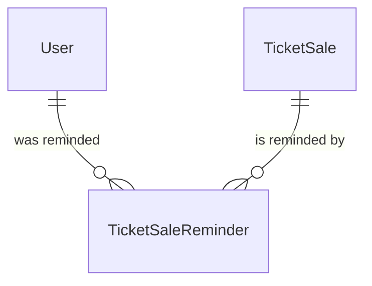

# Spec Delta

## Purpose

A Ticket Sale Reminder records that one reminder stage of one TicketSale has been sent to one User, so the same reminder is not sent to that user again. It links a User and a TicketSale, discovered or an Organizer's, and carries the stage and the time it was sent.

| attribute | meaning | constraint |
|---|---|---|
| user | The fan the reminder was sent to | required |
| ticket sale | The TicketSale the reminder is about | required |
| stage | Which point of the sale's timeline the reminder marks: `APPLY_OPEN`, `APPLY_CLOSE_24H`, `RESULT_DAY` | required; only defined values |
| sent time | When the reminder was recorded as sent | required, set when the record is created |

## ADDED Requirements

### Requirement: Stage values are closed

A ticket sale reminder's stage SHALL be one of `APPLY_OPEN`, `APPLY_CLOSE_24H` or `RESULT_DAY`; any other value SHALL be invalid.

#### Scenario: Undefined stage
- **WHEN** a reminder carries a stage that is not one of the three defined stages
- **THEN** the reminder is invalid

### Requirement: Stages are anchored by method

A reminder stage SHALL be anchored on exactly one milestone of the TicketSale, and only these stages SHALL apply:

- `APPLY_OPEN`: on a Lottery sale, at the start time. On a FirstCome sale, 30 minutes before the start time.
- `APPLY_CLOSE_24H`: on a Lottery sale only, 24 hours before the end time.
- `RESULT_DAY`: on a Lottery sale with a result time only, on the calendar day of that result time.

These stages SHALL apply alike to a discovered sale and to an Organizer's sale.

#### Scenario: Lottery stages
- **WHEN** a discovered Lottery sale opens on 5 October 18:00, closes on 22 October 23:59 and has the result time 3 November 15:00
- **THEN** `APPLY_OPEN` is anchored on 5 October 18:00, `APPLY_CLOSE_24H` on 21 October 23:59 and `RESULT_DAY` on 3 November

#### Scenario: First-come stage
- **WHEN** a FirstCome sale opens on 6 October 19:00
- **THEN** `APPLY_OPEN` is anchored on 6 October 18:30, and neither `APPLY_CLOSE_24H` nor `RESULT_DAY` applies

#### Scenario: Lottery without a result time
- **WHEN** a discovered Lottery sale has no result time
- **THEN** `RESULT_DAY` does not apply to that sale

#### Scenario: Organizer's lottery
- **WHEN** an Organizer's Lottery sale opens on 5 October 18:00 and ends on 12 October 23:59
- **THEN** `APPLY_OPEN` is anchored on 5 October 18:00, `APPLY_CLOSE_24H` on 11 October 23:59 and `RESULT_DAY` on 12 October
