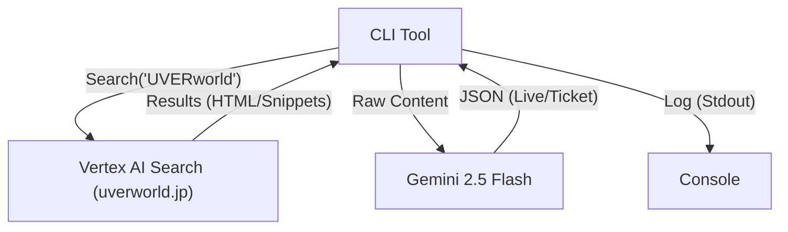

## Architecture Design: Simplified Prototype (UVERworld)

## Context
We need to extract structured live information (dates, venues) from artist websites. Building custom scrapers for every site is unscalable. We will use a Generative AI approach.

## Goals / Non-Goals
- **Goals**: Validate if Vertex AI Search + Gemini can accurately extract schedule data from `uverworld.jp`.
- **Non-Goals**: Production-ready database storage or multi-artist support (Prototype only).

## Decisions

### Decision: Architecture Scaffolding (CLI)
We will build a simple CLI tool instead of a full worker service for this prototype to enable fast iteration and manual verification.

### Decision: Vertex AI Search for Crawling
- **Why**: "Advanced Website Indexing" handles dynamic content rendering and crawling management managed by Google.
- **Resource**: `google_discovery_engine_data_store` (Website type).
- **Reference**: [GCP Docs: Search data store](https://cloud.google.com/generative-ai-app-builder/docs/create-data-store-es)

### Decision: Gemini 2.5 Flash for Parsing
- **Why**: Cost-effective and explicitly selected by user over Pro. Sufficient context window for search results.
- **Reference**: [GCP Docs: Models](https://cloud.google.com/vertex-ai/generative-ai/docs/models?hl=ja)

## Risks / Trade-offs
- **Risk**: Gemini formatting errors. **Mitigation**: Use strict JSON schema in prompt.

