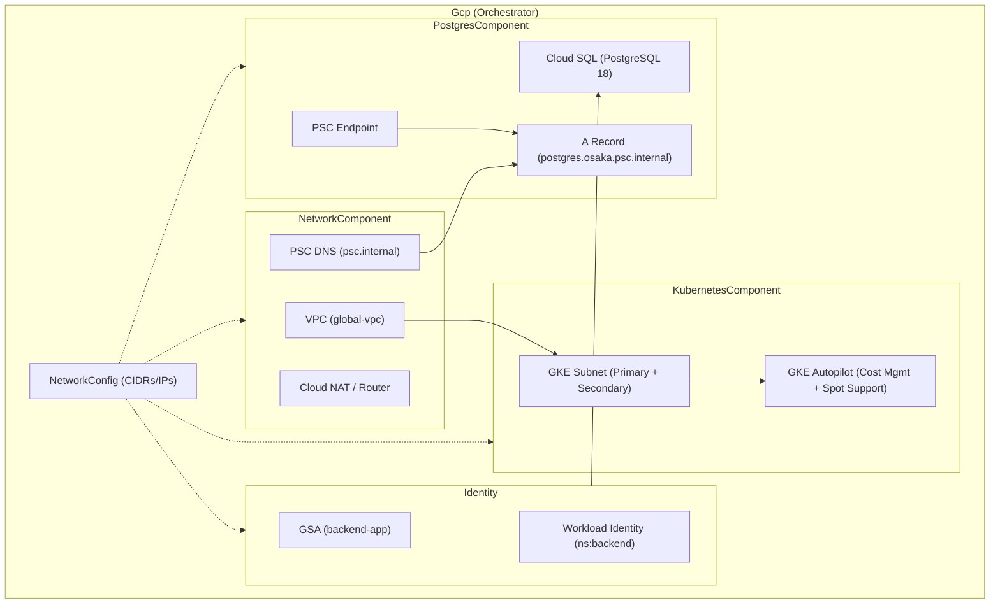

# Design: GCP Infrastructure Refactoring

## Architecture

We have refactored the infrastructure to improve modularity, centralize network configuration, and standardize identity management using Workload Identity.

### Infrastructure Diagram

## 1. Network Design

- **VPC**: `global-vpc` (Custom mode, Global routing).
- **Region**: `asia-northeast2` (Osaka).
- **Subnet**: Specialized subnets for GKE and PSC endpoints.
- **CIDR Management**: Centralized in the `Gcp` orchestrator.
  - Nodes: `10.10.0.0/20`
  - Pods: `10.20.0.0/16`
  - Services: `10.30.0.0/20`
- **Private DNS**: Shared zone `psc.internal` for Private Service Connect services.

## 2. Cloud SQL Design (PostgreSQL 18)

- **Connectivity**: **Private Service Connect (PSC)**.
- **DNS**: `postgres.osaka.psc.internal` points to the PSC Endpoint IP.
- **Identity**: IAM Database Authentication enabled.
- **Cost**: `db-f1-micro` tier for development; HA and PITR disabled in `dev` to reduce costs.

## 3. GKE Design (Autopilot)

- **Mode**: Fully managed Autopilot.
- **Identity**: **Workload Identity** enabled. GKE Pods in the `backend` namespace impersonate the `backend-app` GCP Service Account.
- **Cost Management**: GKE Cost Management enabled. Support for Spot VMs via Pod-level `nodeSelector`.

## 4. Identity Management

- **Orchestrator Level**: GSA creation and WI binding are managed in the `Gcp` class.
- **Role Assignment**: `roles/cloudsql.instanceUser` granted to the backend Service Account.
