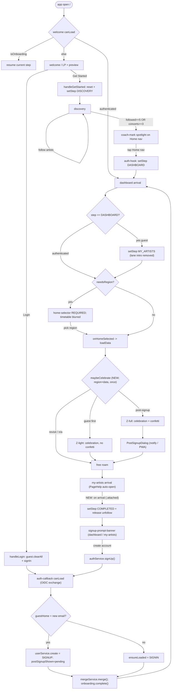

## Context

Onboarding is implemented as a forward-only, hard-gated flow enforced by a single global route guard (`AuthHook.canLoad`, `src/hooks/auth-hook.ts`) plus per-route `canLoad` hooks. The guard's philosophy is **"on block, silently redirect"**, which produces dead taps (a locked bottom-nav tab does nothing), no path back to Welcome, and no login entry once onboarding starts.

The implementation has also **drifted from the specs**: the dashboard "Lane Intro" tour (blocker divs, scroll lock, nav dimming, a celebration overlay at the end) was removed from code — `dashboard-route.ts attached()` now simply advances `DASHBOARD → MY_ARTISTS` ("the lane introduction sequence was removed; visiting the dashboard is now sufficient"). Left behind:
- `celebration-overlay` — fully built (incl. CSS confetti) but registered-yet-never-rendered (dead).
- `nav-dimming-service` — only ever called with `setDimmed(false)` (vestigial).
- Stale specs: `dashboard-lane-introduction`, `onboarding-celebration`, plus Lane-Intro/nav-dimming sections of `onboarding-tutorial`, `frontend-onboarding-flow`, and `state-transition-diagram`.

This change relaxes the guard toward a **soft-gated, free-roam guest model**, revives the celebration as a deliberate two-tier payoff, and re-aligns the drifted specs. It builds on the already-merged `refine-onboarding-copy` (the discovery coach mark is now tap-to-dismiss).

### Current flow (post Lane-Intro removal), end to end

### Corrected onboarding state machine (replaces the stale `state-transition-diagram`)

```mermaid
stateDiagram-v2
  [*] --> lp
  lp --> discovery : Get Started
  discovery --> dashboard : tap Home nav (coach-mark / readyForDashboard)
  state "my-artists" as my_artists
  dashboard --> my_artists : dashboard .attached() (Lane Intro removed)
  my_artists --> completed : my-artists arrival .attached() (NEW; was: hype change)
  completed --> [*]
```

The stale diagram still shows a `detail` state and a `discovery --> dashboard : "Generate Dashboard CTA"` transition — both removed long ago. This change deletes those and updates the completion trigger.

## Goals / Non-Goals

**Goals:**
- No guard-blocked navigation is a silent no-op; every block explains itself.
- Guests can reach Settings (auth-entry + language) from the discovery step, and roam freely after dashboard.
- Account-only features are hidden in-place, never error-walled.
- A two-tier celebration provides an honest emotional payoff (light at creation, full at conversion) without re-introducing hard gates.
- Specs match the post-Lane-Intro implementation.

**Non-Goals:**
- Re-introducing Lane Intro, blocker divs, or scroll lock.
- A full guest experience for every screen (Tickets gets only route access + its existing empty state; no new Tickets guest UI is designed here).
- Backend persistence of guest language preference (local-only until sign-in).
- Changing the discovery progression condition (`followed >= 5 OR artistsWithConcerts >= 3`).

## Decisions

### D1. Feedback-on-block replaces silent redirect (scope A1)
The guard keeps redirecting to the legal route, but **publishes a contextual `Snack`** (or re-lights the coach mark) instead of redirecting silently. The snackbar copy is **gating-aware**: a dashboard tap before the threshold yields "あと N 組フォローでタイムテーブルが見られます" derived from `DASHBOARD_FOLLOW_TARGET - followedCount`; other locked taps get a generic "アーティストを見つけたら開放されます".
- *Alternative considered*: visually disable the nav tabs on discovery (mirror the old Lane-Intro dimming). Rejected — dimming says "you can't", a snackbar says "here's how to", which fits the soft-gate direction and gives progress feedback.

### D2. Settings opens at the discovery step and becomes guest-adaptive (scope A2, A3)
Settings is already 80% guest-safe (home-area, language, sound, about). Only the ACCOUNT section assumes auth. We:
- Allow the `settings` route during onboarding from `discovery` onward (route-guard exception).
- Render ACCOUNT conditionally: **guest** → "ログイン / 新規登録" CTA, **hiding** email-verification + sign-out; **authenticated** → current UI.
- Language change for a guest applies via `I18N.setLocale()` only (no `UserService.UpdatePreferredLanguage`); home-area reads/writes guest storage.
- *Rationale*: Settings becomes the **home of the persistent login affordance**, which directly resolves the "returning user mis-taps Get Started and is trapped" problem without needing Welcome to be reachable.
- *Alternative considered*: put a login button in a global header. Rejected — Settings already exists, is in the bottom nav, and naturally houses account + language.

### D3. Free roam after dashboard; features hidden at point of use (scope A4)
Replace the COMPLETED-guest hard block (Priority 3 currently allows only dashboard/discovery/my-artists and toasts "login required" elsewhere) with: **all routes allowed**; each screen hides account-only affordances. This is the `guest-mode-access` policy capability.

### D4. Welcome is reachable during onboarding (scope A5)
Relax `welcome-route.canLoad` and the guard's "no onboardingStep" redirect so Welcome can be revisited (value-prop re-read). Login lives in Settings (D2), so Welcome-return is a secondary affordance, not the login lifeline.
- *Trade-off*: `handleGetStarted` preserves guest data while `handleLogin` clears it; revisiting Welcome must not silently reset onboarding. Welcome's CTA still calls `setStep(DISCOVERY)` only on explicit tap, so merely viewing Welcome is safe.

### D5. Completion triggers on My Artists arrival, not hype change (scope A6)
Move the `setStep(COMPLETED)` from `onHypeInput()` to `my-artists-route.attached()` (`if isOnboardingStepMyArtists → deactivateSpotlight() + setStep(COMPLETED)`).
- *Why arrival over help-close*: implemented in one file (no new PageHelp API), and robust — closing-the-help requires a close event that does **not** fire if the user navigates away with the sheet open, leaving onboarding stuck. Arrival always fires.
- *Lifecycle ordering*: Aurelia 2 runs child `attached` before parent, so `PageHelp.attached()` (which auto-opens while `isOnboarding` is still true) runs **before** the route's `attached()` completes onboarding — auto-open is preserved.
- *Consequence (accepted)*: `isOnboarding` flips false on arrival, releasing the My Artists unfollow block. This is consistent with the free-roam direction.

### D6. Celebration is one component, two tiers, gated by `maybeCelebrate()` (scope B)
Revive `celebration-overlay` with a new `@bindable confetti = true`; the confetti container renders `if.bind="confetti"`. A single `maybeCelebrate()` is the only fire point, called from **both** `dashboard-route.attached()` (when `!needsRegion`, data ready) and `onHomeSelected()` (after `loadData` resolves) so it always fires once the timetable is real, guarded by a localStorage "shown" flag.
- Z-light (`confetti=false`) = guest's first dashboard; Z-full (`confetti=true`) = post-signup (`postSignupShown==='pending'`), and on dismiss it opens PostSignupDialog (emotion → setup).
- *Why gated on home-selector*: the timetable is `data-blurred` while `needsRegion`; celebrating "your timetable is complete" before a region is chosen would celebrate an empty, blurred board.
- *Why two tiers*: this completes an emotional escalation the funnel already implies — **light ack (created) → signup banner (nudge) → confetti (welcome member)** — without a hard gate.
- *Optional interaction differentiation*: Z-light may auto-dismiss briefly while Z-full is tap-to-dismiss (left to implementation).

### D7. Drift cleanup is bundled, not deferred (scope C)
Delete `nav-dimming-service`; remove `dashboard-lane-introduction`; trim Lane-Intro/Celebration/nav-dimming from the onboarding specs; correct the state diagram. Bundling avoids stacking new behavior on top of fictional specs (e.g. modifying `onboarding-tutorial`'s Lane-Intro section is meaningless unless we first delete it).

## Risks / Trade-offs

- **Guest language change is local-only** → On the next sign-in the backend `preferred_language` wins; a guest's locale choice may appear to "reset". Mitigation: scope says guest language is a convenience; document the non-persistence; merge could optionally carry locale (out of scope).
- **Free roam exposes half-empty screens** (e.g. Tickets for a guest) → Mitigation: rely on each screen's existing empty state; only Settings gets bespoke guest UI in this change; Tickets guest polish is a follow-up.
- **Completion-on-arrival changes a long-standing invariant** (hype no longer required) → Mitigation: covered by the route-guard + my-artists spec deltas and unit tests; behavioral break is intentional and called out BREAKING.
- **maybeCelebrate double-fire** across the two call sites → Mitigation: single localStorage "shown" guard checked inside `maybeCelebrate()`; both call sites are idempotent.
- **Spec deletion churn** (8 modified + 1 removed capability) → Mitigation: most edits are removals re-aligning to shipped code; the corrected diagrams in this design are the reference.

## Migration Plan

- Pure frontend; no proto/BSR/backend coordination. Ships in one frontend PR after the specification PR merges.
- localStorage compatibility: reuse existing `onboardingStep` keys; add one celebration-shown key. No migration of stored values required.
- Rollback: revert the frontend PR; the spec deltas are documentation-only and safe to leave or revert independently.

## Open Questions

- Should the guest's locale choice be merged into the backend on sign-up (carry `I18N.getLocale()` into the create call), or remain local-only? (Currently: local-only.)
- Z-light form factor — confirmed as the celebration-overlay with `confetti=false`; final copy and whether it auto-dismisses are left to implementation.
- Tickets guest surface — accept the existing empty state for now, or design a login-wall CTA? (Currently: out of scope.)
