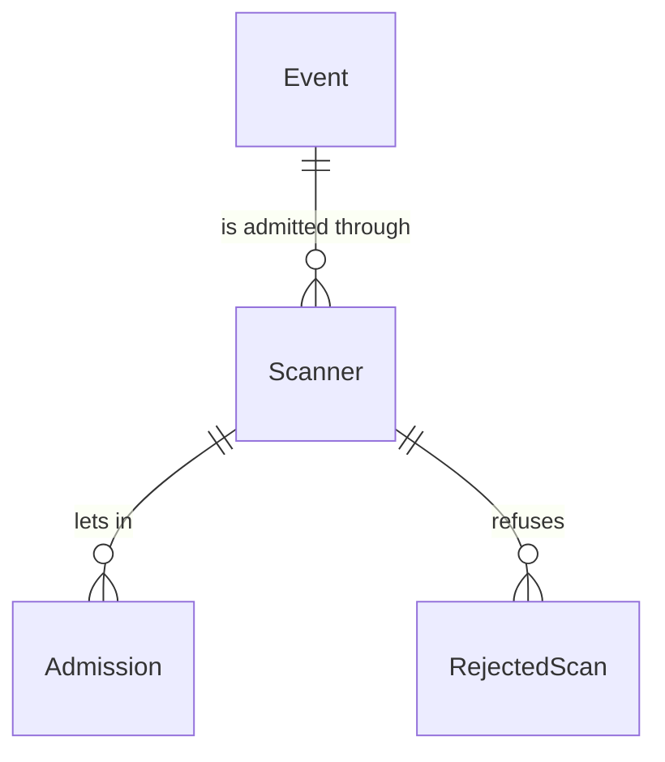
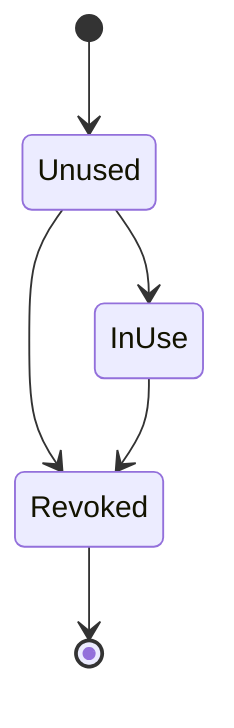

# Spec Delta

## Purpose

A Scanner is one device's right to admit fans to one event during that event's admission window, issued by the Organizer for venue staff who have no account of their own. It grants nothing but admission to that event. The Organizer hands it over as a link that carries its link token; the first device that opens the link creates a key pair and binds its public key to the Scanner, and every later call must be signed with that device's private key.

| attribute | meaning | constraint |
|-----------|---------|------------|
| id | the Scanner's identity | required, assigned on creation |
| event | the one event the Scanner admits to | required |
| number | the Scanner's number within its event, shown to the Organizer and to staff as a label such as 受付1, and in admission results | required, assigned on creation; never reused within the event |
| link token | the secret part of the link the Organizer hands to venue staff | required, random, at least 128 bits, assigned on creation; never shown again once the Scanner is InUse |
| bound public key | the public key of the device the Scanner is bound to, ECDSA over P-256 | absent until the Scanner is bound; set once |
| status | lifecycle | Unused, InUse or Revoked |
| bound time | when a device first opened the link | absent until the Scanner is bound |
| revoked time | when the Organizer revoked the Scanner | absent until revoked |

## ADDED Requirements

### Requirement: Scanners are numbered in issue order

A Scanner's number SHALL be 1 for the first Scanner of its event and, for each later Scanner, one more than the highest number among the event's Scanners, Revoked ones included, so that a number always means the same Scanner of that event.

#### Scenario: First scanner

- **WHEN** the first Scanner of an event is created
- **THEN** its number is 1

#### Scenario: After a revoked scanner

- **WHEN** an event has Scanner 1 (InUse) and Scanner 2 (Revoked) and a new Scanner is created
- **THEN** the new Scanner's number is 3

### Requirement: A new scanner starts Unused

A new Scanner SHALL start Unused, with a fresh random link token, no bound public key, no bound time and no revoked time.

#### Scenario: New scanner

- **WHEN** a Scanner is created
- **THEN** it is Unused, has a link token and has no bound public key

### Requirement: Only a scanner that is not Revoked can be used

A Scanner SHALL be usable exactly when its status is Unused or InUse.

#### Scenario: Scanner in use

- **WHEN** a Scanner is InUse
- **THEN** it is usable

#### Scenario: Revoked scanner

- **WHEN** a Scanner is Revoked
- **THEN** it is not usable

### Requirement: A call is proven by the bound device

A call through an InUse Scanner SHALL be proven when it carries a signature that verifies with the Scanner's bound public key over the link token, the call's content and a signed time, and that signed time is at most 30 seconds before and at most 15 seconds after the time the call is checked. A call through an Unused or Revoked Scanner SHALL never be proven.

#### Scenario: Call from the bound device

- **WHEN** the bound device signs a call at 18:30:00 and it is checked at 18:30:01
- **THEN** the call is proven

#### Scenario: Call from another device

- **WHEN** a call is signed with a key other than the bound public key
- **THEN** the call is not proven

#### Scenario: Replayed call

- **WHEN** a call signed at 18:30:00 is sent again and checked at 18:31:00
- **THEN** the call is not proven

### Requirement: Admission window

The admission window of a Scanner SHALL be derived from its event's current local date, open time and start time, in Japan time. It SHALL open 3 hours before the open time, or 3 hours before the start time when the event has no open time, and close at 04:00 on the day after the local date. A time is inside the window when it is at or after the opening and before the closing. An event without a start time SHALL have no admission window.

#### Scenario: Usual evening show

- **WHEN** the event is on 2026-11-20 with open time 18:00 and start time 19:00
- **THEN** the window is from 2026-11-20 15:00 to 2026-11-21 04:00

#### Scenario: No open time

- **WHEN** the event is on 2026-11-20 with start time 19:00 and no open time
- **THEN** the window opens at 2026-11-20 16:00

#### Scenario: Before the window

- **WHEN** the window opens at 15:00 and the time is 14:59
- **THEN** the time is outside the window

#### Scenario: Window closed

- **WHEN** the window closes at 2026-11-21 04:00 and the time is 2026-11-21 04:00
- **THEN** the time is outside the window

#### Scenario: No start time

- **WHEN** the event has no start time
- **THEN** it has no admission window
