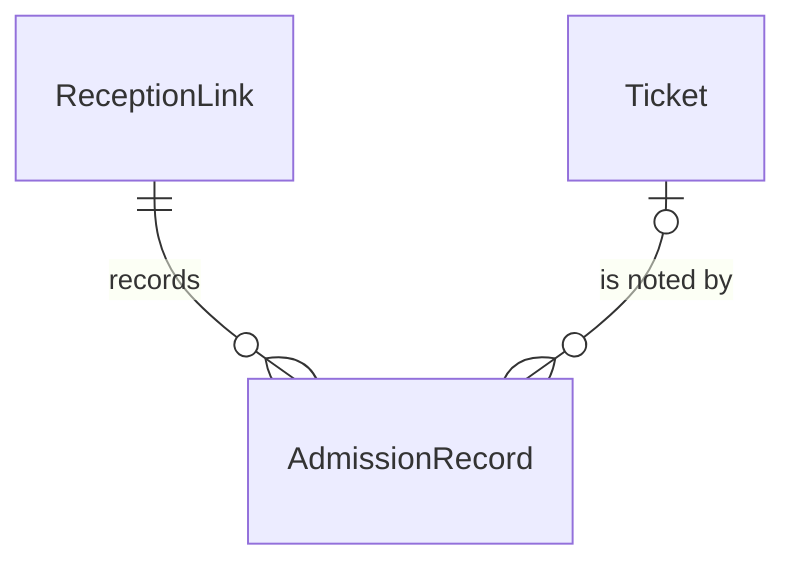

# Spec Delta

## Purpose

An AdmissionRecord is the permanent note of one scan outcome at the venue: a Ticket admitted, or a scan rejected and why, by which ReceptionLink and when. Records are never changed or removed, so that they can later serve as evidence that a holder attended, for example against a chargeback.

| attribute | meaning | constraint |
|-----------|---------|------------|
| id | the record's identity | required, assigned when appended |
| event | the event of the ReceptionLink that scanned | required |
| reception link | the ReceptionLink that scanned | required |
| ticket | the Ticket the outcome is about | required for Admitted and for a rejection about a known Ticket; absent when the token could not be trusted |
| outcome | Admitted or Rejected | required |
| reason | why a scan was rejected | required when Rejected, absent when Admitted: Forged, Expired, OtherEvent, NotHolder, Voided or AlreadyAdmitted |
| time | when the scan was decided | required |

## ADDED Requirements

### Requirement: Outcome and reason agree

An Admitted record SHALL name a Ticket and carry no reason. A Rejected record SHALL carry a reason. A Rejected record with reason NotHolder, Voided or AlreadyAdmitted SHALL name a Ticket; one with reason Forged SHALL name none.

#### Scenario: Admitted

- **WHEN** a record is Admitted with a Ticket and no reason
- **THEN** it is valid

#### Scenario: Admitted with a reason

- **WHEN** a record is Admitted with reason AlreadyAdmitted
- **THEN** it is invalid

#### Scenario: Forged scan

- **WHEN** a record is Rejected with reason Forged and no Ticket
- **THEN** it is valid
