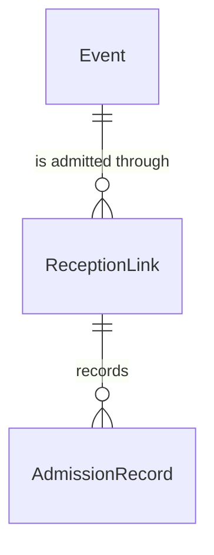
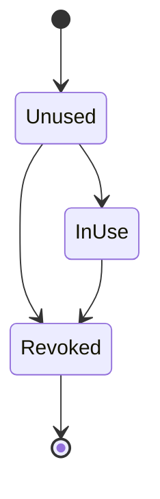

# Spec Delta

## Purpose

A ReceptionLink is the link an Organizer issues so that one device, held by venue staff without an account of their own, can admit fans to one event during that event's reception window. It grants nothing but admission to that event. The first device that opens it creates a key pair and binds its public key to the link; every later call must be signed with that device's private key.

| attribute | meaning | constraint |
|-----------|---------|------------|
| id | the link's identity | required, assigned on creation |
| event | the one event the link admits to | required |
| name | the label the Organizer gives the device, shown in admission records (for example 受付A) | required, 1-20 characters after trimming surrounding spaces; unique among the event's links that are not Revoked |
| token | the secret part of the link's URL | required, random, at least 128 bits, assigned on creation; never shown again once the link is InUse |
| bound public key | the public key of the device the link is bound to, ECDSA over P-256 | absent until the link is bound; set once |
| status | lifecycle | Unused, InUse or Revoked |
| created time | when the link was issued | required |
| bound time | when a device first opened the link | absent until the link is bound |
| revoked time | when the Organizer revoked the link | absent until revoked |

## ADDED Requirements

### Requirement: A link name is short and present

A ReceptionLink name SHALL be 1-20 characters after surrounding spaces are trimmed.

#### Scenario: Usual name

- **WHEN** a link is named `受付A`
- **THEN** the name is valid

#### Scenario: Blank name

- **WHEN** a link is named with spaces only
- **THEN** the name is invalid

#### Scenario: Name too long

- **WHEN** a link is named with 21 characters
- **THEN** the name is invalid

### Requirement: A new link starts Unused

A new ReceptionLink SHALL start Unused, with a fresh random token, no bound public key, no bound time and no revoked time.

#### Scenario: New link

- **WHEN** a ReceptionLink is created
- **THEN** it is Unused, has a token and has no bound public key

### Requirement: Only a link that is not Revoked can be used

A ReceptionLink SHALL be usable exactly when its status is Unused or InUse.

#### Scenario: Link in use

- **WHEN** a link is InUse
- **THEN** it is usable

#### Scenario: Revoked link

- **WHEN** a link is Revoked
- **THEN** it is not usable

### Requirement: A call is proven by the bound device

A call through an InUse ReceptionLink SHALL be proven when it carries a signature that verifies with the link's bound public key over the link token, the call's content and a signed time, and that signed time is at most 30 seconds before and at most 15 seconds after the time the call is checked. A call through an Unused or Revoked link SHALL never be proven.

#### Scenario: Call from the bound device

- **WHEN** the bound device signs a call at 18:30:00 and it is checked at 18:30:01
- **THEN** the call is proven

#### Scenario: Call from another device

- **WHEN** a call is signed with a key other than the bound public key
- **THEN** the call is not proven

#### Scenario: Replayed call

- **WHEN** a call signed at 18:30:00 is sent again and checked at 18:31:00
- **THEN** the call is not proven

### Requirement: Reception window

The reception window of a ReceptionLink SHALL be derived from its event's current local date and open time, in Japan time. It SHALL open 3 hours before the open time and close at 04:00 on the day after the local date. A time is inside the window when it is at or after the opening and before the closing. An event without an open time SHALL have no reception window.

#### Scenario: Usual evening show

- **WHEN** the event is on 2026-11-20 with open time 18:00
- **THEN** the window is from 2026-11-20 15:00 to 2026-11-21 04:00

#### Scenario: Before the window

- **WHEN** the window opens at 15:00 and the time is 14:59
- **THEN** the time is outside the window

#### Scenario: Window closed

- **WHEN** the window closes at 2026-11-21 04:00 and the time is 2026-11-21 04:00
- **THEN** the time is outside the window

#### Scenario: No open time

- **WHEN** the event has no open time
- **THEN** it has no reception window
