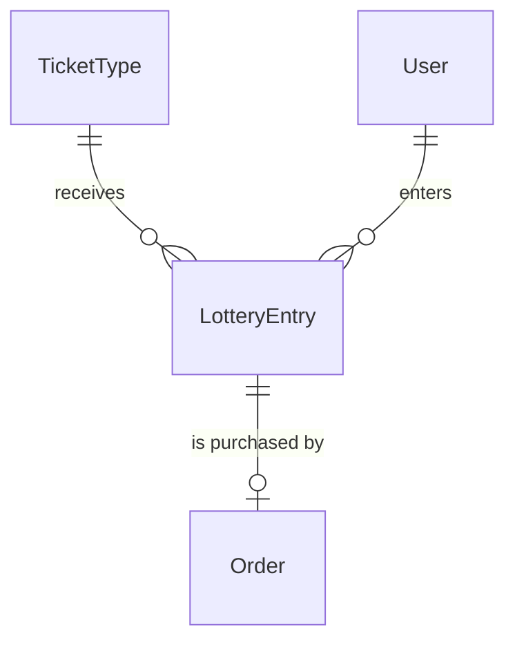
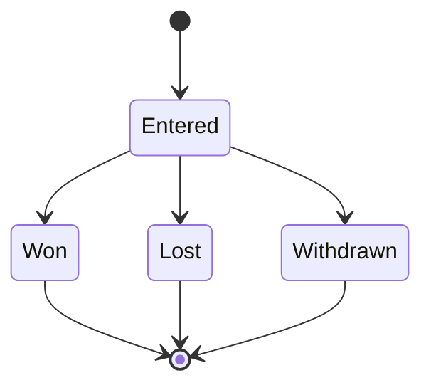

# Spec Delta

## Purpose

A LotteryEntry is one fan account's entry into the lottery for one TicketType: a request for a companion group of tickets allocated all-or-nothing, and the reference to the authorization (hold) placed on the fan's card for the amount until the draw. The fan's 本人確認 (identity check) details are the User's full name and phone number.

| attribute | meaning | constraint |
|-----------|---------|------------|
| id | the entry's identity | required, assigned on creation |
| ticket type | the TicketType entered | required; its sale's method is Lottery |
| user | the fan account that entered | required |
| requested ticket count | size of the companion group, allocated all-or-nothing | required, 1 to the ticket type's per-account limit |
| authorization | reference to the hold placed on the fan's card | required, 1-255 characters, opaque |
| state | lifecycle | Entered, Won, Lost or Withdrawn |
| draw position | the entry's position in its ticket type's random draw order | absent before the draw; set only by the draw |

## ADDED Requirements

### Requirement: A new entry starts Entered

A LotteryEntry SHALL start in state Entered, with no draw position.

#### Scenario: New entry
- **WHEN** a LotteryEntry is created
- **THEN** its state is Entered and it has no draw position

### Requirement: Requested ticket count fits the ticket type

The requested ticket count SHALL be at least 1 and at most the ticket type's per-account limit.

#### Scenario: Count within the limit
- **WHEN** the ticket type allows 4 tickets per account and 2 are requested
- **THEN** the count is valid

#### Scenario: Zero tickets requested
- **WHEN** 0 tickets are requested
- **THEN** the count is invalid

#### Scenario: Count over the limit
- **WHEN** the ticket type allows 4 tickets per account and 5 are requested
- **THEN** the count is invalid

### Requirement: Active entries

An entry SHALL be active unless its state is Withdrawn; Won and Lost entries stay active.

#### Scenario: Withdrawn entry is not active
- **WHEN** the state is Withdrawn
- **THEN** the entry is not active

#### Scenario: Drawn entry is active
- **WHEN** the state is Won or Lost
- **THEN** the entry is active

### Requirement: Withdrawable only while Entered

An entry SHALL be withdrawable only while its state is Entered, that is before the draw has run for it.

#### Scenario: Entered entry
- **WHEN** the state is Entered
- **THEN** the entry is withdrawable

#### Scenario: Drawn or withdrawn entry
- **WHEN** the state is Won, Lost or Withdrawn
- **THEN** the entry is not withdrawable

### Requirement: Accepted card brands

A card SHALL be accepted for an entry unless its brand is American Express; a card whose brand is unknown is accepted.

#### Scenario: American Express
- **WHEN** the card brand is American Express
- **THEN** the card is not accepted

#### Scenario: Other or unknown brand
- **WHEN** the card brand is Visa, Mastercard, JCB, Diners, Discover or unknown
- **THEN** the card is accepted
