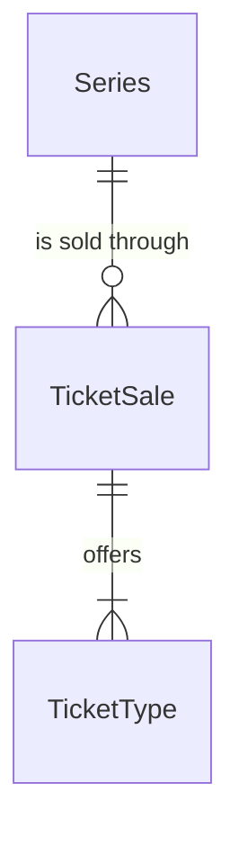

# Spec Delta

## Purpose

A TicketSale is one opportunity to get tickets for some or all events of an Organizer's Series, such as a fan-club presale or a general sale (受付): its name, how tickets are allocated, the window in which fans take part and whether they must hold a verified identity. What it offers for each event is a TicketType.

| attribute | meaning | constraint |
|-----------|---------|------------|
| id | the sale's identity | required, assigned on creation |
| series | the Series whose events the sale offers | required |
| name | the label fans and operators see, for example ファンクラブ先行 | required, 1-100 characters |
| method | how tickets are allocated | Lottery |
| start time | when the sale opens | required, before the end time |
| end time | when the sale closes | required; for Lottery, 1 to 14 days after the start time inclusive |
| verification requirement | whether fans must hold a verified identity to take part | None (the default), Verified-any or JPKI-only |
| drawn time | when the lottery draw ran | absent until the draw runs; Lottery only |

## ADDED Requirements

### Requirement: A lottery window lasts 1 to 14 days

A TicketSale's end time SHALL be after its start time. When its method is Lottery, the window SHALL last at least 1 day and at most 14 days.

#### Scenario: Lottery window within bounds
- **WHEN** a Lottery sale runs for 10 days
- **THEN** the window is valid

#### Scenario: Lottery window shorter than 1 day
- **WHEN** a Lottery sale runs for 23 hours
- **THEN** the window is invalid

#### Scenario: Lottery window longer than 14 days
- **WHEN** a Lottery sale runs for 14 days and 1 hour
- **THEN** the window is invalid

#### Scenario: End not after start
- **WHEN** the end time equals or precedes the start time
- **THEN** the window is invalid

### Requirement: A sale has a name

A TicketSale's name SHALL be 1 to 100 characters.

#### Scenario: Named sale
- **WHEN** a sale is named ファンクラブ先行
- **THEN** the name is valid

#### Scenario: Empty name
- **WHEN** a sale has an empty name
- **THEN** the sale is invalid

### Requirement: Verification requirement

A sale SHALL require verification when its verification requirement is Verified-any or JPKI-only; both require the fan to hold an Active verified identity. A sale created without a requirement SHALL have the requirement None.

#### Scenario: No requirement given
- **WHEN** a sale is created without a verification requirement
- **THEN** its requirement is None and it does not require verification

#### Scenario: Verified-any or JPKI-only
- **WHEN** the requirement is Verified-any or JPKI-only
- **THEN** the sale requires an Active verified identity

### Requirement: Window open at an instant

A sale's window SHALL be open at an instant when the instant is at or after the start time and before the end time.

#### Scenario: Before start
- **WHEN** the instant precedes the start time
- **THEN** the window is not open

#### Scenario: Between start and end
- **WHEN** the instant is at the start time or later and before the end time
- **THEN** the window is open

#### Scenario: At end
- **WHEN** the instant is the end time or later
- **THEN** the window is not open

### Requirement: Two windows overlap

Two sales' windows SHALL overlap when each one starts before the other ends.

#### Scenario: Back to back
- **WHEN** one sale ends at 2026-11-10 23:59 and the other starts at 2026-11-10 23:59
- **THEN** the windows do not overlap

#### Scenario: Overlapping
- **WHEN** one sale runs from 1 to 10 November and the other from 8 to 20 November
- **THEN** the windows overlap

### Requirement: Drawn sale

A Lottery sale SHALL count as drawn once its drawn time is set.

#### Scenario: Drawn time set
- **WHEN** the drawn time is set
- **THEN** the sale is drawn

#### Scenario: Drawn time absent
- **WHEN** the drawn time is absent
- **THEN** the sale is not drawn
