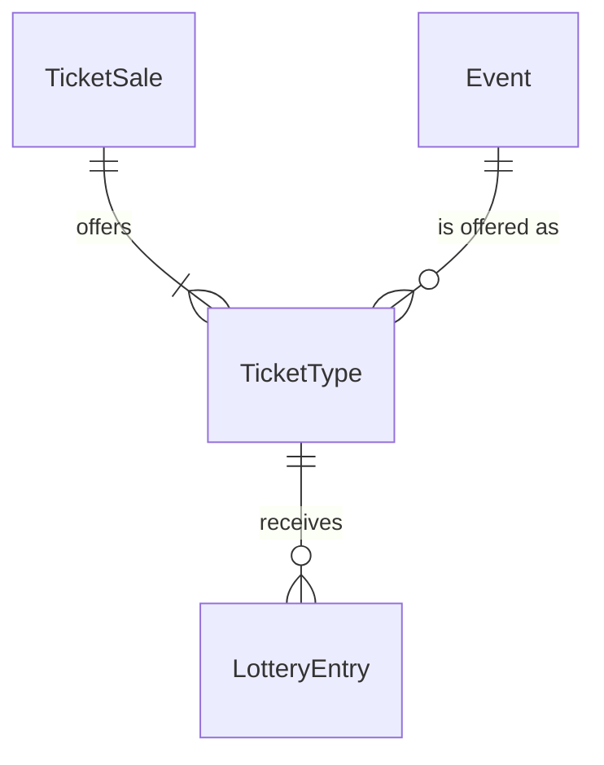

# Spec Delta

## Purpose

A TicketType is what one TicketSale offers for one event: the price of one ticket, how many tickets are offered and how many tickets one account may hold for the event.

| attribute | meaning | constraint |
|-----------|---------|------------|
| id | the ticket type's identity | required, assigned on creation |
| sale | the TicketSale that offers it | required |
| event | the event it admits to | required; an event of the sale's Series; one TicketType per event in a sale |
| price | price of one ticket, 税込 (tax-inclusive), in whole yen | required, 1 to 1,000,000 |
| quantity | tickets offered | required, at least 1 |
| per-account limit | most tickets one account may hold for the event once this sale is done, counting tickets it already holds | required, 1 to 10 and at most the quantity; 4 when not given |

## ADDED Requirements

### Requirement: Price, quantity and per-account limit

A TicketType's price SHALL be 1 to 1,000,000 yen and its quantity SHALL be at least 1. Its per-account limit SHALL be at least 1, at most the quantity and at most 10, because one admission code presents at most 10 tickets and a companion group enters together with one code. A TicketType created without a per-account limit SHALL have a limit of 4.

#### Scenario: Valid sizing
- **WHEN** the quantity is 100, the per-account limit is 4 and the price is 8000 yen
- **THEN** the TicketType is valid

#### Scenario: No limit given
- **WHEN** a TicketType with a quantity of 100 is created without a per-account limit
- **THEN** its per-account limit is 4

#### Scenario: Limit larger than the quantity
- **WHEN** the quantity is 3 and the per-account limit is 4
- **THEN** the TicketType is invalid

#### Scenario: Limit larger than one admission code
- **WHEN** the quantity is 100 and the per-account limit is 11
- **THEN** the TicketType is invalid

#### Scenario: Price out of range
- **WHEN** the price is 0 yen or 1,000,001 yen
- **THEN** the TicketType is invalid

### Requirement: Amount for a requested count

The amount for a requested ticket count SHALL be the price multiplied by the count, in yen.

#### Scenario: Two tickets
- **WHEN** the price is 8000 yen and 2 tickets are requested
- **THEN** the amount is 16000 yen

### Requirement: Room under the per-account limit

A requested ticket count SHALL fit the per-account limit for an account when the tickets the account already holds for the event plus the requested count are at most the limit.

#### Scenario: Presale winner in a general sale with the same limit
- **WHEN** the per-account limit is 4, the account holds 4 tickets for the event and requests 1 more
- **THEN** the count does not fit

#### Scenario: Topping up to a higher limit
- **WHEN** the per-account limit is 4, the account holds 2 tickets for the event and requests 2
- **THEN** the count fits
