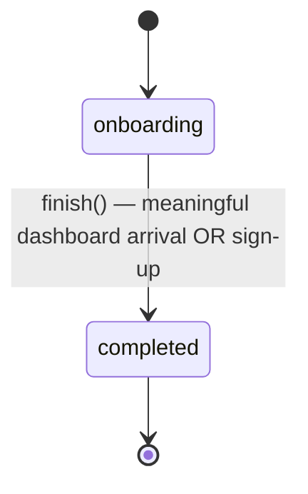

<!-- spec: state-transition-diagram | target: stories/complete-onboarding | flags: CLASSNAME | new_name: Onboarding is a one-way latched boolean -->

### Requirement: Onboarding is a one-way latched boolean

Onboarding SHALL be modeled as a single latched boolean, not an ordered step machine. A brand-new user starts in the `onboarding` state and transitions exactly once, irreversibly, to `completed`. There SHALL be no forced navigation ordering — every route is reachable at any time (soft gate); a guest with no follows is guided by an in-page empty-state CTA, not a guard redirect. The state is exposed as an "is onboarding" flag and persisted as `onboardingComplete` (absent key = still onboarding).

| State        | Description                                   |
|--------------|-----------------------------------------------|
| `onboarding` | First-run experience (default for a new user) |
| `completed`  | Onboarding finished (terminal; one-way)       |

#### Scenario: New user defaults to onboarding

- **WHEN** a brand-new user with no persisted `onboardingComplete` key loads the app
- **THEN** the onboarding state SHALL be `onboarding`

#### Scenario: Meaningful dashboard arrival latches completion

- **WHEN** the user arrives at the dashboard AND the timetable is real (region set and concert data loaded) AND the followed count is at least 1
- **THEN** the dashboard route's completion handler SHALL latch the state to `completed`
- **AND** the latch SHALL be driven by the data-ready + engaged condition, not by whether the celebration overlay rendered

#### Scenario: Zero-follow dashboard arrival does not latch

- **WHEN** the user arrives at the dashboard with a followed count of 0
- **THEN** the state SHALL remain `onboarding`

#### Scenario: Sign-up is an idempotent completion backstop

- **WHEN** the user completes sign-up via the auth-callback route
- **THEN** the completion handler SHALL latch the state to `completed`
- **AND** invoking it when the state is already `completed` SHALL be a no-op

#### Scenario: Completion is one-way

- **WHEN** the state is `completed`
- **THEN** it SHALL NOT return to `onboarding` except via an explicit fresh-onboarding reset

#### Scenario: Legacy onboardingStep is migrated on load

- **WHEN** the app loads with a legacy `onboardingStep` value of `'completed'` or `'7'`
- **THEN** the state SHALL be migrated once to `completed`
