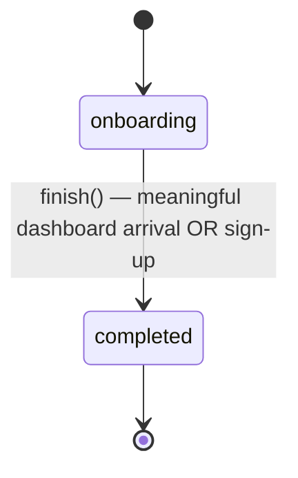

# Complete onboarding

## Purpose

Guides a new user through the onboarding sequence from landing to an irreversible completed state, tracking concert-search progress, presenting a final non-blocking analytics notice, and routing the app based on completion status.

## Requirements

### Requirement: Frontend search status polling for onboarding

The frontend SHALL poll the `ListSearchStatuses` RPC during onboarding to detect when backend concert searches have actually completed, rather than relying on the `SearchNewConcerts` RPC return (which is fire-and-forget).

#### Scenario: Polling starts after SearchNewConcerts fires

- **WHEN** the frontend calls `SearchNewConcerts` for an artist during onboarding
- **THEN** the system SHALL add the artist ID to the set of pending searches
- **AND** the system SHALL start (or continue) a polling timer if not already running

#### Scenario: Batched polling every 2 seconds

- **WHEN** the polling timer fires
- **AND** there are one or more artist IDs with pending search status
- **THEN** the system SHALL call `ListSearchStatuses` with all pending artist IDs in a single batched request
- **AND** for each artist whose status is `COMPLETED` or `FAILED`, the system SHALL mark that artist's search as done
- **AND** for each artist whose status is `PENDING` or `UNSPECIFIED`, the system SHALL keep it in the pending set for the next poll cycle

#### Scenario: Polling stops when all searches resolve

- **WHEN** all artist IDs in the pending set have reached a terminal state (`COMPLETED`, `FAILED`, or timed out)
- **THEN** the system SHALL clear the polling interval timer
- **AND** the system SHALL trigger concert data verification (`verifyConcertData`)

#### Scenario: Per-artist timeout as polling deadline

- **WHEN** an artist's search has been pending for 15 seconds (measured from the time `SearchNewConcerts` was fired)
- **AND** the artist's status has not yet reached `COMPLETED` or `FAILED`
- **THEN** the system SHALL treat the artist's search as done (timed out)
- **AND** the system SHALL remove the artist from the pending set

#### Scenario: Polling error handling

- **WHEN** a `ListSearchStatuses` poll call fails with a network or RPC error
- **THEN** the system SHALL log the error
- **AND** the system SHALL NOT mark any artists as done
- **AND** the system SHALL retry on the next poll cycle (2 seconds later)
- **AND** the per-artist 15-second timeout SHALL still apply independently of poll errors

### Requirement: Single-Flag Onboarding State

The system SHALL model onboarding state as a single persisted boolean rather than an ordered step machine. `OnboardingService` SHALL expose `isOnboarding` as the primary getter and SHALL retain `isCompleted` as its negation (`isCompleted === !isOnboarding`) for call-site compatibility. The persisted value SHALL use completed-polarity (`onboardingComplete`; an absent key means `false`, i.e. still onboarding) so a brand-new user defaults to `isOnboarding === true`. Completion SHALL be a one-way latch exposed as a single `finish()` mutator; once `isOnboarding` becomes `false` it SHALL NOT return to `true` except via an explicit fresh-onboarding reset. The service SHALL NOT expose step values, step ordering, route maps, or a `readyForDashboard` predicate.

#### Scenario: Brand-new user defaults to onboarding

- **WHEN** a user opens the app for the first time and no onboarding key exists in localStorage
- **THEN** `OnboardingService.isOnboarding` SHALL be `true`
- **AND** `OnboardingService.isCompleted` SHALL be `false`

#### Scenario: Completion latches on first meaningful dashboard arrival

- **WHEN** an unauthenticated guest reaches the dashboard for the first time
- **AND** the timetable is real (region is set and concert data has loaded)
- **AND** the guest has at least one followed artist (`followedCount >= 1`)
- **THEN** the system SHALL call `finish()` so `isOnboarding` becomes `false`
- **AND** the latch SHALL be evaluated after the light-celebration decision (so `maybeCelebrate()` observed `isOnboarding === true`), honoring the `needsRegion` deferral

#### Scenario: Latch is independent of whether the celebration is shown

- **WHEN** a guest reaches a meaningful first dashboard (region set, data loaded, `followedCount >= 1`)
- **AND** the light celebration is suppressed (e.g. `localStorage['onboarding.celebrationShown'] === '1'` from a prior session, or `maybeCelebrate()` otherwise early-returns)
- **THEN** the system SHALL still call `finish()`
- **AND** the latch SHALL NOT be gated on the celebration overlay actually rendering

#### Scenario: No latch for a zero-follow dashboard arrival

- **WHEN** an unauthenticated guest with zero followed artists lands on the dashboard (e.g. via deep link, served the empty-state CTA)
- **THEN** the system SHALL NOT call `finish()`
- **AND** `isOnboarding` SHALL remain `true` so the discovery coach mark and page-help auto-open still apply until the guest follows an artist or signs up

#### Scenario: Completion latches on sign-up

- **WHEN** a user completes sign-up via the auth callback
- **THEN** the system SHALL call `finish()` so `isOnboarding` becomes `false`
- **AND** the call SHALL be idempotent if onboarding was already completed

#### Scenario: Completion is one-way

- **WHEN** `isOnboarding` is already `false`
- **AND** the user revisits the dashboard or any onboarding-relevant surface
- **THEN** the system SHALL keep `isOnboarding === false`

#### Scenario: Legacy step value migration

- **WHEN** `OnboardingService` is constructed
- **AND** the legacy `localStorage['onboardingStep']` key exists
- **THEN** the system SHALL set `onboardingComplete = true` when the legacy value denotes completion — i.e. it is in the completed set `{'completed', '7'}` (the legacy numeric index `'7'` mapped to `COMPLETED`)
- **AND** the system SHALL set `onboardingComplete = false` for any other legacy value (e.g. `'discovery'`, `'my-artists'`, `'detail'`)
- **AND** the system SHALL persist the new value and delete the legacy `onboardingStep` key
- **AND** the migration SHALL run at most once per client

### Requirement: Final onboarding step is a non-blocking analytics transparency notice
The onboarding flow SHALL present a one-time **analytics transparency notice** as its final step, rather than an opt-in consent gate. Because analytics runs under the EU-adequacy opt-out model (see the `analytics-consent` capability), there is no signup decision to collect; the notice exists to satisfy the APPI purpose-of-use notification obligation in-context and to signal where the user can opt out. The notice SHALL name PostHog (Klant Solutions B.V., Netherlands) and the cross-border purpose, SHALL link to the privacy policy and to the settings opt-out, and SHALL NOT block progression or alter the default-on analytics state. It SHALL be shown at most once and SHALL NOT reappear once acknowledged.

This requirement replaces the previously-planned signup consent screen with two opt-in toggles; that design is superseded by the opt-out model and is not implemented.

#### Scenario: New user sees the transparency notice once and proceeds
- **WHEN** a user reaches the final onboarding step for the first time
- **THEN** the application SHALL render a transparency notice naming PostHog and the cross-border purpose
- **AND** the notice SHALL link to the privacy policy and to the settings opt-out control
- **AND** dismissing or acknowledging the notice SHALL advance to the authenticated experience without changing the default-on analytics state

#### Scenario: Notice does not gate analytics or block onboarding
- **WHEN** the transparency notice is displayed
- **THEN** identified analytics SHALL already be enabled by default (the notice is informational, not a gate)
- **AND** the application SHALL NOT require any affirmative action on the notice before proceeding
- **AND** the application SHALL NOT show the notice again on subsequent sessions once acknowledged

#### Scenario: Opt-out remains reachable after the notice
- **WHEN** a user who saw the notice later wants to stop analytics
- **THEN** the user SHALL be able to reach the analytics opt-out from the settings page without re-onboarding

### Requirement: Onboarding service routes based on completion status
The `OnboardingService` SHALL check whether the user has completed onboarding and redirect to the appropriate route.

#### Scenario: User has completed onboarding
- **WHEN** `hasCompletedOnboarding` is called and the user has at least one followed artist
- **THEN** it SHALL return `true`

#### Scenario: User has not completed onboarding
- **WHEN** `hasCompletedOnboarding` is called and the user has no followed artists
- **THEN** it SHALL return `false`

#### Scenario: Redirect authenticated user with completed onboarding
- **WHEN** `redirectBasedOnStatus` is called for an authenticated user who has completed onboarding
- **THEN** the router SHALL navigate to `dashboard`

#### Scenario: Redirect authenticated user without onboarding
- **WHEN** `redirectBasedOnStatus` is called for an authenticated user who has not completed onboarding
- **THEN** the router SHALL navigate to `onboarding/discover`

### Requirement: Onboarding is a one-way latched boolean

Onboarding SHALL be modeled as a single latched boolean, not an ordered step machine. A brand-new user starts in the `onboarding` state and transitions exactly once, irreversibly, to `completed`. There SHALL be no forced navigation ordering — every route is reachable at any time (soft gate); a guest with no follows is guided by an in-page empty-state CTA, not a guard redirect. The state is exposed as an "is onboarding" flag and persisted as `onboardingComplete` (absent key = still onboarding).

| State        | Description                                   |
|--------------|-----------------------------------------------|
| `onboarding` | First-run experience (default for a new user) |
| `completed`  | Onboarding finished (terminal; one-way)       |

#### Scenario: New user defaults to onboarding

- **WHEN** a brand-new user with no persisted `onboardingComplete` key loads the app
- **THEN** the onboarding state SHALL be `onboarding`

#### Scenario: Meaningful dashboard arrival latches completion

- **WHEN** the user arrives at the dashboard AND the timetable is real (region set and concert data loaded) AND the followed count is at least 1
- **THEN** the dashboard route's completion handler SHALL latch the state to `completed`
- **AND** the latch SHALL be driven by the data-ready + engaged condition, not by whether the celebration overlay rendered

#### Scenario: Zero-follow dashboard arrival does not latch

- **WHEN** the user arrives at the dashboard with a followed count of 0
- **THEN** the state SHALL remain `onboarding`

#### Scenario: Sign-up is an idempotent completion backstop

- **WHEN** the user completes sign-up via the auth-callback route
- **THEN** the completion handler SHALL latch the state to `completed`
- **AND** invoking it when the state is already `completed` SHALL be a no-op

#### Scenario: Completion is one-way

- **WHEN** the state is `completed`
- **THEN** it SHALL NOT return to `onboarding` except via an explicit fresh-onboarding reset

#### Scenario: Legacy onboardingStep is migrated on load

- **WHEN** the app loads with a legacy `onboardingStep` value of `'completed'` or `'7'`
- **THEN** the state SHALL be migrated once to `completed`
