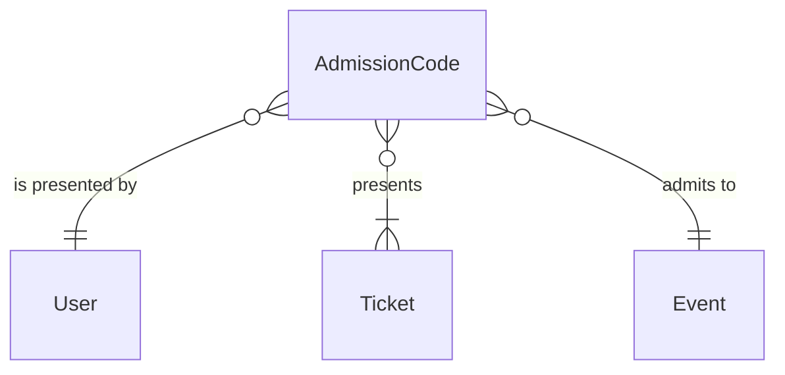

# components/entity/admission-code Specification

## Purpose
An AdmissionCode is what a fan's device shows as the entry QR code at the venue: a statement that one User presents some of their Tickets for one event, signed on the device with the private key of the User's WalletPublicKey. It is made on the device without a connection, renewed every 15 seconds, and never stored.

| attribute | meaning | constraint |
|-----------|---------|------------|
| user | the User presenting the Tickets; must be the holder of each | required |
| event | the event the Tickets admit to | required |
| tickets | the Tickets presented together, for same-time group entry | required, 1 to 10, each at most once; a Ticket not for the event is refused at admission |
| signed time | when the device signed it, by the device's clock | required |
| signature | made with the private key whose public key is the user's WalletPublicKey | required |

## Requirements

### Requirement: A code presents up to 10 tickets

An AdmissionCode SHALL present 1 to 10 distinct Tickets. A code that presents no Ticket, more than 10, or the same Ticket twice SHALL be invalid. The code names only the Tickets, not their events, so a code presenting a Ticket that is not the user's own for the code's event is refused as a whole when it is admitted, not when the code is read.

#### Scenario: Group of three

- **WHEN** a code presents 3 distinct Tickets of the same event
- **THEN** it is valid

#### Scenario: Too many tickets

- **WHEN** a code presents 11 Tickets
- **THEN** it is invalid

#### Scenario: Same ticket twice

- **WHEN** a code presents the same Ticket twice
- **THEN** it is invalid

### Requirement: A code is fresh for a short time around its signing

An AdmissionCode SHALL be fresh at a time when its signed time is at most 30 seconds before that time and at most 15 seconds after it. The second bound allows for a device clock that runs slightly fast.

#### Scenario: Just shown

- **WHEN** a code signed at 18:30:00 is checked at 18:30:10
- **THEN** it is fresh

#### Scenario: Screenshot shown later

- **WHEN** a code signed at 18:30:00 is checked at 18:30:31
- **THEN** it is not fresh

#### Scenario: Device clock slightly fast

- **WHEN** a code signed at 18:30:10 by the device's clock is checked at 18:30:00
- **THEN** it is fresh

#### Scenario: Device clock far ahead

- **WHEN** a code signed at 18:31:00 by the device's clock is checked at 18:30:00
- **THEN** it is not fresh
