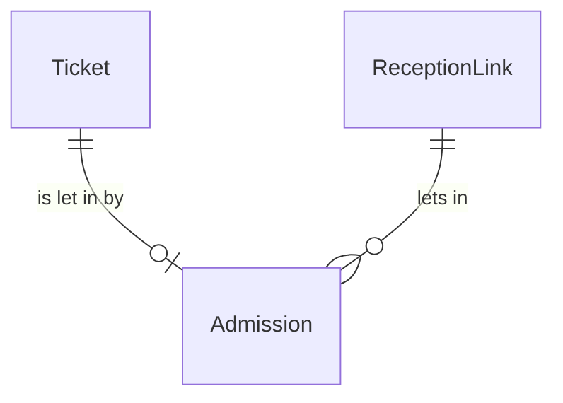

# components/entity/admission Specification

## Purpose
An Admission is the permanent note that a Ticket was let in at the venue: which Ticket, through which ReceptionLink and when. It is stored together with the Ticket's admitted time and never changed or removed, so that it can later serve as evidence that the holder attended, for example against a chargeback.

| attribute | meaning | constraint |
|-----------|---------|------------|
| ticket | the Ticket let in | required; at most one Admission per Ticket |
| event | the event of the Ticket | required |
| reception link | the ReceptionLink that scanned | required |
| admitted time | when the Ticket was let in | required, equal to the Ticket's admitted time |

## Requirements

### Requirement: An Admission is written once with its Ticket

An Admission SHALL be stored only by Ticket.Admit, together with the Ticket's admitted time, and a Ticket SHALL have at most one Admission. No operation SHALL change or remove a stored Admission, including voiding its Ticket.

#### Scenario: Ticket voided after entry

- **WHEN** a Ticket admitted at 18:32 through `受付1` is Voided by a dispute refund
- **THEN** its Admission with 18:32 and `受付1` is unchanged
