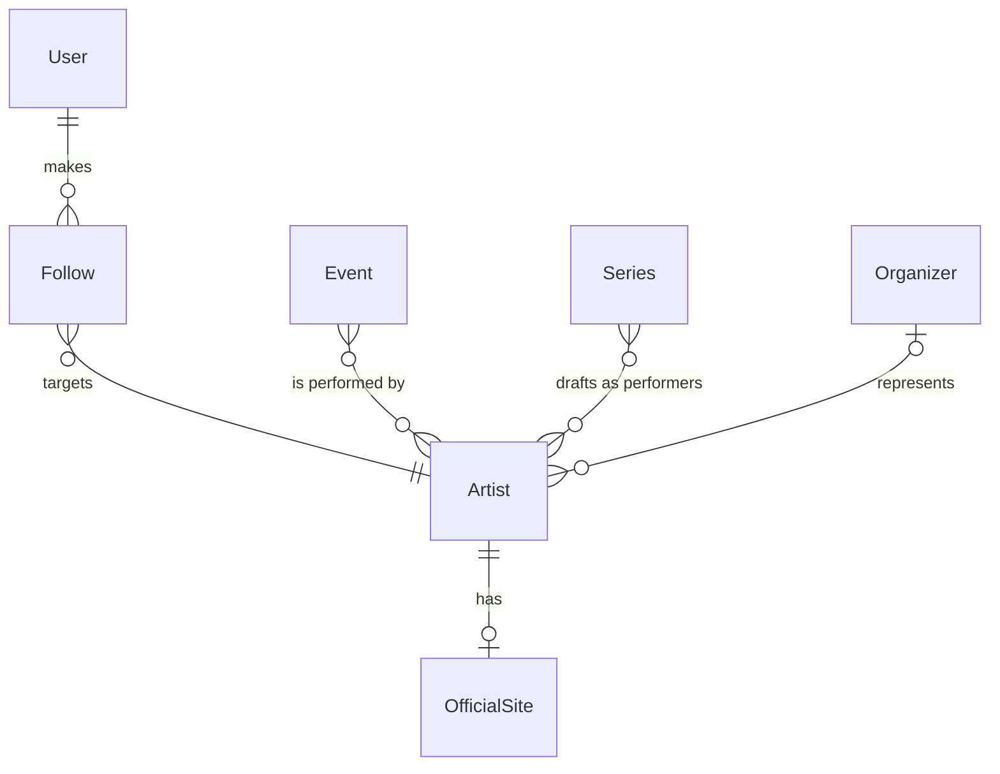

# Artist

## Purpose

An Artist is a musical performer or group that fans follow for concert news. It is registered once per music-catalog identity (MBID) and carries community-curated images of itself together with a color profile of its logo.

| attribute | meaning | constraint |
|-----------|---------|------------|
| id | the artist's identity in Liverty Music | required; a UUID, fresh for every new artist |
| name | display name of the performer or group | required; at least 1 character |
| mbid | the artist's identifier in the music catalog | required; a UUID of 36 characters; one artist per MBID |
| fanart | the artist's community-curated images, grouped by kind: artist_thumb (square portrait), artist_background (wide backdrop), hd_music_logo (high-definition transparent logo), music_logo (standard transparent logo), music_banner (wide banner) | optional; absent when the images were never checked or the last check found none; each kind holds zero or more images |
| fanart image | one image of a kind: its catalog id, URL, like count and language | URL required; like count 0 or more |
| fanart.logo_color_profile | color summary of the artist's best logo: dominant_hue, dominant_lightness, is_chromatic | optional; absent when there is no logo or it could not be analyzed |
| fanart_sync_time | when the artist's images were last checked | optional; absent means never checked |

## Requirements

### Requirement: Artist identity and name are well-formed
An Artist SHALL have an MBID that is a UUID of 36 characters and a name of at least 1 character.

#### Scenario: Missing MBID
- **WHEN** an artist has no MBID
- **THEN** the artist is invalid

#### Scenario: Malformed MBID
- **WHEN** an artist's MBID is not a UUID of 36 characters
- **THEN** the artist is invalid

#### Scenario: Empty name
- **WHEN** an artist's name is empty
- **THEN** the artist is invalid

### Requirement: A new artist starts without images
A new Artist SHALL get a fresh unique id and SHALL start with no fanart and no fanart_sync_time.

#### Scenario: New artist
- **WHEN** an artist is created from a name and an MBID
- **THEN** it has a fresh id, that name and MBID, no fanart and no fanart_sync_time

#### Scenario: Two new artists
- **WHEN** two artists are created from the same name and MBID
- **THEN** their ids differ

### Requirement: The best image of a kind is the most liked
For each image kind, the best image SHALL be the image with the highest like count; when several images share the highest count, the one listed first SHALL be the best; a kind with no images SHALL have no best image. Wherever an artist is presented to a client, each image kind SHALL show only its best image.

#### Scenario: Different like counts
- **WHEN** a kind has images with like counts 3, 7 and 1
- **THEN** the image with 7 likes is the best

#### Scenario: Equal like counts
- **WHEN** two images of a kind have the same highest like count
- **THEN** the one listed first is the best

#### Scenario: No images of a kind
- **WHEN** a kind has no images
- **THEN** the kind has no best image and the artist shows no image of that kind

### Requirement: The best logo prefers high definition
The artist's best logo SHALL be the best hd_music_logo image; when there is none, the best music_logo image; otherwise the artist SHALL have no best logo.

#### Scenario: High-definition logo available
- **WHEN** the artist has hd_music_logo images
- **THEN** the best logo is the best hd_music_logo image

#### Scenario: Only a standard logo
- **WHEN** the artist has no hd_music_logo image but has music_logo images
- **THEN** the best logo is the best music_logo image

#### Scenario: No logo
- **WHEN** the artist has neither hd_music_logo nor music_logo images
- **THEN** the artist has no best logo

### Requirement: Logo color profile values are in range
A logo color profile SHALL have a dominant_lightness between 0 and 1. It SHALL have a dominant_hue between 0 and 360 degrees when is_chromatic is true, and no dominant_hue when is_chromatic is false.

#### Scenario: Chromatic profile
- **WHEN** a logo color profile is chromatic
- **THEN** it has a dominant_hue between 0 and 360 and a dominant_lightness between 0 and 1

#### Scenario: Achromatic profile
- **WHEN** a logo color profile is not chromatic
- **THEN** it has no dominant_hue and a dominant_lightness between 0 and 1
