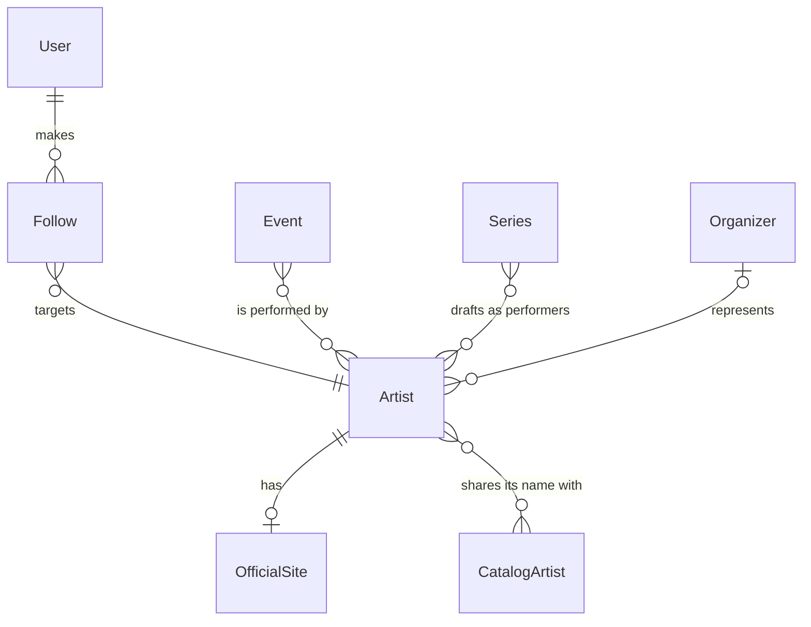
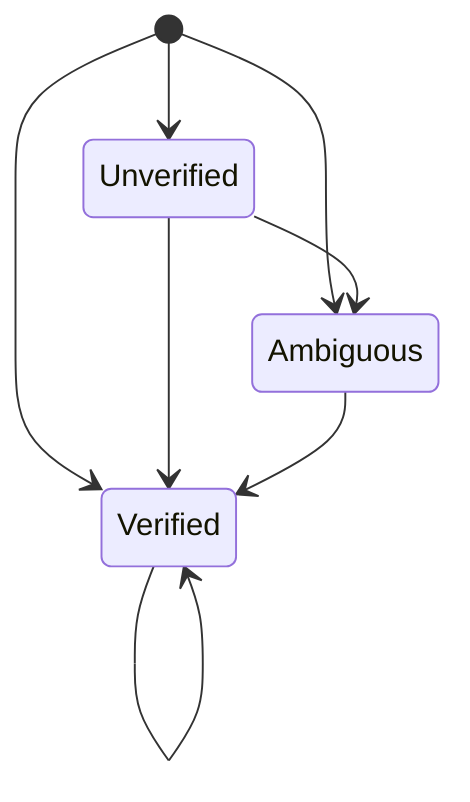

# Artist

## Purpose

An Artist is a musical performer or group that fans follow for concert news. It is registered once per music-catalog identity (MBID) and carries community-curated images of itself. Artists are found through the listening service (name search, charts and similar artists), which files each artist under an MBID of its own choosing; the music catalog says which artist an MBID names.

| attribute | meaning | constraint |
|-----------|---------|------------|
| id | the artist's identity in Liverty Music | required; a UUID, fresh for every new artist |
| name | display name of the performer or group | required; at least 1 character |
| mbid | the artist's identifier in the music catalog: the artist itself, which may differ from listening_mbid when the listening service's MBID names a namesake | required; a UUID of 36 characters; one artist per MBID |
| listening_mbid | the MBID the listening service files the artist under; its name search, charts and similar artists are matched and asked by it | required; a UUID of 36 characters; equal to mbid unless mbid was corrected; an MBID is the mbid or listening_mbid of one artist only |
| mbid_status | whether mbid is known to name this artist and not a namesake in the music catalog | required; Unverified, Verified or Ambiguous |
| name_keys | the names the artist is found by: the keys of its name and of the music catalog's aliases for it, normalized so a name the listening service writes differently still matches | one or more once stored, each once; holds the key of the name only until the catalog's aliases have been read; two artists may share a key |
| fanart | the artist's community-curated images, grouped by kind: artist_thumb (square portrait), artist_background (wide backdrop), music_banner (wide banner) | optional; absent when the images were never checked or the last check found none; each kind holds zero or more images |
| fanart image | one image of a kind: its catalog id, URL, like count and language | URL required; like count 0 or more |
| fanart_sync_time | when the artist's images were last checked | optional; absent means never checked |
| official_site_check_time | when the artist's official site was last checked in the music catalog, whatever the check found | optional; absent means never checked |
| activity_ended | whether the music catalog marks the artist's activity as ended: the group dissolved or the solo artist died | required; false when the catalog records no end and when it was never checked; a hiatus is not an end |
| organizer | the Organizer that represents the artist | optional; at most one |

Events announced about it:

| event | announced by | carries |
|-------|--------------|---------|
| Artist.Created | Artist.Create | the Artist as registered |
| Artist.Represented | Organizer.AssociateArtist | the Artist with the Organizer as its organizer |

```mermaid
erDiagram
  Artist ||--o| OfficialSite : "has"
  User ||--o{ Follow : "makes"
  Follow }o--|| Artist : "targets"
  Event }o--o{ Artist : "is performed by"
  Series }o--o{ Artist : "drafts as performers"
  Organizer |o--o{ Artist : "represents"
  Artist }o--o{ CatalogArtist : "shares its name with"
```

States of mbid_status:

```mermaid
stateDiagram-v2
  [*] --> Unverified
  [*] --> Verified
  [*] --> Ambiguous
  Unverified --> Verified
  Unverified --> Ambiguous
  Ambiguous --> Verified
  Verified --> Verified
```

## Requirements

### Requirement: Artist identity and name are well-formed
An Artist SHALL have an MBID that is a UUID of 36 characters and a name of at least 1 character.

#### Scenario: Missing MBID
- **WHEN** an artist has no MBID
- **THEN** the artist is invalid

#### Scenario: Malformed MBID
- **WHEN** an artist's MBID is not a UUID of 36 characters
- **THEN** the artist is invalid

#### Scenario: Empty name
- **WHEN** an artist's name is empty
- **THEN** the artist is invalid

### Requirement: A new artist starts without images
A new Artist SHALL get a fresh unique id and SHALL start with no fanart, no fanart_sync_time, no official_site_check_time and activity_ended false.

#### Scenario: New artist
- **WHEN** an artist is created from a name and an MBID
- **THEN** it has a fresh id, that name and MBID, no fanart, no fanart_sync_time, no official_site_check_time and activity_ended false

#### Scenario: Two new artists
- **WHEN** two artists are created from the same name and MBID
- **THEN** their ids differ

### Requirement: The best image of a kind is the most liked
For each image kind, the best image SHALL be the image with the highest like count; when several images share the highest count, the one listed first SHALL be the best; a kind with no images SHALL have no best image. Wherever an artist is presented to a client, each image kind SHALL show only its best image.

#### Scenario: Different like counts
- **WHEN** a kind has images with like counts 3, 7 and 1
- **THEN** the image with 7 likes is the best

#### Scenario: Equal like counts
- **WHEN** two images of a kind have the same highest like count
- **THEN** the one listed first is the best

#### Scenario: No images of a kind
- **WHEN** a kind has no images
- **THEN** the kind has no best image and the artist shows no image of that kind

### Requirement: One MBID names one artist
An MBID SHALL be the MBID or among the other_mbids of at most one Artist, and an Artist's other_mbids SHALL not hold its own MBID. An Artist found under an MBID it was corrected from is the same Artist, with the same id.

#### Scenario: Corrected artist keeps its identity
- **WHEN** an artist's MBID is corrected from A to B
- **THEN** looking it up by A or by B finds the same artist, with the same id and followers

#### Scenario: One owner per MBID
- **WHEN** MBID A is among the other_mbids of one artist
- **THEN** no other artist has A as its MBID or among its other_mbids
