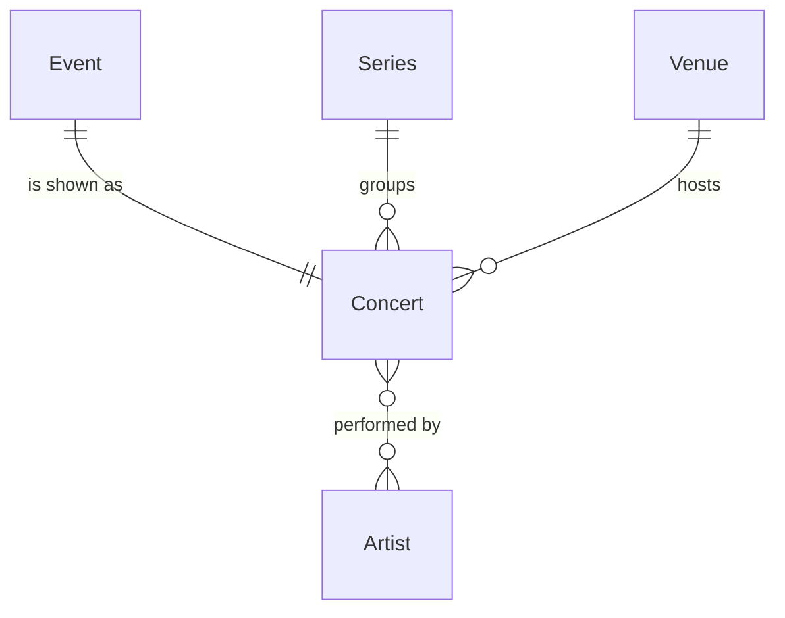

# Concert

## Purpose

A Concert is the fan-facing view of one music Event: the performance (venue, date, start and doors-open time) together with its parent Series and the Artists who perform at it. It stores nothing of its own beyond the Event it extends; title, type and source page come from the Series.

| attribute | meaning | constraint |
|-----------|---------|------------|
| id | identifier shared with the Event it extends | required |
| venue | resolved place where it is held | required on every catalog read; absent only on a discovery preview |
| listed venue name | the venue text as the source or organizer listed it, normalized | optional, 1–255 characters; absent on concerts stored before the name was kept |
| local date | calendar date at the venue | required |
| start time | performance start | optional; absent means not announced |
| open time | doors open | optional; absent means not announced |
| series | parent Series (title, type, source page) | required |
| performers | Artists performing | at least 1 |

## Requirements

### Requirement: A concert is exactly one event

A Concert SHALL be exactly one Event: it carries the Event's id, venue, listed venue name, date and times, and adds only the embedded Series and the performing Artists. A Concert SHALL have no title or source page of its own; they are read from its Series.

#### Scenario: Title comes from the series
- **WHEN** a Concert belongs to a Series titled "ARENA TOUR 2026"
- **THEN** the Concert's title is "ARENA TOUR 2026"

#### Scenario: Concert id is its event id
- **WHEN** a Concert extends the Event with id E
- **THEN** the Concert's id is E

### Requirement: A concert has at least one performer

A Concert SHALL carry at least one performing Artist, and the same Artist SHALL appear at most once among its performers. The order of performers is not meaningful.

#### Scenario: Co-headlined concert
- **WHEN** two Artists perform at the same Event
- **THEN** the Concert lists both Artists as performers, each once

### Requirement: Proximity to a home area

A Concert's proximity to a home area SHALL be classified, in this order: AWAY when there is no home area or no venue; HOME when the venue's admin area equals the home area's level-1 code; NEARBY when both the venue's coordinates and the home area's centroid are known and the great-circle distance between them is at most 200 km; AWAY otherwise.

#### Scenario: Same admin area is HOME
- **WHEN** the venue's admin area is JP-13 and the home area's level-1 code is JP-13
- **THEN** the proximity is HOME

#### Scenario: Admin area match wins over distance
- **WHEN** the venue's admin area equals the home area's level-1 code and the venue is 500 km from the centroid
- **THEN** the proximity is HOME

#### Scenario: Different admin area within 200 km is NEARBY
- **WHEN** the venue's admin area is JP-14, the home area's level-1 code is JP-13, and the venue is 30 km from the home area's centroid
- **THEN** the proximity is NEARBY

#### Scenario: Venue without an admin area can still be NEARBY
- **WHEN** the venue has no admin area and lies 50 km from the home area's centroid
- **THEN** the proximity is NEARBY

#### Scenario: Beyond 200 km is AWAY
- **WHEN** the admin areas differ and the venue is 500 km from the home area's centroid
- **THEN** the proximity is AWAY

#### Scenario: Venue coordinates unknown
- **WHEN** the admin areas differ and the venue has no coordinates
- **THEN** the proximity is AWAY

#### Scenario: Home centroid unknown
- **WHEN** the admin areas differ and the home area has no centroid
- **THEN** the proximity is AWAY

#### Scenario: No home area
- **WHEN** there is no home area
- **THEN** the proximity is AWAY

#### Scenario: No venue
- **WHEN** the Concert has no venue
- **THEN** the proximity is AWAY

### Requirement: Earliest concert of a set

The earliest Concert of a set SHALL be the one with the earliest local date; on the same date a known start time comes before an unknown one and an earlier start before a later one; any remaining tie is broken by the smaller id. An empty set has no earliest Concert.

#### Scenario: Known start precedes unknown start on the same date
- **WHEN** two Concerts share a date, one starting at 18:00 and one with no start time
- **THEN** the earliest is the one starting at 18:00

#### Scenario: Earlier date wins regardless of time
- **WHEN** one Concert is on 2026-05-01 with no start time and another on 2026-05-02 at 12:00
- **THEN** the earliest is the one on 2026-05-01

#### Scenario: Empty set
- **WHEN** the set of Concerts is empty
- **THEN** there is no earliest Concert

### Requirement: Fan visibility follows the series

A Concert SHALL be visible to fans exactly when its Series is publicly visible (see Series).

#### Scenario: Concert of an unlisted organizer series
- **WHEN** a Concert's Series is a first-party Series with visibility UNLISTED
- **THEN** the Concert is not visible to fans
