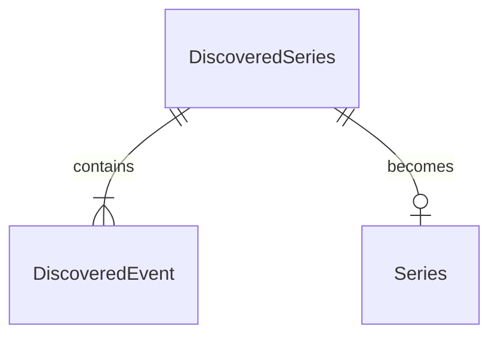

# Discovered Series

## Purpose

A DiscoveredSeries is what an external concert search returns for an Artist: one tour or standalone show with its shared title, type and source page, and the discovered events under it, each a single date at a single listed venue. It is not yet a Series; creating concerts from it turns it into one.

| attribute | meaning | constraint |
|-----------|---------|------------|
| title | tour or show name | required for creation; a series without a title is skipped |
| type | TOUR or SINGLE | required |
| source page | the page dedicated to this tour or show | optional |
| events | discovered events | at least 1 |

| discovered event attribute | meaning | constraint |
|----------------------------|---------|------------|
| listed venue name | venue text as the source wrote it | required; a blank name makes the event unusable |
| admin area | ISO 3166-2 code of the venue's area | optional; absent when unknown |
| local date | calendar date | required |
| start time | performance start | optional |
| open time | doors open | optional |

## Requirements

### Requirement: Discovered series type

A DiscoveredSeries SHALL be TOUR when the source presented it as a tour, and SINGLE when it presented a standalone show, whatever the number of its events.

#### Scenario: Tour with one date in range
- **WHEN** a tour has one discovered event
- **THEN** the DiscoveredSeries is TOUR

#### Scenario: Two-day standalone run
- **WHEN** a standalone show runs on two consecutive days at one venue
- **THEN** the DiscoveredSeries is SINGLE

### Requirement: A discovered event becomes a concert

A discovered event SHALL become a Concert under a given Series, Venue and performing Artist, keeping its local date, start time, open time and listed venue name, with that Artist as its only performer.

#### Scenario: Conversion keeps the times
- **WHEN** a discovered event on 2026-09-01 starting 18:00 with doors at 17:00 becomes a Concert
- **THEN** the Concert is on 2026-09-01, starts at 18:00, opens at 17:00 and has the Artist as its only performer

#### Scenario: Unknown start stays unknown
- **WHEN** a discovered event has no start time
- **THEN** the Concert it becomes has no start time
