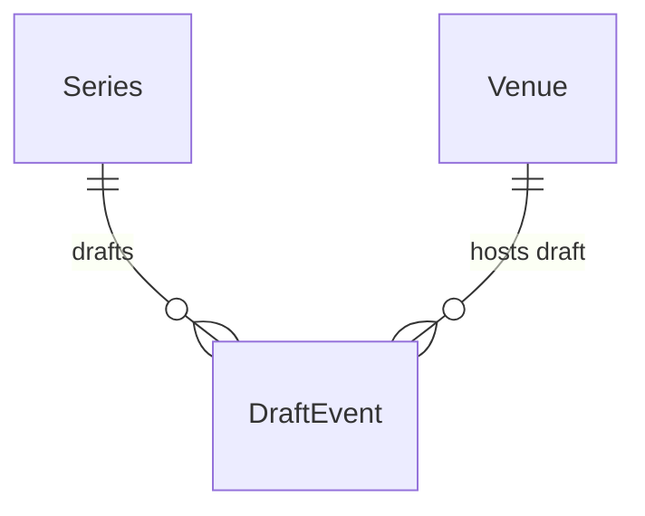

# Draft Event

## Purpose

A DraftEvent is a performance being authored under a DRAFT first-party Series: a Venue, a local date and optional start and doors-open times. It becomes an Event only when the Series is published.

| attribute | meaning | constraint |
|-----------|---------|------------|
| id | draft event identifier | required |
| series | the DRAFT Series it belongs to | required |
| venue | where it will happen | required |
| listed venue name | the venue name the organizer entered | optional |
| local date | calendar date at the venue | required |
| start time | performance start | optional |
| open time | doors open | optional |

## Requirements

### Requirement: A draft event exists only while its series is a draft

A DraftEvent SHALL belong to a DRAFT Series; once the Series is published, its DraftEvents are gone and its performances are Events.

#### Scenario: After publish
- **WHEN** a Series with two DraftEvents is published
- **THEN** it has no DraftEvents

### Requirement: A multi-showtime day is several draft events

Each performance time SHALL be its own DraftEvent; two showtimes on one date at one Venue (昼の部/夜の部) are two DraftEvents with different start times.

#### Scenario: Matinee and evening
- **WHEN** an organizer authors 13:00 and 18:00 shows on 2026-08-01 at one Venue
- **THEN** the Series has two DraftEvents, starting 13:00 and 18:00
