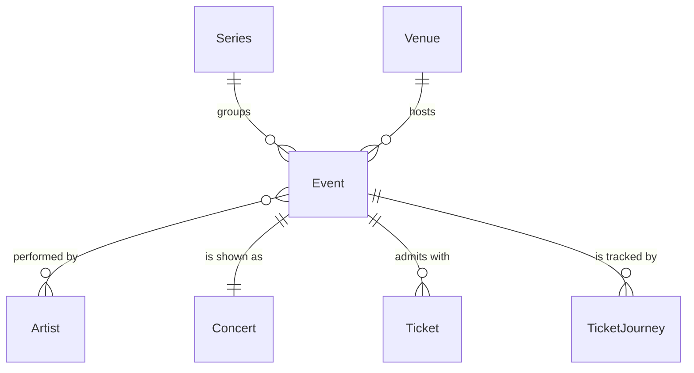

# Event

## Purpose

An Event is one performance at one Venue on one local date, at an optional start time, belonging to exactly one Series. Two Events are the same performance exactly when their Venue, date and start time coincide.

| attribute | meaning | constraint |
|-----------|---------|------------|
| id | event identifier | required |
| series | the engagement it belongs to | required |
| venue | where it happens | required |
| listed venue name | venue text as listed by the source or organizer, normalized | optional, 1–255 characters; absent on events stored before the name was kept |
| local date | calendar date at the venue | required; a date without a time of day |
| start time | performance start | optional; absent means unknown |
| open time | doors open | optional; absent means unknown |
| reschedule time | when the organizer announced a 延期 (postponement) | optional, set by the system; absent means never postponed |
| performers | Artists performing | at least 1 |

## Requirements

### Requirement: Event identity is venue, date and start time

Two Events SHALL be the same performance exactly when they have the same Venue, the same local date and the same start time, where an unknown start time matches only another unknown start time. Series, performers and listed venue name SHALL play no part in identity.

#### Scenario: Matinee and evening shows are distinct
- **WHEN** two Events share Venue and date and start at 13:00 and 18:00
- **THEN** they are different Events

#### Scenario: Same slot under different series is one event
- **WHEN** two Events share Venue, date and start time 18:00 but were grouped under different Series
- **THEN** they are the same Event

#### Scenario: Two unknown start times collapse
- **WHEN** two Events share Venue and date and neither has a start time
- **THEN** they are the same Event

#### Scenario: Unknown start does not match a known start
- **WHEN** two Events share Venue and date, one starting at 18:00 and one with no start time
- **THEN** they are different Events

### Requirement: Series-level data is not on the event

An Event SHALL carry no title, type or source page; those belong to its Series and are shared by every Event of that Series.

#### Scenario: Tour stops share one title
- **WHEN** three Events belong to the same TOUR Series
- **THEN** all three have the Series' title and none has a title of its own

### Requirement: Performers of an event

An Event SHALL have one or more performing Artists, each at most once. Co-headliners and support acts are all performers of the same Event.

#### Scenario: Co-headliners on one event
- **WHEN** two Artists co-headline one performance
- **THEN** the Event has both Artists as performers, each once
