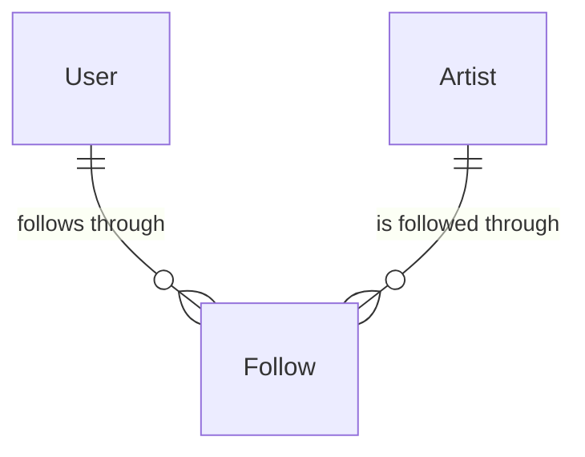

# Follow

## Purpose

A Follow records that a fan wants to be kept informed about one artist, together with the fan's hype level for that artist: how far the fan will travel for its concerts. The hype level decides which newly added concerts of the artist reach the fan by push.

| attribute | meaning | constraint |
|-----------|---------|------------|
| user_id | the fan who follows | required |
| artist_id | the followed artist | required; at most one Follow per fan and artist |
| hype | the fan's hype level for this artist | required; one of Watch, Home, Nearby, Away (least to most enthusiastic); a new Follow starts at Nearby |

Hype levels: **Watch** (the artist's concerts appear on the fan's dashboard, no push), **Home** (push for concerts in the fan's home area), **Nearby** (push for concerts in the home area or near it), **Away** (push for every concert). Any hype level may be changed to any other.

## Requirements

### Requirement: Hype level is one of four values

A hype level SHALL be one of Watch, Home, Nearby or Away. Any other value, including an empty one, SHALL be invalid.

#### Scenario: Known hype level

- **WHEN** the hype level is Watch, Home, Nearby or Away
- **THEN** it is valid

#### Scenario: Unknown or empty hype level

- **WHEN** the hype level is "unknown" or empty
- **THEN** it is invalid

### Requirement: A new Follow starts at Nearby

A new Follow SHALL start with hype level Nearby.

#### Scenario: Fan follows an artist

- **WHEN** a Follow is created for a fan and an artist
- **THEN** its hype level is Nearby

### Requirement: Concerts matched by the hype level

Given a set of concerts and the fan's home, a Follow's hype level SHALL match the subset of those concerts it promises to push, judged by each concert's Proximity to the fan's home: Watch matches none; Home matches the concerts whose proximity is Home, and none when the fan has no home area; Nearby matches the concerts whose proximity is Home or Nearby, and none when the fan has no home; Away matches every concert. The subset keeps the given order and contains only concerts from the given set.

#### Scenario: Watch matches nothing

- **WHEN** the hype level is Watch
- **THEN** no concert is matched, whatever the fan's home and the concerts

#### Scenario: Home matches only concerts in the home area

- **WHEN** the hype level is Home, the fan's home area is JP-13, and the concerts are one in JP-13 and one in JP-40
- **THEN** only the JP-13 concert is matched

#### Scenario: Home without a home area

- **WHEN** the hype level is Home and the fan has no home area
- **THEN** no concert is matched

#### Scenario: Nearby matches home-area and nearby concerts

- **WHEN** the hype level is Nearby and the concerts are one in the fan's home area, one whose proximity is Nearby and one whose proximity is Away
- **THEN** the home-area concert and the nearby concert are matched

#### Scenario: Nearby with only distant concerts

- **WHEN** the hype level is Nearby and every concert's proximity is Away
- **THEN** no concert is matched

#### Scenario: Nearby without a home

- **WHEN** the hype level is Nearby and the fan has no home
- **THEN** no concert is matched

#### Scenario: Away matches everything

- **WHEN** the hype level is Away
- **THEN** every given concert is matched, whatever the fan's home
