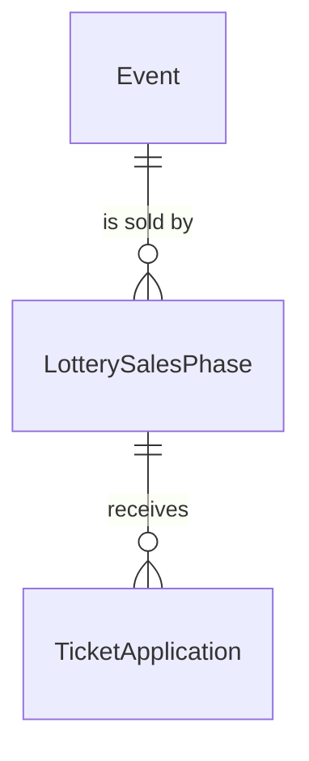

# LotterySalesPhase

## Purpose

A LotterySalesPhase is an Organizer-configured lottery sale of one event's tickets: an application window, a ticket capacity, a max tickets per application, a per-ticket price in yen and an identity-verification requirement. It is distinct from the SalesPhase, which is a sales period discovered from public sources and is not sold through the platform.

| attribute | meaning | constraint |
|-----------|---------|------------|
| id | the phase's identity | required, assigned on creation |
| event | the event whose tickets the phase sells | required |
| open time | when applications open | required, before close time |
| close time | when applications close | required, 1 to 14 days after open time inclusive |
| ticket capacity | tickets available in the phase | required, greater than 0 |
| max tickets per application | largest companion group one application may request | required, 1 to ticket capacity |
| ticket price | per-ticket price in whole yen | required, greater than 0 |
| verification requirement | whether applicants must hold a verified identity | None (the default), Verified-any or JPKI-only |
| drawn time | when the draw ran | absent until the draw runs |

## Requirements

### Requirement: Application window is 1 to 14 days

The close time SHALL be after the open time, and the window SHALL last at least 1 day and at most 14 days.

#### Scenario: Window within bounds

- **WHEN** the window lasts 10 days
- **THEN** the window is valid

#### Scenario: Window shorter than 1 day

- **WHEN** the window lasts 23 hours
- **THEN** the window is invalid

#### Scenario: Window longer than 14 days

- **WHEN** the window lasts 14 days and 1 hour
- **THEN** the window is invalid

#### Scenario: Close not after open

- **WHEN** the close time equals or precedes the open time
- **THEN** the window is invalid

### Requirement: Capacity, group size and price

The ticket capacity, the max tickets per application and the ticket price SHALL each be greater than 0, and the max tickets per application SHALL NOT exceed the ticket capacity. Capacity is counted in tickets, not applications.

#### Scenario: Valid sizing

- **WHEN** capacity is 100, max tickets per application is 4 and the price is 8000 yen
- **THEN** the phase is valid

#### Scenario: Group larger than capacity

- **WHEN** capacity is 3 and max tickets per application is 4
- **THEN** the phase is invalid

#### Scenario: Non-positive value

- **WHEN** capacity, max tickets per application or price is 0 or less
- **THEN** the phase is invalid

### Requirement: Verification requirement

A phase SHALL require verification when its verification requirement is Verified-any or JPKI-only; both require the applicant to hold an Active verified identity. A phase created without a requirement SHALL have the requirement None.

#### Scenario: No requirement given

- **WHEN** a phase is created without a verification requirement
- **THEN** its requirement is None and it does not require verification

#### Scenario: Verified-any or JPKI-only

- **WHEN** the requirement is Verified-any or JPKI-only
- **THEN** the phase requires an Active verified identity

### Requirement: Window open at an instant

The window SHALL be open at an instant when the instant is at or after the open time and before the close time.

#### Scenario: Before open

- **WHEN** the instant precedes the open time
- **THEN** the window is not open

#### Scenario: Between open and close

- **WHEN** the instant is at the open time or later and before the close time
- **THEN** the window is open

#### Scenario: At close

- **WHEN** the instant is the close time or later
- **THEN** the window is not open

### Requirement: Amount for a requested count

The amount held for an application SHALL be the ticket price multiplied by the requested ticket count, in yen.

#### Scenario: Two tickets

- **WHEN** the price is 8000 yen and 2 tickets are requested
- **THEN** the amount is 16000 yen

### Requirement: Drawn phase

A phase SHALL count as drawn once its drawn time is set.

#### Scenario: Drawn time set

- **WHEN** the drawn time is set
- **THEN** the phase is drawn

#### Scenario: Drawn time absent

- **WHEN** the drawn time is absent
- **THEN** the phase is not drawn
