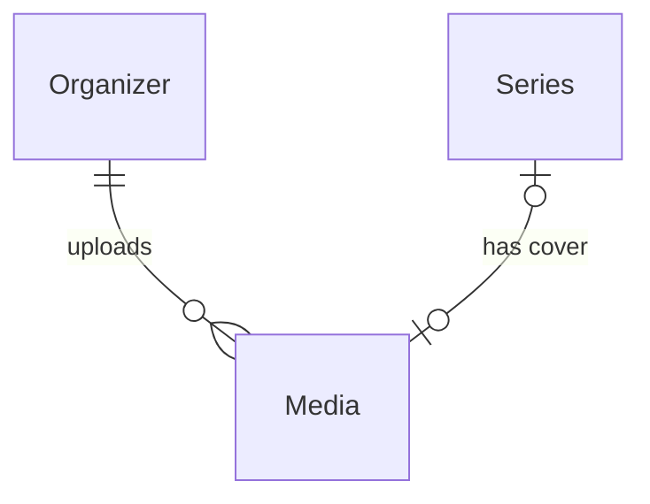

# Media

## Purpose

A Media is an image an organizer uploaded for one of its Series, served to fans only as processed variants: a thumbnail at most 800 px wide and a large image at most 1920 px wide. The original upload is never served.

| attribute | meaning | constraint |
|-----------|---------|------------|
| id | media identifier, also the version of its served addresses | required |
| organizer | the Organizer that uploaded it | required |
| kind | IMAGE | required |
| thumb | address of the thumbnail variant | required when shown as a cover |
| large | address of the large variant | required when shown as a cover |

## Requirements

### Requirement: A shown image exposes both variants

A Media of kind IMAGE, when shown as a Series cover, SHALL expose both a thumb and a large variant address.

#### Scenario: Cover with both variants
- **WHEN** a Series cover is an IMAGE with thumb and large addresses
- **THEN** the cover is valid

#### Scenario: Cover missing a variant
- **WHEN** a Series cover is an IMAGE with only a thumb address
- **THEN** the cover is invalid

### Requirement: Served addresses are stable per media

The variant addresses of a Media SHALL be derived from its organizer and id and SHALL never change; a replaced cover gets a new Media with new addresses.

#### Scenario: Replacing the cover
- **WHEN** a Series' cover is replaced by a new upload
- **THEN** the new cover is a different Media with different variant addresses
