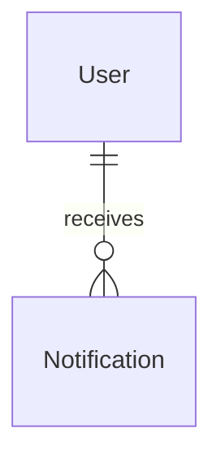
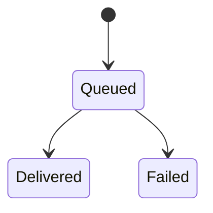

# Notification

## Purpose

A Notification is the durable record of one message sent to one fan, such as new concerts of a followed artist, a ticket-sale reminder or a sales-phase announcement. It records what was sent, whether the push channel accepted it, and whether the fan has read or dismissed it.

| attribute | meaning | constraint |
|-----------|---------|------------|
| id | the notification's identity, also carried inside the pushed message so the fan's response can be traced back to it | required; assigned when recorded |
| user_id | the fan it is for | required |
| type | what produced it | required; one of new_concerts, sales_reminder, sales_phase_announcement |
| message | the pushed content: title, body, a tag (a later message with the same tag replaces an earlier one on the device) and data holding the in-app link and the notification id | required |
| delivery_status | whether the push channel accepted the message | required; Queued, Delivered or Failed |
| failure_reason | why delivery failed | present only when Failed |
| queue_time | when the notification was recorded | required |
| deliver_time | when the push channel accepted the message | present only when Delivered |
| read_time | when the fan read it | optional; absent until read |
| dismiss_time | when the fan dismissed it | optional; absent until dismissed |

Delivered means that the push service accepted the message for at least one of the fan's browsers, not that a device displayed it. Read and dismissed are times, independent of the delivery status.

## Requirements

### Requirement: A new Notification starts Queued

A new Notification SHALL start with delivery status Queued, with no deliver time, no failure reason, and no read or dismiss time.

#### Scenario: Notification recorded

- **WHEN** a Notification is created
- **THEN** its delivery status is Queued and it has no deliver, read or dismiss time

### Requirement: The delivery outcome is consistent

A Delivered Notification SHALL have a deliver time and no failure reason. A Failed Notification SHALL have a failure reason and no deliver time.

#### Scenario: Delivered

- **WHEN** a Notification is Delivered
- **THEN** it has a deliver time and no failure reason

#### Scenario: Failed

- **WHEN** a Notification is Failed
- **THEN** it has a failure reason and no deliver time

### Requirement: Read and dismissed do not depend on delivery

A Notification SHALL be readable and dismissable whatever its delivery status.

#### Scenario: A failed notification is read

- **WHEN** a Failed Notification is marked read
- **THEN** it has a read time and stays Failed
