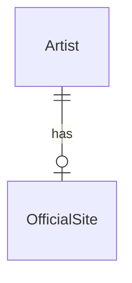

# OfficialSite

## Purpose

An OfficialSite is the official website of one Artist, used to ground concert discovery for that artist. It has an identity of its own, and an artist has at most one.

| attribute | meaning | constraint |
|-----------|---------|------------|
| id | the official site's identity | required; a UUID, fresh for every new official site |
| artist_id | the artist whose website it is | required; an existing artist |
| url | the website's address | required; a valid URI of 1 to 2048 characters |

## Requirements

### Requirement: A new official site gets a fresh id
A new OfficialSite SHALL be created from an artist id and a URL and SHALL get a fresh unique id.

#### Scenario: New official site
- **WHEN** an official site is created for an artist with a URL
- **THEN** it has a fresh id, that artist id and that URL

#### Scenario: Two new official sites
- **WHEN** two official sites are created from the same artist id and URL
- **THEN** their ids differ

### Requirement: Official site URL is a valid address
An OfficialSite's url SHALL be a valid URI of 1 to 2048 characters.

#### Scenario: Malformed URL
- **WHEN** an official site's url is not a valid URI
- **THEN** the official site is invalid

#### Scenario: Overlong URL
- **WHEN** an official site's url is longer than 2048 characters
- **THEN** the official site is invalid
