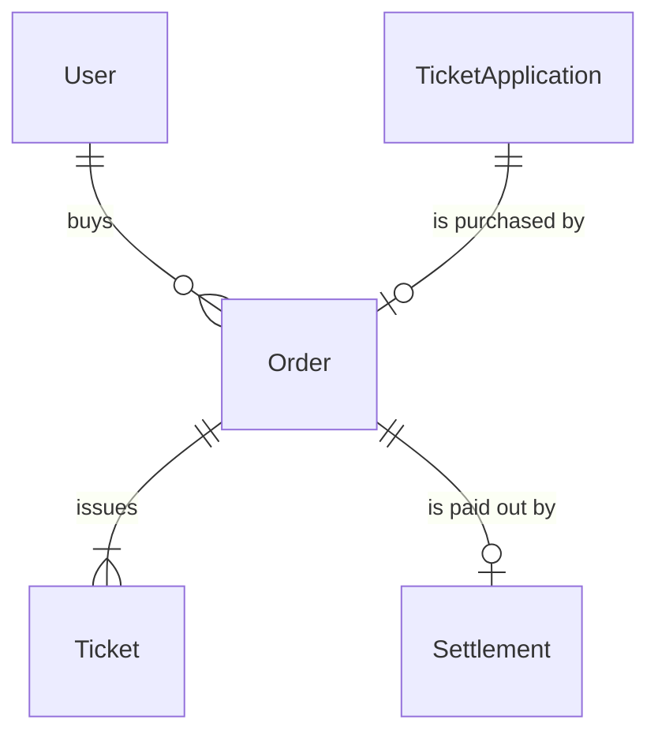
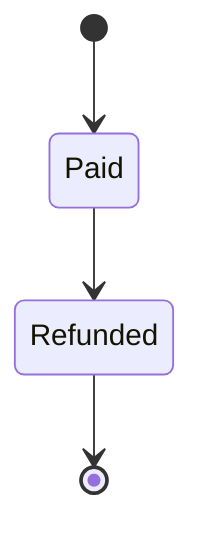

# Order

## Purpose

An Order is the purchase record of one winning TicketApplication: a reference to its captured payment, the amount paid and its own status. One Order covers all tickets of that application, and an Order exists only after the payment has been captured.

| attribute | meaning | constraint |
|-----------|---------|------------|
| id | the order's identity | required, assigned on creation |
| buyer | the winning applicant's account | required |
| application | the winning TicketApplication it was created from | required, one Order per application |
| payment service | which of the platform's payment services holds the payment | required |
| payment reference | reference to the captured payment | required, 1-255 characters, opaque |
| payment method reference | reference to the payment method used | optional, at most 255 characters, opaque |
| card brand | card brand shown to the buyer | optional, at most 40 characters |
| card last four | last four card digits shown to the buyer | optional, exactly 4 digits or empty |
| status | lifecycle | Paid or Refunded |
| amount | total paid, in the currency's smallest unit (whole yen) | required, greater than 0 |
| currency | ISO 4217 currency of the amount | required, 3 uppercase letters |
| paid time | when the Order was created from the captured payment | required |
| refund reference | reference to the refund issued to the buyer | empty unless refunded for a cancellation or a postponement |

## Requirements

### Requirement: An Order is created Paid

An Order SHALL start in status Paid, because it is created from an already captured payment; there is no pending Order.

#### Scenario: New order

- **WHEN** an Order is created
- **THEN** its status is Paid and its refund reference is empty

### Requirement: No card data is stored

An Order SHALL hold only references to the payment and the display facets card brand and card last four; it SHALL NOT hold the card number, security code or expiry. Card last four SHALL be exactly 4 digits or empty.

#### Scenario: Display facets only

- **WHEN** an Order is created from a card payment
- **THEN** it records the card brand and the last four digits, and no card number, security code or expiry

#### Scenario: Malformed last four

- **WHEN** card last four is "12a4" or "123"
- **THEN** the Order is invalid

### Requirement: Amount and currency

The amount SHALL be greater than 0 and the currency SHALL be a 3-letter uppercase ISO 4217 code.

#### Scenario: Non-positive amount

- **WHEN** the amount is 0
- **THEN** the Order is invalid

#### Scenario: Yen order

- **WHEN** the amount is 16000 and the currency is JPY
- **THEN** the amount and currency are valid

### Requirement: Refundable only while Paid

An Order SHALL be refundable only while its status is Paid.

#### Scenario: Paid order

- **WHEN** the status is Paid
- **THEN** the Order is refundable

#### Scenario: Refunded order

- **WHEN** the status is Refunded
- **THEN** the Order is not refundable
