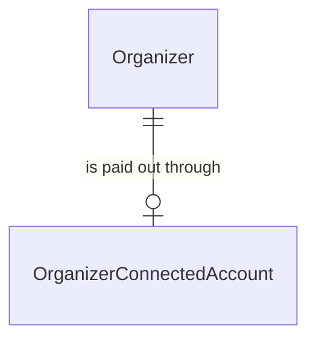
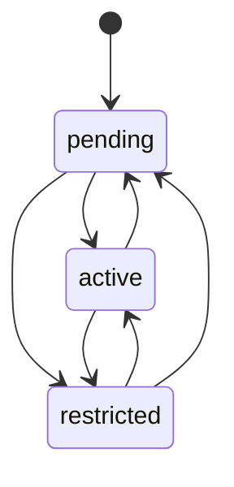

# OrganizerConnectedAccount

## Purpose

An OrganizerConnectedAccount is an Organizer's account at the payment provider for receiving payouts, together with how far the Organizer is through the provider's 本人確認 (identity check) for it. It only receives the Organizer's share after an event; it never accepts card payments, and it holds an opaque reference only, never bank or identity data.

| attribute | meaning | constraint |
|-----------|---------|------------|
| organizer | the Organizer that owns the account | required; one account per Organizer |
| account reference | the payment provider's opaque reference to the account | required; 1 to 255 characters; meaningful only to the provider |
| status | payout onboarding status: how ready the account is to receive payouts | pending, active or restricted |

## Requirements

### Requirement: A new account starts pending

A new OrganizerConnectedAccount SHALL start with status pending: the Organizer has not yet completed the identity check.

#### Scenario: New account

- **WHEN** an account is created for an Organizer
- **THEN** its status is pending

### Requirement: Payout-eligible exactly when active

An OrganizerConnectedAccount SHALL be payout-eligible when its status is active, and SHALL NOT be payout-eligible when its status is pending or restricted.

#### Scenario: Active account

- **WHEN** the status is active
- **THEN** the account is payout-eligible

#### Scenario: Pending or restricted account

- **WHEN** the status is pending or restricted
- **THEN** the account is not payout-eligible
