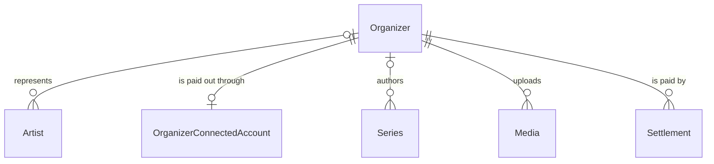
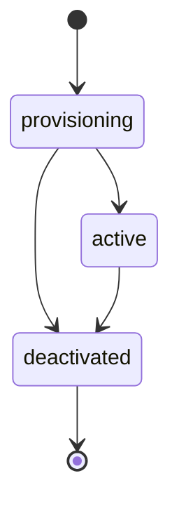

# Organizer

## Purpose

An Organizer is a vetted seller - a record label, management agency, promoter or self-publishing artist - that an admin creates to sell tickets for the Artists it represents. Being created by an admin is the vetting; an Organizer is an identity separate from any Artist, and its operators sign in to the Organizer's own isolated tenant.

| attribute | meaning | constraint |
|-----------|---------|------------|
| id | unique identity of the Organizer | required; UUID; assigned at creation; never the same value as an ArtistId |
| name | public display name, such as the label or promoter name | required; 1 to 200 characters |
| operator email | email of the initial operator, captured at creation to seed the operator's sign-in | required; an email address; never shown to the organizer or fan audiences |
| tenant link | the Organizer's isolated sign-in tenant | optional; empty until provisioning links the tenant; once set, no other Organizer has the same tenant |
| status | lifecycle | provisioning, active or deactivated |

## Requirements

### Requirement: Name and operator email are well-formed

An Organizer's name SHALL be 1 to 200 characters long, and its operator email SHALL be an email address.

#### Scenario: Empty name

- **WHEN** the name is empty
- **THEN** the Organizer is invalid

#### Scenario: Name too long

- **WHEN** the name is 201 characters long
- **THEN** the Organizer is invalid

#### Scenario: Malformed operator email

- **WHEN** the operator email is not an email address
- **THEN** the Organizer is invalid

### Requirement: A new Organizer starts provisioning with its own identity

A new Organizer SHALL start in status provisioning with no tenant link, and SHALL receive a new id of its own. An Organizer made for a self-publishing artist SHALL still have an id different from that Artist's ArtistId; there is no separate verified flag, because existence is the vetting.

#### Scenario: New Organizer

- **WHEN** an Organizer is created
- **THEN** its status is provisioning and it has no tenant link

#### Scenario: Organizer identity is separate from artist identity

- **WHEN** an Organizer is created for a self-publishing artist
- **THEN** the Organizer's id differs from the Artist's ArtistId

### Requirement: Only an active Organizer serves its operators

An Organizer SHALL serve requests from its own operators only while its status is active.

#### Scenario: Active Organizer

- **WHEN** the status is active
- **THEN** the Organizer serves its operators

#### Scenario: Provisioning Organizer

- **WHEN** the status is provisioning
- **THEN** the Organizer does not serve its operators

#### Scenario: Deactivated Organizer

- **WHEN** the status is deactivated
- **THEN** the Organizer does not serve its operators

### Requirement: The roster is fixed once deactivated

The Artists an Organizer represents SHALL be changeable while its status is provisioning or active, and SHALL NOT be changeable once it is deactivated.

#### Scenario: Roster of a provisioning or active Organizer

- **WHEN** the status is provisioning or active
- **THEN** Artists can be associated with and disassociated from the Organizer

#### Scenario: Roster of a deactivated Organizer

- **WHEN** the status is deactivated
- **THEN** Artists can be neither associated with nor disassociated from the Organizer

### Requirement: Deactivation is final

An Organizer SHALL become active only from provisioning, and a deactivated Organizer SHALL never leave deactivated.

#### Scenario: Deactivated Organizer cannot be activated

- **WHEN** the status is deactivated
- **THEN** the Organizer cannot become active or provisioning again

#### Scenario: Active Organizer cannot return to provisioning

- **WHEN** the status is active
- **THEN** the Organizer cannot become provisioning again
