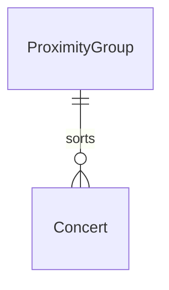

# Proximity

## Purpose

Proximity says how close a Concert's venue is to a reference area: HOME (same administrative area), NEARBY (within 200 km of the area's centroid) or AWAY (anything else, including an unknown location or no home area). A proximity group is one calendar date's Concerts sorted into those three lists.

| value | meaning |
|-------|---------|
| HOME | the venue's admin area equals the home area's level-1 code |
| NEARBY | not HOME; venue coordinates and home centroid both known; great-circle distance at most 200 km |
| AWAY | everything else |

| proximity group attribute | meaning | constraint |
|---------------------------|---------|------------|
| date | the calendar date of every Concert in the group | required |
| home | HOME Concerts of that date | zero or more |
| nearby | NEARBY Concerts of that date | zero or more |
| away | AWAY Concerts of that date | zero or more |

## Requirements

### Requirement: A proximity group sorts one date's concerts

Every Concert in a proximity group SHALL fall on the group's date and SHALL appear in exactly one of its three lists, the one matching its proximity.

#### Scenario: One concert per list
- **WHEN** a group for 2026-03-15 holds one HOME, one NEARBY and one AWAY Concert
- **THEN** each Concert appears once, in the list for its proximity

### Requirement: Proximity values

Proximity SHALL take exactly one of HOME, NEARBY or AWAY; there is no unspecified proximity for a classified Concert.

#### Scenario: Concert with no location
- **WHEN** a Concert's venue has neither a matching admin area nor coordinates
- **THEN** its proximity is AWAY
