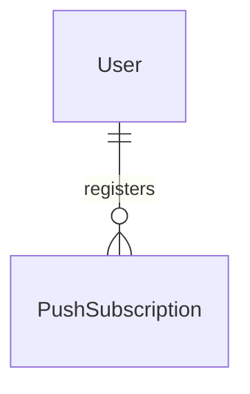

# Push Subscription

## Purpose

A PushSubscription is one browser that a fan has allowed to receive push messages: the address the browser's push service gave it and the keys needed to encrypt messages for it. A fan may hold several PushSubscriptions, one per browser.

| attribute | meaning | constraint |
|-----------|---------|------------|
| id | the subscription's identity | required; assigned when the browser is first registered and kept when it registers again |
| user_id | the fan who owns it | required |
| endpoint | the browser's push address | required; an absolute URI of at most 2048 characters; belongs to at most one PushSubscription across all fans |
| p256dh | the browser's public encryption key | required; Base64url, 1 to 256 characters |
| auth | the browser's authentication secret | required; Base64url, 1 to 64 characters |

## Requirements

### Requirement: Push address and keys are well formed

A PushSubscription's endpoint SHALL be an absolute URI of at most 2048 characters, its p256dh SHALL be 1 to 256 characters and its auth SHALL be 1 to 64 characters. Any other value SHALL be invalid.

#### Scenario: Valid browser subscription

- **WHEN** the endpoint is an absolute https URI of 300 characters, p256dh is 87 characters and auth is 22 characters
- **THEN** the subscription is valid

#### Scenario: Endpoint too long or not absolute

- **WHEN** the endpoint is 2049 characters long, or is a relative path
- **THEN** the subscription is invalid

#### Scenario: Missing key

- **WHEN** p256dh or auth is empty
- **THEN** the subscription is invalid

### Requirement: Device family of a push address

A PushSubscription's device family SHALL be derived from the push service its endpoint points to, as one of android, apple, firefox, windows or other; a push service that is not recognised SHALL give other. The device family is the only information about a browser that may be reported outside the subscription; the endpoint itself SHALL NOT be.

#### Scenario: Recognised push service

- **WHEN** the endpoint points to the push service of Apple browsers
- **THEN** the device family is apple

#### Scenario: Unrecognised push service

- **WHEN** the endpoint points to a push service that is not recognised
- **THEN** the device family is other
