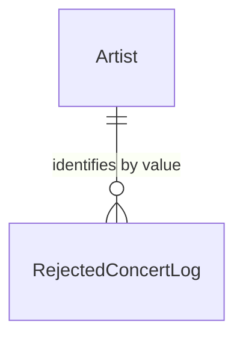

# Rejected Concert Log

## Purpose

A RejectedConcertLog entry is an append-only record of a staged concert an admin dropped, kept only to analyse the quality of concert discovery. It never influences discovery: a rejected concert can be discovered again.

| attribute | meaning | constraint |
|-----------|---------|------------|
| id | entry identifier | required |
| artist | the Artist it was discovered for, held by value | required |
| artist name | the Artist's name when it was rejected | required |
| title | title as discovered | required |
| local date | calendar date | required |
| start time | start as discovered | optional |
| open time | doors open as discovered | optional |
| listed venue name | venue text as discovered | required |
| admin area | admin area as discovered | optional |
| source page | where it was found | optional |
| resolved place id | resolved venue's place identity | optional |
| resolved venue name | resolved venue's name | optional |
| resolved admin area | resolved venue's admin area | optional |
| reason | why it was dropped | required |
| reviewed by | identity of the reviewing admin | optional |
| rejected time | when it was dropped | required |

## Requirements

### Requirement: The log is append-only

A RejectedConcertLog entry SHALL never be changed or removed once written, and SHALL survive the removal of the Artist it names.

#### Scenario: Artist removed later
- **WHEN** an Artist named in an entry is removed
- **THEN** the entry still holds the artist identifier and artist name

### Requirement: The log never suppresses

A RejectedConcertLog entry SHALL NOT affect whether a later discovery is published, staged or skipped.

#### Scenario: Same concert discovered after rejection
- **WHEN** a concert matching a RejectedConcertLog entry is discovered again
- **THEN** it is handled like any new discovery
