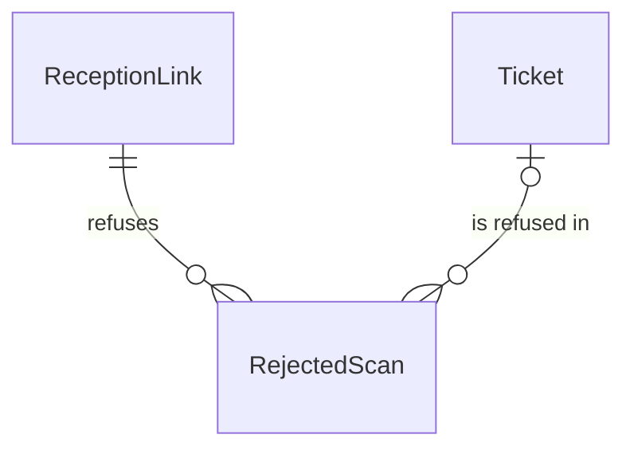

# components/entity/rejected-scan Specification

## Purpose
A RejectedScan is the permanent note that a scan at the venue, or one Ticket in it, was refused: why, through which ReceptionLink and when. RejectedScans are never changed or removed. Unlike an Admission, losing one is acceptable, so they are stored apart from the Ticket.

| attribute | meaning | constraint |
|-----------|---------|------------|
| event | the event of the ReceptionLink that scanned | required |
| reception link | the ReceptionLink that scanned | required |
| ticket | the Ticket the refusal is about | required, except absent when the reason is Forged |
| reason | why it was refused | required: Forged, Expired, OtherEvent, Voided or AlreadyAdmitted |
| scanned time | when the scan was decided | required |

## Requirements

### Requirement: A ticket is named exactly when the code could be trusted

A RejectedScan with reason Forged SHALL name no Ticket, because a forged or unreadable code proves nothing about the Tickets it lists. A RejectedScan with any other reason SHALL name a Ticket: the code's signature verified, so the Tickets it presents are known.

#### Scenario: Forged scan

- **WHEN** a RejectedScan has reason Forged and no Ticket
- **THEN** it is valid

#### Scenario: Expired code

- **WHEN** a RejectedScan has reason Expired and names a Ticket presented by the code
- **THEN** it is valid

#### Scenario: Forged scan naming a ticket

- **WHEN** a RejectedScan has reason Forged and names a Ticket
- **THEN** it is invalid
