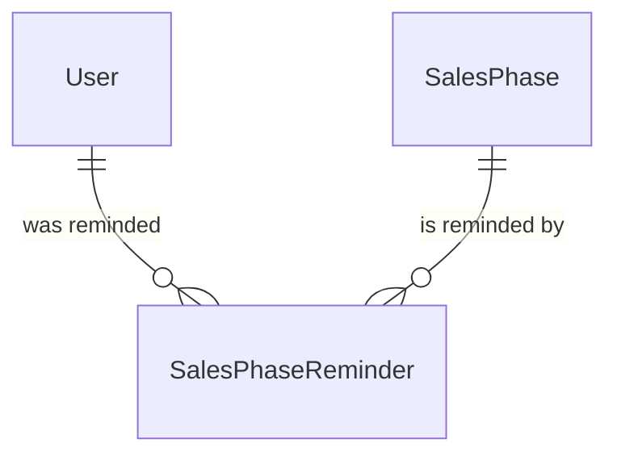

# Sales Phase Reminder

## Purpose

A Sales Phase Reminder records that one reminder stage of one Sales Phase has been sent to one User, so the same reminder is not sent to that user again. It links a User and a Sales Phase and carries the stage and the time it was sent.

| attribute | meaning | constraint |
|---|---|---|
| user | The fan the reminder was sent to | required |
| sales phase | The sales phase the reminder is about | required |
| stage | Which point of the phase's timeline the reminder marks: `APPLY_OPEN`, `APPLY_CLOSE_24H`, `APPLY_CLOSE_1H`, `RESULT_DAY` | required; only defined values |
| sent time | When the reminder was recorded as sent | required, set when the record is created |

## Requirements

### Requirement: Each stage is anchored on one milestone of its sales phase

A reminder stage SHALL be anchored on exactly one milestone of the sales phase: `APPLY_OPEN` on the apply start time, `APPLY_CLOSE_24H` on 24 hours before the apply end time, `APPLY_CLOSE_1H` on 1 hour before the apply end time, and `RESULT_DAY` on the calendar day of the lottery result time. A stage whose milestone is unknown on the phase SHALL NOT apply to that phase. The payment deadline time SHALL anchor no stage.

#### Scenario: Close stages

- **WHEN** a phase's apply end time is 10 July 23:59
- **THEN** `APPLY_CLOSE_24H` is anchored on 9 July 23:59 and `APPLY_CLOSE_1H` on 10 July 22:59

#### Scenario: Unknown milestone

- **WHEN** a phase has no lottery result time
- **THEN** `RESULT_DAY` does not apply to that phase

#### Scenario: Payment deadline known

- **WHEN** a phase has a payment deadline time
- **THEN** no stage is anchored on it

### Requirement: Stage values are closed

A sales phase reminder's stage SHALL be one of `APPLY_OPEN`, `APPLY_CLOSE_24H`, `APPLY_CLOSE_1H` or `RESULT_DAY`; any other value SHALL be invalid.

#### Scenario: Undefined stage

- **WHEN** a reminder carries a stage that is not one of the four defined stages
- **THEN** the reminder is invalid
