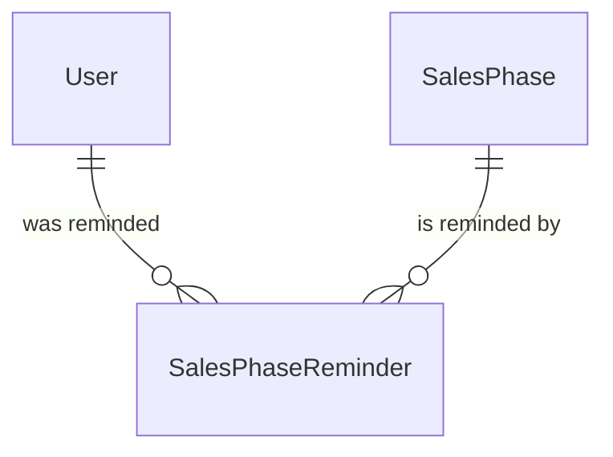

# Sales Phase Reminder

## Purpose

A Sales Phase Reminder records that one reminder stage of one Sales Phase has been sent to one User, so the same reminder is not sent to that user again. It links a User and a Sales Phase and carries the stage and the time it was sent.

| attribute | meaning | constraint |
|---|---|---|
| user | The fan the reminder was sent to | required |
| sales phase | The sales phase the reminder is about | required |
| stage | Which point of the phase's timeline the reminder marks: `APPLY_OPEN`, `APPLY_CLOSE_24H`, `RESULT_DAY` | required; only defined values |
| sent time | When the reminder was recorded as sent | required, set when the record is created |

```mermaid
erDiagram
    User ||--o{ SalesPhaseReminder : "was reminded"
    SalesPhase ||--o{ SalesPhaseReminder : "is reminded by"
```

## Requirements

### Requirement: Stage values are closed

A sales phase reminder's stage SHALL be one of `APPLY_OPEN`, `APPLY_CLOSE_24H` or `RESULT_DAY`; any other value SHALL be invalid.

#### Scenario: Undefined stage

- **WHEN** a reminder carries a stage that is not one of the three defined stages
- **THEN** the reminder is invalid

### Requirement: Stages are anchored by method

A reminder stage SHALL be anchored on exactly one milestone of the sales phase, and only these stages SHALL apply:

- `APPLY_OPEN`: on a `LOTTERY` phase, at the apply start time. On a `FIRST_COME` phase, 30 minutes before the apply start time.
- `APPLY_CLOSE_24H`: on a `LOTTERY` phase only, 24 hours before the apply end time.
- `RESULT_DAY`: on a `LOTTERY` phase with a lottery result time only, on the calendar day of that time.

#### Scenario: Lottery stages

- **WHEN** a `LOTTERY` phase opens on 5 October 18:00, closes on 22 October 23:59 and announces results on 3 November 15:00
- **THEN** `APPLY_OPEN` is anchored on 5 October 18:00, `APPLY_CLOSE_24H` on 21 October 23:59 and `RESULT_DAY` on 3 November

#### Scenario: First-come stage

- **WHEN** a `FIRST_COME` phase opens on 6 October 19:00
- **THEN** `APPLY_OPEN` is anchored on 6 October 18:30, and neither `APPLY_CLOSE_24H` nor `RESULT_DAY` applies

#### Scenario: Lottery without a result time

- **WHEN** a `LOTTERY` phase has no lottery result time
- **THEN** `RESULT_DAY` does not apply to that phase
