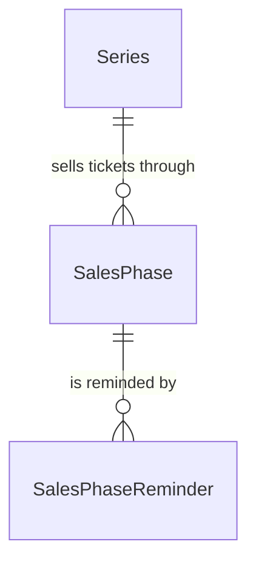

# Sales Phase

## Purpose

A Sales Phase is one ticket-sales opportunity (a fan-club presale, a play-guide lottery, a general on-sale, and so on) announced for a Series (tour) as a whole; it records how and through whom tickets are sold and the milestones of its timeline, so that fans tracking the series can be told when to apply and when results come out. It is discovered from the artist's published ticket information and is unrelated to the organizer-authored lottery sales phase of an Event, which shares the words but none of the attributes.

| attribute | meaning | constraint |
|---|---|---|
| id | The sales phase's identity; the handle reminders refer to | required, UUID, assigned by the system, never changes |
| series | The tour the phase sells tickets for | required |
| method | How tickets are allocated: `LOTTERY` (抽選 lottery) or `FIRST_COME` (先着 first come) | optional; `UNSPECIFIED` means not yet determined; only defined values |
| channel | Who sells the tickets, the gate a fan passes: `FAN_CLUB`, `OFFICIAL`, `PLAYGUIDE`, `CREDIT_CARD`, `MOBILE_CARRIER`, `GENERAL` | optional; `UNSPECIFIED` means not yet determined; only defined values |
| provider name | The named ticket outlet (for example イープラス, チケットぴあ), mainly for `PLAYGUIDE` | optional free text, at most 255 characters; empty means none or unknown |
| sequence | The 0-based ordinal of the round within its channel, when a channel runs several rounds | integer, at least 0; 0 when the channel has one round |
| apply start time | When applications or sales open (受付開始) | required, an absolute instant |
| apply end time | When applications or sales close (受付終了) | optional; empty means not yet announced |
| lottery result time | When lottery results are announced (当落発表) | optional; empty means not announced or not a lottery |
| payment deadline time | The payment deadline for winners (入金期限) | optional; empty means not announced or not applicable |
| url | The page where fans apply for this phase | optional; empty means none known |
| discovered time | When the system first learned of the phase | required, set once when the phase is created |

## Requirements

### Requirement: A sales phase applies to its whole series

A sales phase SHALL belong to exactly one Series and apply to all of that series' events; it SHALL carry no per-event coverage. A standalone concert's phases SHALL belong to its single-event series.

#### Scenario: Tour-wide phase

- **WHEN** a tour announces a fan-club presale
- **THEN** the sales phase belongs to the tour's series and covers every event of the series

#### Scenario: Standalone concert

- **WHEN** a standalone concert announces a general on-sale
- **THEN** the sales phase belongs to that concert's single-event series

### Requirement: Method and channel are orthogonal classifications

A sales phase SHALL be classified by method and by channel independently, and SHALL order repeated rounds of one channel by sequence. Method SHALL be one of `UNSPECIFIED`, `LOTTERY` or `FIRST_COME`; channel SHALL be one of `UNSPECIFIED`, `FAN_CLUB`, `OFFICIAL`, `PLAYGUIDE`, `CREDIT_CARD`, `MOBILE_CARRIER` or `GENERAL`. `UNSPECIFIED` SHALL mean not yet determined. A method or channel outside these values SHALL be invalid.

#### Scenario: Lottery through a play guide

- **WHEN** a phase is a lottery sold through イープラス
- **THEN** its method is `LOTTERY`, its channel is `PLAYGUIDE` and its provider name is イープラス

#### Scenario: Not yet classified

- **WHEN** the method and channel of a phase are not yet known
- **THEN** the phase is valid with method `UNSPECIFIED` and channel `UNSPECIFIED`

#### Scenario: Undefined value

- **WHEN** a phase carries a channel value that is not one of the defined channels
- **THEN** the phase is invalid

#### Scenario: Second round of a channel

- **WHEN** a fan club runs a first and a second presale round
- **THEN** the first round has sequence 0 and the second has sequence 1

### Requirement: Only the apply start time is required

A sales phase SHALL always have a known apply start time. The apply end time, lottery result time and payment deadline time SHALL be optional, and an absent value SHALL mean the milestone is not yet announced. A negative sequence or a provider name longer than 255 characters SHALL be invalid.

#### Scenario: Later milestones not yet announced

- **WHEN** a phase's apply start time is known and its close, result and payment dates are not
- **THEN** the phase is valid with only the apply start time set

#### Scenario: No start time

- **WHEN** a phase has no apply start time
- **THEN** the phase is invalid

#### Scenario: Out-of-range values

- **WHEN** a phase has sequence -1, or a provider name of 256 characters
- **THEN** the phase is invalid

### Requirement: The discovered time is set once

A sales phase's discovered time SHALL be set when the phase is first created and SHALL never change afterwards, however often the phase is discovered again.

#### Scenario: Re-discovery keeps the discovered time

- **WHEN** a phase created on 1 June is discovered again on 5 June with new details
- **THEN** its discovered time stays 1 June
