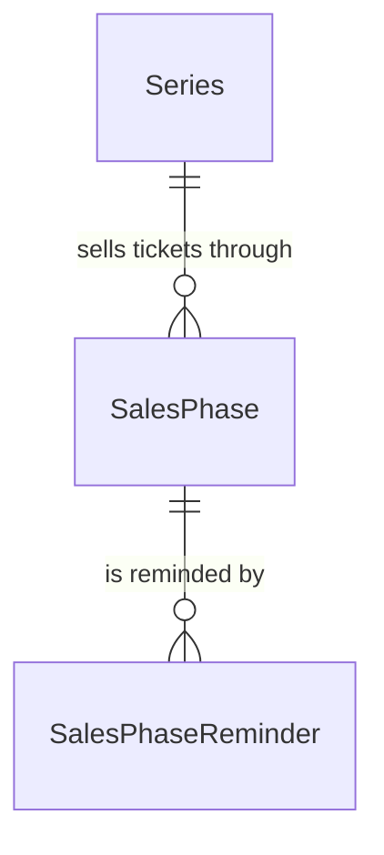

# Sales Phase

## Purpose

A Sales Phase is one ticket-sales opportunity (a fan-club lottery, a presale, a general on-sale, and so on) announced for a Series (tour) as a whole; it records how tickets are allocated and the milestones of its timeline, so that fans tracking the series can be told when to apply and when results come out. It is discovered from the artist's published ticket information and is unrelated to the organizer-authored lottery sales phase of an Event, which shares the words but none of the attributes.

| attribute | meaning | constraint |
|---|---|---|
| id | The sales phase's identity; the handle reminders refer to | required, UUID, assigned by the system, never changes |
| series | The tour the phase sells tickets for | required |
| method | How tickets are allocated: `LOTTERY` (抽選 lottery) or `FIRST_COME` (先着 first come) | required; only these values |
| apply start time | When applications or sales open (受付開始) | required, an absolute instant |
| apply end time | When applications or sales close (受付終了) | required for `LOTTERY`; optional for `FIRST_COME`, where empty means the sale ends when tickets run out; after the apply start time |
| lottery result time | When lottery results are announced (当落発表) | optional; `LOTTERY` only; empty means not announced; not before the apply end time |
| discovered time | When the system first learned of the phase | required, set once when the phase is created |

```mermaid
erDiagram
    Series ||--o{ SalesPhase : "sells tickets through"
    SalesPhase ||--o{ SalesPhaseReminder : "is reminded by"
```

## Requirements

### Requirement: A sales phase applies to its whole series

A sales phase SHALL belong to exactly one Series and apply to all of that series' events; it SHALL carry no per-event coverage. A standalone concert's phases SHALL belong to its single-event series.

#### Scenario: Tour-wide phase

- **WHEN** a tour announces a fan-club presale
- **THEN** the sales phase belongs to the tour's series and covers every event of the series

#### Scenario: Standalone concert

- **WHEN** a standalone concert announces a general on-sale
- **THEN** the sales phase belongs to that concert's single-event series

### Requirement: The discovered time is set once

A sales phase's discovered time SHALL be set when the phase is first created and SHALL never change afterwards, however often the phase is discovered again.

#### Scenario: Re-discovery keeps the discovered time

- **WHEN** a phase created on 1 June is discovered again on 5 June with new details
- **THEN** its discovered time stays 1 June

### Requirement: Method is the only classification

A sales phase SHALL be classified only by its method, which SHALL be `LOTTERY` or `FIRST_COME`. A phase without a method or with any other value SHALL be invalid.

#### Scenario: Fan-club lottery

- **WHEN** a fan club runs a lottery presale for a tour
- **THEN** the phase's method is `LOTTERY`

#### Scenario: No method

- **WHEN** a phase has no method
- **THEN** the phase is invalid

### Requirement: When an application has ended

A sales phase's application SHALL have ended at its apply end time. A `FIRST_COME` phase without an apply end time SHALL count as ended at its apply start time.

#### Scenario: Lottery before its close

- **WHEN** a `LOTTERY` phase closes on 22 October 23:59 and the current time is 20 October
- **THEN** its application has not ended

#### Scenario: First-come sale until sold out

- **WHEN** a `FIRST_COME` phase has no apply end time and opened at 18:30 today
- **THEN** its application has ended since 18:30

### Requirement: Required milestones depend on the method

A sales phase SHALL always have a known apply start time. A `LOTTERY` phase SHALL also have an apply end time; a `FIRST_COME` phase's apply end time SHALL be optional, and an absent value SHALL mean the sale ends when tickets run out. A lottery result time SHALL be optional and SHALL appear only on a `LOTTERY` phase. An apply end time SHALL be after the apply start time, and a lottery result time SHALL NOT be before the apply end time.

#### Scenario: First-come sale until sold out

- **WHEN** a `FIRST_COME` phase has an apply start time and no apply end time
- **THEN** the phase is valid

#### Scenario: Lottery without a close

- **WHEN** a `LOTTERY` phase has no apply end time
- **THEN** the phase is invalid

#### Scenario: No start time

- **WHEN** a phase has no apply start time
- **THEN** the phase is invalid

#### Scenario: Close before open

- **WHEN** a phase's apply end time is before its apply start time
- **THEN** the phase is invalid

#### Scenario: Result before close

- **WHEN** a `LOTTERY` phase's lottery result time is before its apply end time
- **THEN** the phase is invalid

#### Scenario: Result on a first-come sale

- **WHEN** a `FIRST_COME` phase has a lottery result time
- **THEN** the phase is invalid
