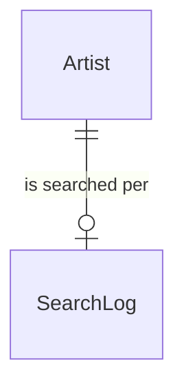
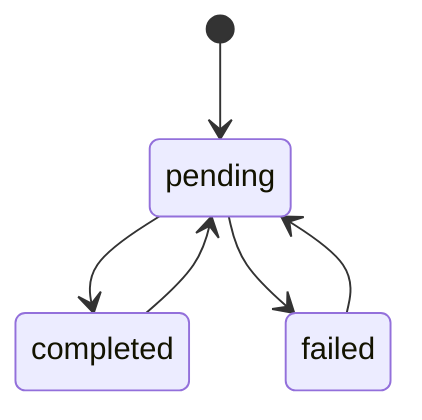

# Search Log

## Purpose

A SearchLog records, per Artist, the latest external concert search: when it started, how it ended, and when a search last found a new concert. It decides whether another external search for that Artist is worth running.

| attribute | meaning | constraint |
|-----------|---------|------------|
| artist | the Artist searched | required; one SearchLog per Artist |
| search time | when the latest search started | required |
| status | pending, completed or failed | required |
| last found time | when a search last found at least one new concert | optional; absent means never |

## Requirements

### Requirement: Fresh search

A SearchLog SHALL be fresh at a moment when its status is completed and less than the freshness window has passed since its search time.

#### Scenario: Completed within the window
- **WHEN** the status is completed, the search time is 13:30 and the moment is 14:00 with a 1-hour window
- **THEN** the SearchLog is fresh

#### Scenario: Completed outside the window
- **WHEN** the status is completed, the search time is 13:30 and the moment is 16:00 with a 1-hour window
- **THEN** the SearchLog is not fresh

#### Scenario: Failed search is never fresh
- **WHEN** the status is failed and the search time is 1 minute ago
- **THEN** the SearchLog is not fresh

### Requirement: Search still in progress

A SearchLog SHALL be in progress at a moment when its status is pending and less than the pending timeout has passed since its search time; a pending SearchLog older than that is treated as abandoned.

#### Scenario: Recent pending search
- **WHEN** the status is pending, the search time is 13:57 and the moment is 14:00 with a 5-minute timeout
- **THEN** the search is in progress

#### Scenario: Abandoned pending search
- **WHEN** the status is pending, the search time is 13:57 and the moment is 14:10 with a 5-minute timeout
- **THEN** the search is not in progress

#### Scenario: Completed search is not in progress
- **WHEN** the status is completed
- **THEN** the search is not in progress

### Requirement: Recently discovered

A SearchLog SHALL count as recently discovered at a moment when it has a last found time and less than the discovery window has passed since it. A SearchLog with no last found time is never recently discovered.

#### Scenario: Found 3 days ago with a 14-day window
- **WHEN** the last found time is 3 days before the moment and the window is 14 days
- **THEN** the SearchLog is recently discovered

#### Scenario: Never found
- **WHEN** the SearchLog has no last found time
- **THEN** it is not recently discovered
