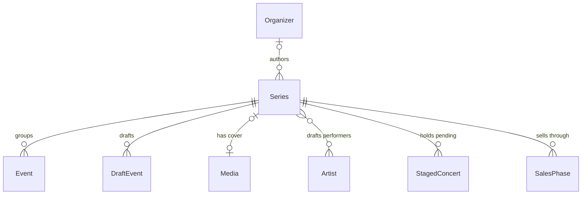
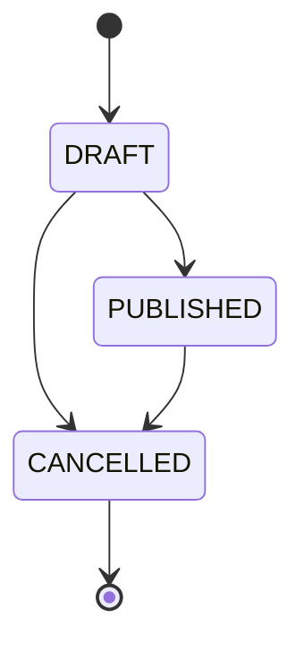

# Series

## Purpose

A Series groups the Events of one engagement — a tour, a single-venue run, or a festival — and owns what they share: title, type and source page. A Series authored by an organizer (first-party) also carries a description, a cover image, a visibility and a publish state; a Series found by discovery has none of these and is always visible.

| attribute | meaning | constraint |
|-----------|---------|------------|
| id | series identifier | required |
| title | shared title (tour, show or festival name) | required, 1–255 characters |
| type | TOUR, SINGLE or FESTIVAL | required |
| source page | official page for the engagement | optional; a URI of at most 2048 characters |
| organizer | owning Organizer | optional; present exactly when the Series is first-party |
| description | organizer-written body text | optional, 1–10000 characters; first-party only |
| cover image | current cover Media | optional; first-party only |
| visibility | PUBLIC or UNLISTED | first-party only |
| publish state | DRAFT, PUBLISHED or CANCELLED | first-party only |
| share token | token that opens an UNLISTED Series | present only on a published UNLISTED Series; never shown on reads |
| published at | when it became PUBLISHED | set on publish |
| cancelled at | when it became CANCELLED | set on cancel |

## Requirements

### Requirement: Series type

A Series' type SHALL be TOUR (events at several venues by the same performers under one name), SINGLE (one venue over one or more consecutive days) or FESTIVAL (a multi-performer event). A Series found by discovery SHALL be TOUR or SINGLE; FESTIVAL is set only by an organizer.

#### Scenario: Unspecified type is invalid
- **WHEN** a Series has no type
- **THEN** it is invalid

#### Scenario: Discovered standalone show
- **WHEN** discovery finds a standalone show spanning two days at one venue
- **THEN** its Series type is SINGLE

### Requirement: Every event belongs to one series

Every Event SHALL belong to exactly one Series, and a Series' title and source page SHALL be shared by all its Events.

#### Scenario: Tour with three stops
- **WHEN** a tour has three stops on different dates and venues
- **THEN** one Series holds the title and source page, and each stop is an Event of that Series

### Requirement: Public visibility

A Series SHALL be publicly visible when it is not first-party, or when it is first-party, PUBLISHED and PUBLIC. A first-party Series that is DRAFT, CANCELLED, or UNLISTED is not publicly visible; its Events are not shown on any fan-facing list.

#### Scenario: Discovered series is visible
- **WHEN** a Series has no organizer
- **THEN** it is publicly visible

#### Scenario: Published public series is visible
- **WHEN** a first-party Series is PUBLISHED with visibility PUBLIC
- **THEN** it is publicly visible

#### Scenario: Published unlisted series is not visible
- **WHEN** a first-party Series is PUBLISHED with visibility UNLISTED
- **THEN** it is not publicly visible

#### Scenario: Draft series is not visible
- **WHEN** a first-party Series is DRAFT
- **THEN** it is not publicly visible

#### Scenario: Cancelled series is not visible
- **WHEN** a first-party Series is CANCELLED
- **THEN** it is not publicly visible

### Requirement: A draft series has no catalog events

While a first-party Series is DRAFT, its performances SHALL be DraftEvents, not Events: it occupies no Event slot and claims no discovered Event until it is published.

#### Scenario: Draft performance does not claim a slot
- **WHEN** a DRAFT Series has a DraftEvent at a Venue, date and start time where a discovered Event exists
- **THEN** the discovered Event still belongs to its own Series

### Requirement: Cancelled is terminal

A CANCELLED Series SHALL NOT become DRAFT or PUBLISHED again.

#### Scenario: Cancelled series stays cancelled
- **WHEN** a Series is CANCELLED
- **THEN** it has no transition to DRAFT or PUBLISHED

### Requirement: Share token only on an unlisted series

A share token SHALL exist only on a published first-party Series whose visibility is UNLISTED, and it SHALL never be part of what a Series read returns.

#### Scenario: Public series has no token
- **WHEN** a first-party Series is PUBLISHED with visibility PUBLIC
- **THEN** it has no share token
