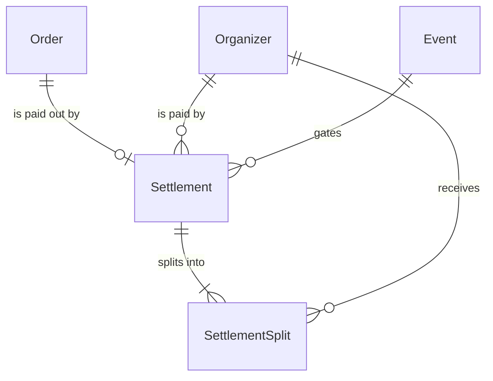
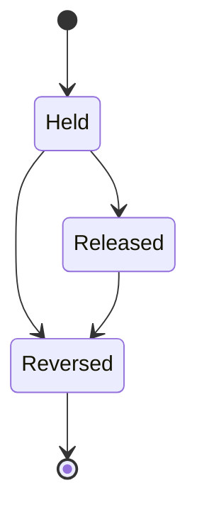

# Settlement

## Purpose

A Settlement is the payout record for one Order's captured money under the 収納代行 (collection agency) scheme, with the Organizer as seller of record: the money stays with the platform while the Settlement is Held, each payee's split is paid out to the payee's payout account when it is Released, the platform keeps the remainder as its fee, and payouts are clawed back when it is Reversed. The platform bears any negative balance on an Organizer's payout account.

| attribute | meaning | constraint |
|-----------|---------|------------|
| id | the settlement's identity | required, assigned on creation |
| order | the Order whose money it pays out | required, one Settlement per Order |
| organizer | the Organizer receiving the payout | required |
| event | the event whose start gates the release | required |
| charge reference | reference to the captured charge the payouts are tied to | empty until resolved at release |
| splits | the payees' shares | at least one |
| split payee | the Organizer receiving the split | required |
| split amount | the payee's net share, in whole yen | required, greater than 0 |
| split payout reference | reference to the payout of the split | empty until released |
| split reversal reference | reference to the claw-back of the split | empty unless reversed |
| status | lifecycle | Held, Released or Reversed |
| released time | when the splits were paid out | empty while Held |
| created time | when the Settlement was recorded | required |

## Requirements

### Requirement: Money is held until release

While a Settlement is Held, none of its Order's money SHALL have been paid to any payee; all of it stays with the platform.

#### Scenario: Held settlement

- **WHEN** a Settlement is Held
- **THEN** no split has a payout reference

### Requirement: Splits and platform fee

A Settlement SHALL have at least one split, every split amount SHALL be greater than 0, and the sum of the split amounts SHALL NOT exceed its Order's amount. The platform fee is the Order's amount minus the sum of the split amounts. The venue is the Organizer's own cost and is never a payee.

#### Scenario: Single Organizer split

- **WHEN** the Order's amount is 16000 yen and the only split pays the Organizer 14400 yen
- **THEN** the splits are valid and the platform fee is 1600 yen

#### Scenario: No split

- **WHEN** a Settlement has no split
- **THEN** its splits are invalid

#### Scenario: Non-positive split

- **WHEN** a split amount is 0 or less
- **THEN** its splits are invalid

#### Scenario: Splits exceed the order

- **WHEN** the split amounts add up to more than the Order's amount
- **THEN** its splits are invalid

### Requirement: Release eligibility

A Settlement SHALL be eligible for release at an instant, given its event's current start time and a dispute buffer, only when the start time is known and the instant is after the start time plus the buffer.

#### Scenario: Start time unknown

- **WHEN** the event has no start time
- **THEN** the Settlement is not eligible for release

#### Scenario: Buffer not yet elapsed

- **WHEN** the instant is before the start time plus the buffer
- **THEN** the Settlement is not eligible for release

#### Scenario: Buffer elapsed

- **WHEN** the instant is after the start time plus the buffer
- **THEN** the Settlement is eligible for release

### Requirement: Released only from Held

A Settlement SHALL be releasable only while Held; a Released or Reversed Settlement is never released again.

#### Scenario: Reversed settlement

- **WHEN** the status is Reversed
- **THEN** the Settlement is not releasable
