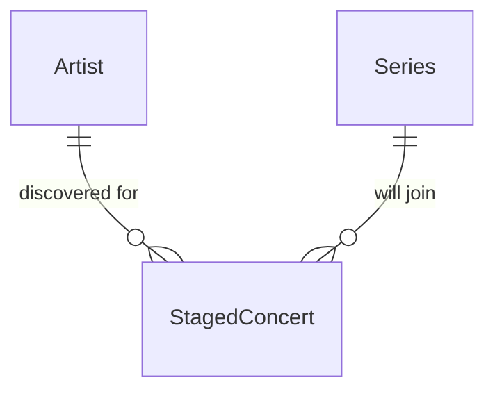

# Staged Concert

## Purpose

A StagedConcert is a discovered performance held for admin review instead of being published: its venue could not be resolved, or it collides with an Event already in the catalog. It is not a Concert and is never shown to fans; it exists only until an admin approves or rejects it.

| attribute | meaning | constraint |
|-----------|---------|------------|
| id | staged concert identifier | required |
| artist | the Artist it was discovered for | required |
| series | the Series it will join on approval | required |
| title | the Series title as discovered, for review display | required |
| local date | calendar date at the venue | required |
| start time | performance start | optional; absent means unknown |
| open time | doors open | optional; absent means unknown |
| listed venue name | venue text as discovered, normalized | required |
| admin area | admin area as discovered, as an ISO 3166-2 code | optional |
| source page | where it was found | optional |
| resolved place id | map place identity of the resolved venue | optional; absent when the venue was not resolved |
| resolved venue name | canonical name of the resolved venue | optional |
| resolved admin area | admin area of the resolved venue | optional |
| resolved coordinates | location of the resolved venue | optional |
| discovered time | when it was first staged | required |

## Requirements

### Requirement: A staged concert is not a concert

A StagedConcert SHALL NOT appear in any fan-facing concert list or in the admin catalog list of Concerts.

#### Scenario: Staged concert on a followed artist
- **WHEN** a StagedConcert exists for an Artist a fan follows
- **THEN** it is not among that fan's concerts

### Requirement: Resolved preview is all or nothing on the place

A StagedConcert whose venue was not resolved SHALL have no resolved place id, resolved venue name or resolved coordinates.

#### Scenario: Unresolved venue
- **WHEN** a StagedConcert was staged because its venue could not be resolved
- **THEN** it carries no resolved place id, resolved venue name or resolved coordinates
