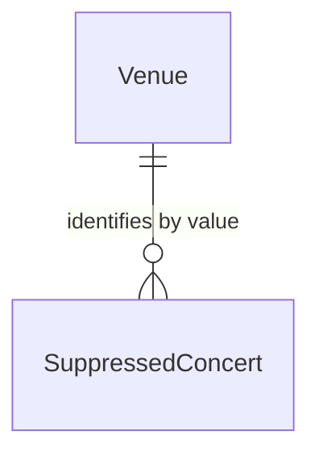

# Suppressed Concert

## Purpose

A SuppressedConcert records the slot — Venue, local date and start time — of a published Concert an admin deleted, so that discovery and organizer publishing do not bring it back. It is independent of the performing Artist and is distinct from the analysis-only RejectedConcertLog.

| attribute | meaning | constraint |
|-----------|---------|------------|
| id | suppression identifier | required |
| venue | the deleted Event's Venue, held by value | required |
| local date | the deleted Event's date | required |
| start time | the deleted Event's start time | optional; absent means the deleted Event had none |
| suppressed time | when it was recorded | required |

## Requirements

### Requirement: Suppression matches a slot

A SuppressedConcert SHALL match a slot when the Venue and local date are equal and the start times are equal, where an unknown start time matches only an unknown start time. The performing Artist SHALL play no part in the match.

#### Scenario: Same slot, other artist
- **WHEN** a SuppressedConcert holds Venue V, 2026-07-01, 18:00 and a slot for another Artist is V, 2026-07-01, 18:00
- **THEN** the slot is suppressed

#### Scenario: Different start time
- **WHEN** a SuppressedConcert holds Venue V, 2026-07-01, 18:00 and a slot is V, 2026-07-01, 13:00
- **THEN** the slot is not suppressed

#### Scenario: Unknown start matches unknown start
- **WHEN** a SuppressedConcert holds Venue V, 2026-07-01 with no start time and a slot is V, 2026-07-01 with no start time
- **THEN** the slot is suppressed

### Requirement: Suppression is not a rejection

A SuppressedConcert SHALL NOT be written to or read from the RejectedConcertLog, and a RejectedConcertLog entry SHALL NOT suppress anything.

#### Scenario: Rejected concert is not suppressed
- **WHEN** a staged concert was rejected and no SuppressedConcert holds its slot
- **THEN** its slot is not suppressed
