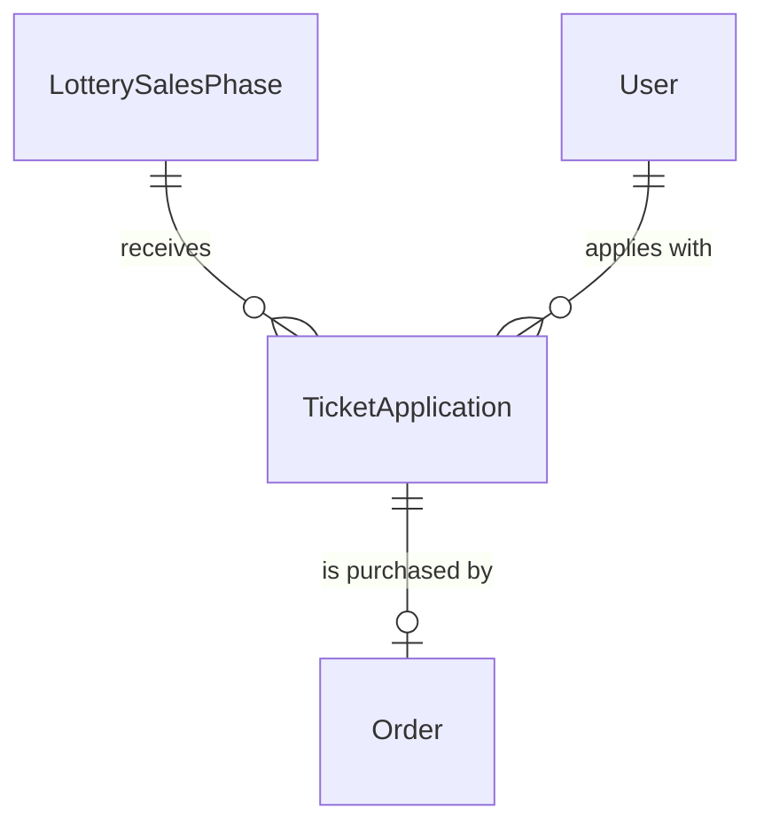
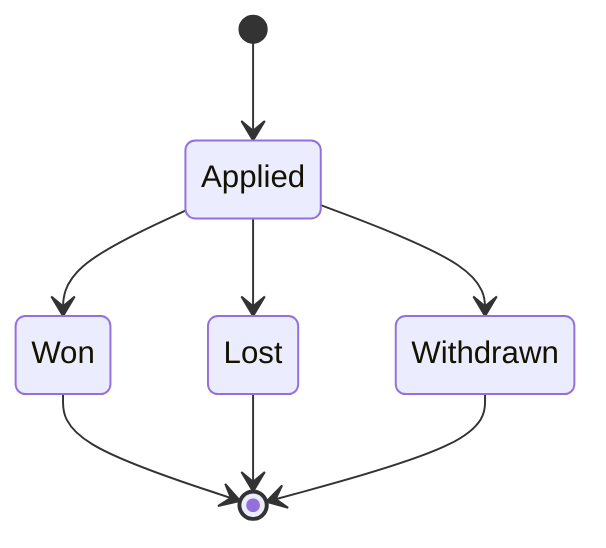

# TicketApplication

## Purpose

A TicketApplication is one fan account's entry into one LotterySalesPhase: a request for a companion group of tickets allocated all-or-nothing, the applicant's 本人確認 (identity check), and the reference to the authorization (hold) placed on the applicant's card for the amount until the draw.

| attribute | meaning | constraint |
|-----------|---------|------------|
| id | the application's identity | required, assigned on creation |
| phase | the LotterySalesPhase applied to | required |
| applicant | the fan account that applied | required |
| requested ticket count | size of the companion group, allocated all-or-nothing | required, 1 to the phase's max tickets per application |
| applicant full name | the applicant's real full name (氏名) for the covered ticket | required, 1-200 characters |
| applicant phone number | the applicant's contact phone (連絡先) | required, 1-20 characters |
| authorization | reference to the hold placed on the applicant's card | required, 1-255 characters, opaque |
| state | lifecycle | Applied, Won, Lost or Withdrawn |
| draw position | the application's position in the draw's random order | absent before the draw; set only by the draw |

## Requirements

### Requirement: A new application starts Applied

A TicketApplication SHALL start in state Applied, with no draw position.

#### Scenario: New application

- **WHEN** a TicketApplication is created
- **THEN** its state is Applied and it has no draw position

### Requirement: Requested ticket count fits the phase

The requested ticket count SHALL be at least 1 and at most the phase's max tickets per application.

#### Scenario: Count within the limit

- **WHEN** the phase allows 4 tickets per application and 2 are requested
- **THEN** the count is valid

#### Scenario: Zero tickets requested

- **WHEN** 0 tickets are requested
- **THEN** the count is invalid

#### Scenario: Count over the limit

- **WHEN** the phase allows 4 tickets per application and 5 are requested
- **THEN** the count is invalid

### Requirement: Applicant identity is required

The applicant full name SHALL be 1-200 characters and the applicant phone number 1-20 characters.

#### Scenario: Identity complete

- **WHEN** both a full name and a phone number within their lengths are given
- **THEN** the identity is valid

#### Scenario: Missing name or phone

- **WHEN** the full name or the phone number is empty
- **THEN** the identity is invalid

### Requirement: Active applications

An application SHALL be active unless its state is Withdrawn; Won and Lost applications stay active.

#### Scenario: Withdrawn application is not active

- **WHEN** the state is Withdrawn
- **THEN** the application is not active

#### Scenario: Drawn application is active

- **WHEN** the state is Won or Lost
- **THEN** the application is active

### Requirement: Withdrawable only while Applied

An application SHALL be withdrawable only while its state is Applied, that is before the draw has run for it.

#### Scenario: Applied application

- **WHEN** the state is Applied
- **THEN** the application is withdrawable

#### Scenario: Drawn or withdrawn application

- **WHEN** the state is Won, Lost or Withdrawn
- **THEN** the application is not withdrawable

### Requirement: Accepted card brands

A card SHALL be accepted for an application unless its brand is American Express; a card whose brand is unknown is accepted.

#### Scenario: American Express

- **WHEN** the card brand is American Express
- **THEN** the card is not accepted

#### Scenario: Other or unknown brand

- **WHEN** the card brand is Visa, Mastercard, JCB, Diners, Discover or unknown
- **THEN** the card is accepted
