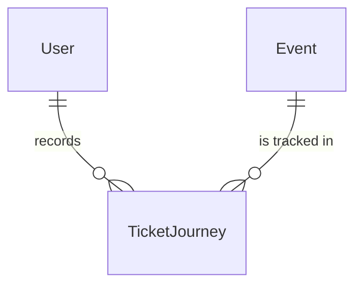
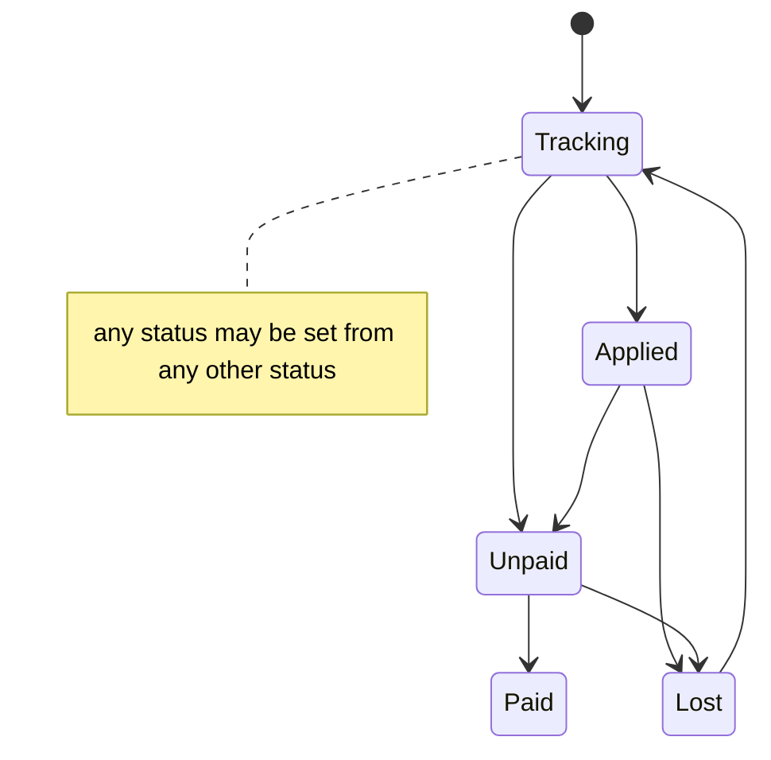

# Ticket Journey

## Purpose

A Ticket Journey is a fan's own record of where they stand in getting a ticket for one event, from watching for the sale through a lottery to a secured ticket. A fan has at most one journey per event; the fan sets it by hand, the system does not check it against real ticket sales, and a ticket the platform itself issues marks it Paid.

| attribute | meaning | constraint |
|-----------|---------|------------|
| user id | the fan who owns the journey | required; always the fan the journey was recorded for, never chosen by another user |
| event id | the event the journey is about (an event, not a concert, so that non-music events can be tracked later) | required; an event that exists; together with user id it identifies the journey |
| status | the fan's current stage | required; one of Tracking, Applied, Lost, Unpaid, Paid; a journey never exists without one of these five |

States:

- Tracking: the fan is watching the event for ticket sales information. It is also the fan's "tell me about this sale" signal for the event's series.
- Applied: the fan has entered a ticket lottery (抽選申込済 lottery applied).
- Lost: the fan lost the lottery (落選 lottery lost) or missed the payment deadline (入金期限切れ payment deadline expired).
- Unpaid: the fan won or bought a ticket and still has to pay (入金待ち awaiting payment).
- Paid: the fan has paid and secured the ticket (チケット確保 ticket secured).

Every status may follow every other status. The diagram shows the typical flow only.

## Requirements

### Requirement: Status is one of the five journey statuses

A Ticket Journey's status SHALL be exactly one of Tracking, Applied, Lost, Unpaid and Paid. Any other value is not a journey status.

#### Scenario: A defined status

- **WHEN** a journey's status is Applied
- **THEN** the status is valid

#### Scenario: No status or an unknown status

- **WHEN** a journey is given no status, or a value outside the five journey statuses
- **THEN** the status is not valid

### Requirement: Any status may follow any status

A Ticket Journey SHALL accept any of the five statuses as its next status, whatever its current status is, so the fan can always match the journey to their real situation. There is no transition guard.

#### Scenario: Going back from Paid to Tracking

- **WHEN** a journey's status is Paid and Tracking is given as its next status
- **THEN** the change is allowed

#### Scenario: Skipping the lottery

- **WHEN** a journey's status is Tracking and Unpaid is given as its next status
- **THEN** the change is allowed
