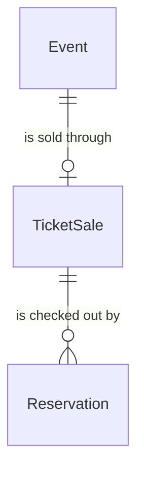

# components/entity/ticket-sale Specification

## Purpose
A TicketSale is the platform's own sale of one event's tickets, first come, first served: an Organizer offers a quantity of tickets at one tax-inclusive price during a sale window, and each fan may buy up to a per-account limit. It is distinct from the SalesPhase entity, which records sales announced elsewhere.

| attribute | meaning | constraint |
|-----------|---------|------------|
| id | the sale's identity | required, assigned on creation |
| event | the event whose tickets are sold | required; one TicketSale per event |
| method | how tickets are allocated | FirstCome |
| sale start | when the sale opens, an instant entered and shown in Japan time | required |
| sale end | when the sale closes, an instant entered and shown in Japan time | required; after the sale start and no later than the event's start time |
| price | price of one ticket, 税込 (tax-inclusive), in yen | required; 1 to 1,000,000 |
| quantity | tickets offered | required; at least 1 |
| per-account limit | most tickets one User may hold or have bought from the sale | required; 1 to 10; 4 when not given |
| sold count | tickets on the sale's Committed and Completed Reservations | required; 0 to the quantity; starts at 0 |
| held count | tickets on the sale's Reservations that are holding when the sale is read | derived when read; 0 to the quantity |
| state | where the sale stands when it is read: NotYetOnSale, OnSale, AllHeld, SoldOut or Ended | derived when read ("Sale state at a time") |
| low stock | whether an OnSale sale has few tickets left when it is read | derived when read ("Sale state at a time") |

## Requirements

### Requirement: Sale window, price, quantity and limit

A TicketSale's sale end SHALL be after its sale start, its price SHALL be 1 to 1,000,000 yen, its quantity SHALL be at least 1 and its per-account limit SHALL be 1 to 10. A TicketSale created without a per-account limit SHALL have a limit of 4.

#### Scenario: Usual sale

- **WHEN** a sale runs from 2026-11-01 10:00 to 2026-11-20 18:00, priced 3000 yen, with 150 tickets and no limit given
- **THEN** it is valid and its per-account limit is 4

#### Scenario: End before start

- **WHEN** the sale end is before the sale start
- **THEN** the TicketSale is invalid

#### Scenario: Limit over 10

- **WHEN** the per-account limit is 11
- **THEN** the TicketSale is invalid

### Requirement: Remaining tickets

A TicketSale's remaining count at a time SHALL be its quantity minus its sold count minus the counts of its Reservations that are holding at that time, and never below 0.

#### Scenario: Some sold, some held

- **WHEN** a sale of 150 has sold 100 and Reservations holding 6 tickets
- **THEN** 44 tickets remain

### Requirement: Sale state at a time

A TicketSale's state at a time SHALL be:
- NotYetOnSale before the sale start;
- Ended at or after the sale end;
- SoldOut when the sold count equals the quantity;
- AllHeld when the remaining count is 0 and the sold count is below the quantity;
- OnSale otherwise.

Ended takes precedence over SoldOut and AllHeld. An OnSale sale SHALL be LowStock when its remaining count is at most one tenth of its quantity, rounded up, so a sale of 9 tickets is LowStock with 1 left.

#### Scenario: Before opening

- **WHEN** a sale opening at 10:00 is checked at 09:59
- **THEN** it is NotYetOnSale

#### Scenario: Last tickets held by others

- **WHEN** a sale of 150 has sold 147 and Reservations hold the other 3
- **THEN** it is AllHeld

#### Scenario: Sold out

- **WHEN** a sale of 150 has sold 150
- **THEN** it is SoldOut

#### Scenario: Few left

- **WHEN** a sale of 150 has 15 tickets remaining
- **THEN** it is OnSale and LowStock

#### Scenario: Small sale, last ticket

- **WHEN** a sale of 9 has 1 ticket remaining
- **THEN** it is OnSale and LowStock

#### Scenario: Closed

- **WHEN** a sale is checked at its sale end
- **THEN** it is Ended

### Requirement: Price fixed while tickets are held or sold

A TicketSale's price SHALL be changeable only while its sold count and its held count are both 0, so every fan who pays for a sale's tickets pays the same price.

#### Scenario: Price change before any ticket is held

- **WHEN** a sale with nothing sold or held changes its price from 3000 to 3500 yen
- **THEN** the change is allowed

#### Scenario: Price change while tickets are held

- **WHEN** a sale with nothing sold and Reservations holding 2 tickets changes its price
- **THEN** the change is not allowed

#### Scenario: Price change after tickets sold

- **WHEN** a sale with 1 ticket sold changes its price
- **THEN** the change is not allowed

#### Scenario: Price change after every checkout lapsed

- **WHEN** a sale whose only Reservation expired without a commit changes its price
- **THEN** the change is allowed
